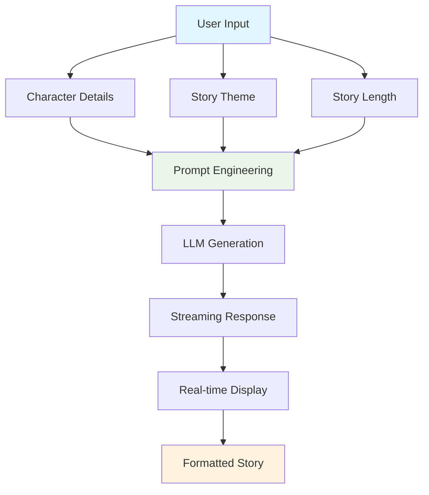

# Bedtime Story Generator

Learn prompt engineering and LLM integration by building an AI story generator that creates personalized bedtime stories.

## 🎯 Learning Objectives

Master the core concepts of **Large Language Model (LLM) integration** through hands-on implementation:

- **Prompt Engineering Techniques** - Design effective prompts for consistent, high-quality outputs
- **LLM Parameter Control** - Master temperature, tokens, and model selection
- **Streaming Response Handling** - Build real-time user experiences
- **Input Validation & Safety** - Ensure appropriate content generation
- **LLM Limitations & Optimization** - Understand when and why LLMs work

## 🏗️ System Architecture



## 🚀 Quick Start

```bash
# Start the demo
make dev

# Visit: http://localhost:4020/demos/bedtime-story
```

## 🧪 Learning Challenges

### **Challenge 1: Prompt Engineering Impact**
**Goal**: Understand how prompt design affects story quality

**Experiment**:
- Try different prompt structures (simple vs detailed)
- Test with/without examples in prompts
- Compare single-shot vs few-shot prompting

**Question**: How does prompt design affect story consistency and creativity?

### **Challenge 2: Temperature & Creativity Control**
**Goal**: Master LLM parameter tuning

**Experiment**:
- Set temperature: 0.3, 0.7, 1.0
- Generate stories with same inputs
- Compare creativity vs consistency trade-offs

**Question**: How does temperature affect creativity vs consistency in story generation?

### **Challenge 3: Streaming vs Batch Processing**
**Goal**: Understand real-time user experience

**Experiment**:
- Compare streaming experience to waiting
- Test with different story lengths
- Measure user engagement differences

**Question**: How does streaming improve user experience and engagement?

### **Challenge 4: Input Validation & Safety**
**Goal**: Build robust, safe applications

**Experiment**:
- Try invalid inputs (empty fields, special characters)
- Test with very long character names
- Test edge cases and boundary conditions

**Question**: How robust is your error handling and input validation?

## 🔧 Configuration

```bash
# .env
FIREWORKS_API_KEY=your_key_here
FIREWORKS_MODEL=accounts/fireworks/models/qwen3-235b-a22b-instruct-2507
# or
GEMINI_API_KEY=your_key_here
# or
OPENAI_API_KEY=your_key_here
```

## 🎓 Key LLM Concepts

### **What You'll Discover:**
1. **Prompt Sensitivity** - Small changes in prompts can dramatically affect output
2. **Temperature Trade-offs** - Higher creativity vs lower consistency
3. **Token Limitations** - Context window constraints and optimization
4. **Hallucination Risk** - LLMs may generate inappropriate or incorrect content
5. **Streaming Benefits** - Real-time feedback improves user experience

### **Production Considerations:**
- Input validation & sanitization
- Content moderation for safety
- Rate limiting & abuse prevention
- Performance optimization
- Error handling & fallbacks

## 🚀 Advanced Challenges

### **Challenge 5: Multi-Character Stories**
**Goal**: Master complex prompt engineering

**Learning Focus**: Advanced prompt design, character relationship modeling, and dialogue generation techniques.

### **Challenge 6: Pre-processing Enhancement**
**Goal**: Improve input quality before generation

**Learning Focus**: Input validation strategies, age-appropriate content filtering, and data quality optimization.

### **Challenge 7: Post-processing Pipeline**
**Goal**: Enhance story quality after generation

**Learning Focus**: Output validation, readability scoring, and content quality assessment.

### **Challenge 8: Story Quality Optimization**
**Goal**: Generate more engaging, coherent stories

**Learning Focus**: Story structure validation, character development, and narrative flow optimization.

### **Challenge 9: Safety & Content Moderation**
**Goal**: Ensure child-safe content generation

**Learning Focus**: Content filtering, safety mechanisms, and appropriate content validation.

## 🤔 Critical Thinking Questions

1. **How would you handle inappropriate content?** What safety measures would you add?
2. **What if users want to continue a story?** How would you maintain context?
3. **How would you personalize stories more?** What additional inputs could you use?
4. **How would you measure story quality?** What metrics would you track?
5. **How would you handle multiple languages?** What localization challenges exist?
6. **What if parents want to customize story themes?** How would you implement that?

## 📚 Further Learning

**Essential Reading:**
- [OpenAI Prompt Engineering Guide](https://platform.openai.com/docs/guides/prompt-engineering) - Best practices
- [Anthropic Prompt Engineering](https://docs.anthropic.com/claude/docs/prompt-engineering) - Advanced techniques

**Next Steps:**
- Implement few-shot learning
- Add story continuation features
- Build story rating system
- Add voice narration
- Explore multi-modal generation

---

*This demo teaches you LLM engineering by building something real. Experiment with prompts, break things, and learn what makes AI applications work.*
