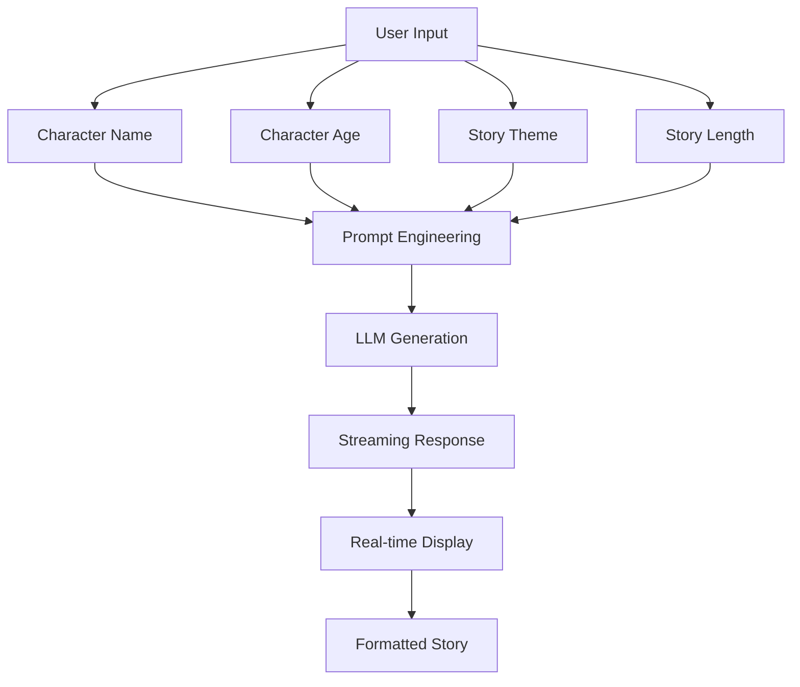

# Bedtime Stories for Kids

Learn prompt engineering and LLM integration by building an AI story generator that creates personalized bedtime stories.

## 🎯 What You'll Learn

**Core LLM Engineering:**
- Prompt engineering techniques
- Streaming responses with Server-Sent Events
- JSON parsing & error handling
- Temperature & token control
- User experience optimization

## 🏗️ Story Generation Flow



## 🚀 Quick Start

```bash
# Start the demo
make dev

# Visit: http://localhost:4020/demos/bedtime-story
```

## 🧠 Learning Experiments

### 1. **Prompt Engineering Impact**
- Try different prompt structures
- Test with/without examples
- **Question**: How does prompt design affect story quality?

### 2. **Temperature & Creativity**
- Set temperature: 0.3, 0.7, 1.0
- Generate stories with same inputs
- **Question**: How does temperature affect creativity vs consistency?

### 3. **Streaming vs Batch**
- Compare streaming experience to waiting
- Test with different story lengths
- **Question**: How does streaming improve user experience?

### 4. **Error Handling**
- Try invalid inputs (empty fields, special characters)
- Test with very long character names
- **Question**: How robust is your error handling?

## 🔧 Configuration

```bash
# .env
GEMINI_API_KEY=your_key_here
# or
OPENAI_API_KEY=your_key_here
```

## 🎓 Key Learning Points

### **Prompt Engineering Techniques:**
1. **Clear Instructions**: Specific, actionable prompts
2. **Structured Output**: Request JSON format for parsing
3. **Length Control**: Use user input to control output
4. **Context Setting**: Include character details for personalization

### **Streaming Implementation:**
- Server-Sent Events (SSE) for real-time updates
- Async generators for word-by-word streaming
- Error handling during streaming
- User feedback during generation

### **Production Considerations:**
- Input validation & sanitization
- Rate limiting & abuse prevention
- Content moderation for child safety
- Performance optimization

## 🧪 Advanced Experiments

### **Challenge 1: Multi-Character Stories**
- **Goal**: Support multiple characters in one story
- **Implementation**:
  - Modify frontend to accept character arrays
  - Update prompts to handle character relationships
  - Add character dialogue and interactions
- **Learning**: Complex prompt engineering

### **Challenge 2: Pre-processing Enhancement**
- **Goal**: Improve input quality before generation
- **Implementation**:
  - Validate and clean user inputs
  - Add age-appropriate content filtering
  - Implement character name suggestions
- **Learning**: Input validation and data quality

### **Challenge 3: Post-processing Pipeline**
- **Goal**: Enhance story quality after generation
- **Implementation**:
  - Add story structure validation
  - Implement readability scoring
  - Add age-appropriate language checking
- **Learning**: Output validation and quality control

### **Challenge 4: Improve Story Quality**
- Add more detailed character descriptions
- Include story structure (beginning, middle, end)
- **Goal**: More engaging, coherent stories

### **Challenge 5: Add Story Variations**
- Generate multiple story options
- Add "surprise me" random theme
- **Goal**: More variety and replayability

### **Challenge 6: Optimize for Speed**
- Reduce max tokens for faster generation
- Implement caching for similar requests
- **Goal**: Generate stories in <10 seconds

### **Challenge 7: Add Safety Features**
- Filter inappropriate content
- Add content warnings
- **Goal**: Child-safe story generation

## 📚 Further Learning

**Essential Reading:**
- [OpenAI Prompt Engineering Guide](https://platform.openai.com/docs/guides/prompt-engineering) - Best practices
- [Anthropic Prompt Engineering](https://docs.anthropic.com/claude/docs/prompt-engineering) - Advanced techniques

**Next Steps:**
- Implement few-shot learning
- Add story continuation features
- Build story rating system
- Add voice narration

## 🚀 Multi-Character Story Challenge

### **Step 1: Frontend Updates**
```typescript
// Add multiple character support
const [characters, setCharacters] = useState<Character[]>([
  { name: '', age: 5, role: 'main' }
]);

interface Character {
  name: string;
  age: number;
  role: 'main' | 'friend' | 'family' | 'pet';
}

// Add character to story
const addCharacter = () => {
  setCharacters([...characters, { name: '', age: 5, role: 'friend' }]);
};
```

### **Step 2: Enhanced Prompting**
```python
def create_multi_character_prompt(characters: List[Character], theme: str) -> str:
    """Create prompt for multiple characters"""
    char_descriptions = []
    for char in characters:
        char_descriptions.append(f"{char['name']} (age {char['age']}, {char['role']})")
    
    prompt = f"""
    Create a bedtime story with these characters: {', '.join(char_descriptions)}
    Theme: {theme}
    
    Requirements:
    - Include dialogue between characters
    - Show character relationships
    - Age-appropriate for youngest character
    - Engaging plot with beginning, middle, end
    """
    return prompt
```

## 🔧 Pre-processing Pipeline Challenge

### **Input Validation**
```python
def validate_story_inputs(data: dict) -> dict:
    """Validate and clean story inputs"""
    validation = {"valid": True, "errors": []}
    
    # Character name validation
    if not data.get('character_name', '').strip():
        validation["errors"].append("Character name is required")
        validation["valid"] = False
    
    # Age validation
    age = data.get('character_age', 0)
    if not (3 <= age <= 12):
        validation["errors"].append("Age must be between 3 and 12")
        validation["valid"] = False
    
    return validation
```

## 🎯 Post-processing Enhancement Challenge

### **Story Quality Validation**
```python
def validate_story_quality(story: str, age: int) -> dict:
    """Validate story quality and appropriateness"""
    validation = {
        "readability_score": 0.0,
        "age_appropriate": True,
        "structure_score": 0.0
    }
    
    # Check readability
    validation["readability_score"] = calculate_readability(story)
    
    # Check age appropriateness
    validation["age_appropriate"] = check_age_appropriateness(story, age)
    
    # Check story structure
    validation["structure_score"] = check_story_structure(story)
    
    return validation
```

## 🤔 Thought Experiments

1. **How would you handle inappropriate content?** What safety measures would you add?
2. **What if users want to continue a story?** How would you maintain context?
3. **How would you personalize stories more?** What additional inputs could you use?
4. **How would you measure story quality?** What metrics would you track?
5. **How would you handle multiple languages?** What localization challenges exist?
6. **What if parents want to customize story themes?** How would you implement that?

## 💡 Prompt Engineering Tips

### **Good Prompt Structure:**
```
1. Context: What you want to create
2. Instructions: How to create it
3. Format: What format to use
4. Examples: Show what good looks like
5. Constraints: What to avoid
```

### **Example Evolution:**
```
❌ Bad: "Write a story about a kid"
✅ Good: "Write a bedtime story for a 5-year-old named Emma about friendship. Make it 3-5 paragraphs with clear moral lesson."
```

---

*This demo teaches you LLM engineering by building something real. Experiment with prompts, break things, and learn what makes AI applications work.*
