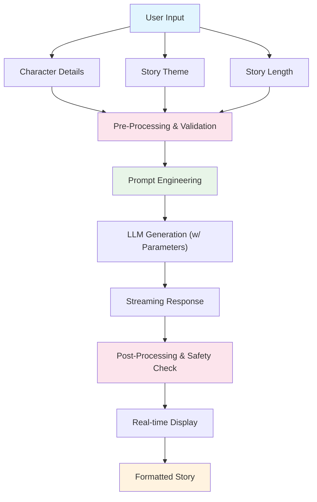

# Bedtime Story Generator

Learn prompt engineering and LLM integration by building an AI story generator that creates personalized bedtime stories.

## Learning Objectives

Master the core concepts of **Large Language Model (LLM) integration** through a hands-on, project-based approach:

- **Prompt Engineering:** Design, test, and refine prompts for consistent, high-quality, and safe outputs.
- **LLM Parameter Control:** Master `temperature`, `max_tokens`, and model selection to balance creativity and coherence.
- **Streaming Response Handling:** Build a fluid, real-time user experience by handling token streams.
- **Application Robustness:** Implement input validation, error handling, and content safety guardrails.
- **LLM Pipelines:** Build pre- and post-processing steps to enhance input quality and generated output.

## System Architecture



## Quick Start

```bash
# Start the demo
make dev

# Visit: http://localhost:4020/demos/bedtime-story
```

-----

## Your Learning Path: Incremental Challenges

Follow these incremental challenges to build your application. Each one adds a new layer of functionality and learning.

### Challenge 1: The First Story (Basic API Call)

**Goal:** Get your first end-to-end story generated, establishing the basic request-response loop.

- **Your Task:**

  1. Wire up the basic UI inputs (e.g., `characterName`, `storyTheme`) to a backend function.

  2. Create a **simple, one-shot prompt** that interpolates the user's input.

     - *Example:* `"Write a short bedtime story about a {characterName} who wants to {storyTheme}."`

  3. Make a standard (non-streaming) API call to the LLM.

  4. Display the entire story at once when it returns.

- **Key Concepts:** Basic API integration, Zero-Shot Prompting.

-----

### Challenge 2: The *Reliable* Story (Prompt Engineering)

**Goal:** Dramatically improve story quality and consistency by engineering a better prompt.

- **Your Task:**

  1. **Refactor your prompt** into a more robust structure.

  2. **Add Role-Setting:** Start the prompt with `"You are a magical bedtime storyteller for children."`

  3. **Give Clear Instructions:** Specify tone, style, length (e.g., "The story should be 3 paragraphs long," "The tone should be uplifting and gentle").

  4. **Use Examples (Few-Shot):** Provide 1-2 examples of a good input/output pair within your prompt to guide the model's structure.

- **Key Concepts:** Prompt Engineering, Role Prompting, Few-Shot vs. Zero-Shot, Instruction Following.

- **Experiment:** Compare the outputs from Challenge 1's prompt to your new prompt. Note the difference in quality, consistency, and tone.

-----

### Challenge 3: The *Creative* Story (Parameter Control)

**Goal:** Understand and control the trade-off between creativity and coherence.

- **Your Task:**

  1. Expose the `temperature` parameter in your API call.

  2. Run the *same* prompt from Challenge 2 three times with different settings:

     - `temperature: 0.2` (Highly consistent, but maybe boring)
     - `temperature: 0.7` (A good balance)
     - `temperature: 1.2` (Highly creative, but may be incoherent or strange)

  3. Observe the differences. Choose a default value that feels right for a "bedtime story."

- **Key Concepts:** **Temperature** (creativity vs. determinism), `max_tokens` (output length), `top_p`.

-----

### Challenge 4: The *Real-Time* Story (Streaming)

**Goal:** Build a modern, engaging user experience by streaming the story in real-time.

- **Your Task:**

  1. Modify your API call to request a **streaming response** (e.g., using Server-Sent Events or async generators).

  2. On the frontend, instead of waiting for the full response, listen for individual tokens (or chunks) as they arrive.

  3. Append the new tokens to the display in real-time, "typing" the story out for the user.

- **Key Concepts:** Streaming vs. Batch processing, Asynchronous JavaScript, User Experience (Perceived Performance).

- **Food for Thought:** Notice how this immediately *feels* faster and more interactive for the user, even if the total generation time is the same.

-----

### Challenge 5: The *Safe* Story (Validation & Guardrails)

**Goal:** Make your application robust and ensure it only generates child-safe content.

- **Your Task (Input Validation):**

  1. Add frontend and backend validation.

  2. Prevent empty submissions.

  3. Limit the length of inputs (e.g., `characterName` < 50 chars). What happens if a user inputs 10,000 characters? (Test this!)

- **Your Task (Content Moderation):**

  1. Add **safety instructions** to your main prompt.

  2. *Example:* `"IMPORTANT: The story must be 100% child-safe. Do NOT include any scary, violent, or inappropriate themes, even if the user requests them."`

  3. Test this by entering "a scary monster" or "a battle" as the theme. Does the LLM obey your safety instruction?

- **Key Concepts:** Input Validation, Sanitization, Content Moderation, Prompt-based Guardrails, Edge Case Testing.

-----

### Challenge 6: The *Complex* Story (Advanced Prompting)

**Goal:** Evolve your prompt to handle more complex user requirements.

- **Your Task:**

  1. Add a new input field to the UI: `secondaryCharacter`.

  2. Update your prompt to **skillfully weave both characters** into the narrative.

  3. Instruct the model to **include dialogue** between the two characters.

- **Key Concepts:** Advanced Prompt Design, Handling multiple inputs, Dialogue Generation, State Management.

-----

### Challenge 7: The *Polished* Story (Pre- & Post-processing)

**Goal:** Implement a full pipeline to clean inputs *before* the LLM call and validate outputs *after*.

- **Your Task (Pre-processing):**

  1. Before building the prompt, automatically enhance the user's input.

  2. *Example:* If a user enters `theme: "friends"`, your code could transform it to `theme: "a story about the value of friendship"`.

- **Your Task (Post-processing):**

  1. After receiving the full, streamed story, run a check on it.

  2. *Example:* Does the story end with a complete sentence? If not (due to `max_tokens`), can you either filter it or (as an advanced step) make a second, smaller LLM call to "write a conclusion for this story"?

- **Key Concepts:** LLM Pipelines, Pre-processing, Post-processing, Output Validation, Chaining LLM calls.

-----

### Challenge 8 (Bonus): The *Continuing* Story (Context & Memory)

**Goal:** Add a "memory" to your application so users can continue their story.

- **Your Task:**

  1. Add a "Continue Story" button to the UI after a story is generated.

  2. When pressed, make a new API call.

  3. This time, your prompt must include the **entire previously generated story** as context, followed by an instruction like `"Now, write the next chapter of this story."`

- **Key Concepts:** Context Window Management, Chat History, Maintaining State.

- **Challenge:** What happens when the story gets too long for the model's context window? How would you handle that? (This leads to concepts like summarization and RAG).

## Configuration

```bash
# .env
FIREWORKS_API_KEY=your_key_here
FIREWORKS_MODEL=accounts/fireworks/models/qwen3-235b-a22b-instruct-2507
# or
GEMINI_API_KEY=your_key_here
# or
OPENAI_API_KEY=your_key_here
```

## Critical Thinking Questions

1. **How would you handle inappropriate content?** What *other* safety measures could you add?
2. **How would you personalize stories more?** What *additional* inputs could you use?
3. **How would you measure story quality?** What metrics would you track?
4. **How would you handle multiple languages?** What localization challenges exist?
5. **What if parents want to customize story themes?** How would you implement that?

## Further Learning

**Essential Reading:**

- [OpenAI Prompt Engineering Guide](https://platform.openai.com/docs/guides/prompt-engineering) - Best practices
- [Anthropic Prompt Engineering](https://docs.anthropic.com/claude/docs/prompt-engineering) - Advanced techniques

**Next Steps:**

- Implement a "save" or "favorite" story feature.
- Build a story rating system (e.g., thumbs up/down) to collect data.
- Add voice narration using a Text-to-Speech (TTS) API.
- Explore multi-modal generation (e.g., using DALL-E or Midjourney to create a cover image for the story).
