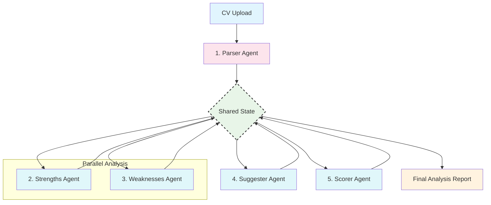

# CV Analyzer

Learn agentic patterns and multi-agent orchestration by building an AI-powered system that analyzes CVs and provides actionable improvement suggestions.

## Learning Objectives

Master the fundamentals of **Agentic AI** and **Workflow Orchestration** through hands-on implementation:

- **Agent Design:** Create specialized, single-purpose agents for tasks (e.g., parsing, analysis, scoring).
- **Stateful Workflows:** Use **LangGraph** to manage a `state` object that agents read from and write to.
- **Orchestration & Routing:** Build a graph of nodes (agents) and edges (transitions) to control the flow of analysis.
- **Task Decomposition:** Learn why breaking a large problem into smaller, agentic steps improves quality, cost, and maintainability.
- **Context-Aware Analysis:** Incorporate external context (like a job description) into your agentic workflow.

## System Architecture (Final Target)

This is the final multi-agent system you will build. Each "Agent" is a node in a LangGraph workflow that operates on a shared `state` object.



## Quick Start

```bash
# Start the demo
make dev

# Visit: http://localhost:4020/demos/cv-analyzer
```

-----

## Your Learning Path: Incremental Challenges

Follow these incremental challenges to build your application. Each one adds a new layer of agentic complexity.

### Challenge 1: The Monolith (Single Prompt)

**Goal:** Establish a baseline and understand the limitations of a single, "do-it-all" prompt.

- **Architecture:**

  ```mermaid
  graph TD
      A["CV Document"] --> B["Parse Raw Text"]
      B --> C["Single 'God' Prompt"]
      C --> D["LLM Call"]
      D --> E["Full Analysis (String)"]
      style A fill:#e1f5fe
      style C fill:#e8f5e8
      style E fill:#fff3e0
  ```

- **Your Task:**

  1. Implement file upload for a `.pdf` or `.txt` CV.

  2. Use a library (like `pypdf`) to extract the **raw text** into a single string.

  3. Create one massive "monolithic" prompt that asks the LLM to do *everything*:

     - `"Analyze this CV text. Identify strengths, find weaknesses, suggest improvements, and give a score from 1-100."`

  4. Send this to the LLM and display the raw string response.

- **Experiment:** Try this with 3 different CVs (one good, one bad, one weirdly formatted).

- **Observation:** Notice how inconsistent the output is. The formatting is unreliable, the quality is mediocre, and the LLM struggles to do all tasks well at once. You have no control over the process.

-----

### Challenge 2: The Specialist (First Agents)

**Goal:** Improve quality by decomposing the problem into specialized, single-purpose prompts. This is the first step toward an agentic mindset.

- **Architecture:**

  ```mermaid
  graph TD
      A["CV Raw Text"] --> B["Agent 1: Get Strengths"]
      A --> C["Agent 2: Get Weaknesses"]
      A --> D["Agent 3: Get Suggestions"]
      B --> E["Strength Analysis"]
      C --> F["Weakness Analysis"]
      D --> G["Suggestions List"]
      subgraph Sequential["Sequential, Unrelated Calls"]
          B
          C
          D
      end
      style A fill:#e1f5fe
      style B fill:#e8f5e8
      style C fill:#e8f5e8
      style D fill:#e8f5e8
  ```

- **Your Task:**

  1. **Do not use LangGraph yet.**

  2. Create 3 separate functions, each with its own specialized prompt and its own LLM call:

     - `analyze_strengths(text)`: `"Based on this CV, list the key professional strengths."`

     - `analyze_weaknesses(text)`: `"Based on this CV, list the primary weaknesses or areas for improvement."`

     - `get_suggestions(text)`: `"Based on this CV, provide a list of actionable suggestions."`

  3. Call these functions *sequentially* (one after the other) and manually combine their string outputs for the user.

- **Observation:** The quality of each *part* of the analysis is much higher. But it's slow (3 full API calls) and inefficient, as each agent is re-reading the entire raw text. The agents are "unaware" of each other.

-----

### Challenge 3: The Workflow (Intro to LangGraph)

**Goal:** Introduce orchestration. Create a formal **state** and a **graph** to pass information between agents, avoiding redundant work.

- **State Definition:** First, define your graph's `state`. This is the shared "memory" for your agents.

  ```python
  class CvAnalysisState(TypedDict):
      raw_text: str             # The input CV text
      strengths: list[str]      # Output of strengths_agent
      weaknesses: list[str]     # Output of weaknesses_agent
      suggestions: list[str]    # Output of suggestions_agent
      score: int                # Output of scorer_agent
  ```

- **Architecture:**

  ```mermaid
  graph TD
      A(Start) --> B["Agent: Get Strengths"]
      B --> C{Shared State}
      C --> D["Agent: Get Weaknesses"]
      D --> C
      C --> E["Agent: Get Suggestions"]
      E --> C
      C --> F(End)
      style C fill:#e8f5e8,stroke:#333,stroke-width:2px,stroke-dasharray: 5 5
      style B fill:#e0f7fa
      style D fill:#e0f7fa
      style E fill:#e0f7fa
  ```

- **Your Task:**

  1. Refactor your Challenge 2 functions into **LangGraph nodes**.

  2. Each node will now:

     - Take the `state` as input.

     - Read `state["raw_text"]` to perform its analysis.

     - Return a dictionary to **update** the state (e.g., `{"strengths": ["...", "..."]}`).

  3. Define a `StateGraph` using your `CvAnalysisState`.

  4. Add your agent nodes and create **edges** to connect them in a simple sequence: `Strengths` -> `Weaknesses` -> `Suggestions`.

- **Observation:** You now have a true, traceable workflow! You can see the state evolve. However, the agents still only read the raw text. And `Suggestions` could be better if it knew what the `Weaknesses` were.

-----

### Challenge 4: The *Smart* Workflow (Agent Collaboration)

**Goal:** Make agents truly collaborate by reading from and writing to the shared state.

- **Your Task:**

  1. **Upgrade your agents** to be state-aware.

  2. **`strengths_agent`:** Reads `state["raw_text"]`, writes to `state["strengths"]`.

  3. **`weaknesses_agent`:** Reads `state["raw_text"]`, writes to `state["weaknesses"]`.

  4. **`suggester_agent` (The Upgrade):**

     - Now reads `state["weaknesses"]` (instead of the full text).

     - Its new prompt is: `"For each of the following weaknesses, provide an actionable suggestion:\n{weaknesses_list}"`

  5. **Add a new `scorer_agent`:**

     - Reads `state["strengths"]` and `state["weaknesses"]`.

     - Prompt: `"Based on these strengths {strengths_list} and weaknesses {weaknesses_list}, give a score from 1-100."`

     - Writes to `state["score"]`.

- **Observation:** This is a *massive* leap in quality and efficiency. Your `suggester_agent` is now highly focused and its output is directly tied to the `weaknesses_agent`. Your agents are *collaborating*.

-----

### Challenge 5: The Parser Agent (Structured Data)

**Goal:** Stop passing raw text. Add a "Parser Agent" as the *first* step to convert the unstructured CV into structured JSON, making all downstream agents faster, cheaper, and more reliable.

- **New State Definition (v2):**

  ```python
  class CvData(TypedDict):
      name: str
      email: str
      summary: str
      experience: list[str]
      education: list[str]
      skills: list[str]

  class CvAnalysisState(TypedDict):
      raw_text: str
      cv_data: CvData           # NEW: Structured data
      job_description: str      # For the next challenge
      # ... (strengths, weaknesses, etc.)
  ```

- **Architecture:**

  ```mermaid
  graph TD
      A(Start) --> B["Agent: Parser"]
      B --> C{Shared State}
      C --> D["Agent: Strengths"]
      D --> C
      C --> E["Agent: Weaknesses"]
      E --> C
      C --> F(End)
      style B fill:#fce4ec
      style C fill:#e8f5e8,stroke:#333,stroke-width:2px,stroke-dasharray: 5 5
  ```

- **Your Task:**

  1. Create a new **`parser_agent`** as the *very first node* in your graph.

  2. This agent's prompt is a "structured data extractor":

     - `"Extract the following information from the CV text into a JSON object: name, email, summary, experience (as a list), education (as a list), skills (as a list).\n\n{raw_text}"`

  3. It reads `state["raw_text"]` and writes to `state["cv_data"]`.

  4. **Refactor all other agents** (`strengths`, `weaknesses`) to read from the *clean* `state["cv_data"]` object instead of `state["raw_text"]`. Their prompts will be much simpler and cheaper (e.g., `"Analyze this 'Experience' section: {experience_list}"`).

- **Observation:** Your agents are now dramatically more reliable. They operate on clean, structured data, not messy text. Your LLM calls are smaller, faster, and cost less.

-----

### Challenge 6: The Context-Aware Graph (Job Matching)

**Goal:** Make the analysis dynamic by adding external context (a job description).

- **Your Task:**

  1. Add a `job_description` string to your graph's `state` (provided by the user at the start).

  2. **Upgrade all your agents** to be context-aware:

     - `parser_agent`: No change.

     - `strengths_agent`: New Prompt -> `"Compare the CV data {cv_data} against the job description {job_description}. What are the candidate's biggest strengths *for this specific job*?"`

     - `weaknesses_agent`: New Prompt -> `"Compare the CV data {cv_data} against the job description {job_description}. What key requirements are *missing* from the CV?"`

     - `scorer_agent`: New Prompt -> `"Based on this comparison, score the CV's fit for the job from 1-100."`

- **Experiment:** Analyze the same CV with two different job descriptions (e.g., "Senior Python Developer" vs. "Junior Project Manager"). The *entire analysis* should change.

-----

### Challenge 7: The Parallel Graph (Optimization)

**Goal:** Optimize for speed and cost by running independent agents in parallel.

- **Architecture:**

  ```mermaid
  graph TD
      A(Start) --> B["Agent: Parser"]
      B --> C{Shared State}
      subgraph Parallel["Run in Parallel"]
          direction TB
          D["Agent: Strengths"]
          E["Agent: Weaknesses"]
          G["Agent: Format-Checker"]
      end
      C --> D
      C --> E
      C --> G
      D --> F{Join}
      E --> F
      G --> F
      F --> H["Agent: Suggester"]
      H --> I["Agent: Scorer"]
      I --> J(End)
      style C fill:#e8f5e8,stroke:#333,stroke-width:2px,stroke-dasharray: 5 5
      style F fill:#e8f5e8,stroke:#333,stroke-width:2px,stroke-dasharray: 5 5
  ```

- **Your Task:**

  1. Identify agents that *do not* depend on each other. `strengths_agent` and `weaknesses_agent` are perfect examples—both only need `cv_data` and `job_description`.

  2. Refactor your LangGraph workflow. After the `parser_agent` runs, create **conditional edges** or a "branch" that executes `strengths_agent` and `weaknesses_agent` **in parallel**.

  3. Create a "join" node that waits for *both* to finish before proceeding to the `suggester_agent` and `scorer_agent` (which need their outputs).

- **Observation:** Your total analysis time is significantly reduced, as your two most expensive analysis steps now run at the same time.

## Configuration

```bash
# .env
FIREWORKS_API_KEY=your_key_here
FIREWORKS_MODEL=accounts/fireworks/models/qwen3-235b-a22b-instruct-2507
# or
GEMINI_API_KEY=your_key_here
# or
OPENAI_API_KEY=your_key_here
```

## Key Agentic AI Concepts

### **What You'll Discover:**

1. **Task Decomposition:** Breaking a giant, complex prompt (Challenge 1) into specialized agents (Challenge 2) is the single most important step for improving quality and reliability.
2. **Stateful Orchestration:** A shared `state` object (Challenge 3) is the "brain" or "memory" of your operation. Agents collaborate *through* this state, not by talking to each other directly.
3. **The Parser Agent Pattern:** Using an agent as the *first step* to convert unstructured text into structured JSON (Challenge 5) is a fundamental pattern. It cleans the data for all other agents, making them cheaper and more accurate.
4. **Agentic Collaboration:** True agentic behavior emerges when one agent's output (`weaknesses_agent`) becomes the *direct input* for another agent (`suggester_agent`), as in Challenge 4.
5. **Parallelism:** Orchestration graphs (Challenge 7) unlock performance gains by letting you run independent tasks simultaneously, just like in a traditional data pipeline.

## Critical Thinking Questions

1. **How would you handle partial failures?** If the `strengths_agent` succeeds but the `weaknesses_agent` fails, what should your graph do? Should it stop? Should it try again? Should it continue and just report a partial analysis?
2. **How would you optimize costs?** What if the `parser_agent` determines the CV is for a "Chef," but the job is for a "Software Engineer"? Could you add a *conditional edge* to stop the graph early and save money?
3. **How would you handle human-in-the-loop?** What if the `parser_agent` isn't sure about the "Experience" section? How would you build a step in your graph to *pause*, ask the user for clarification, and then *resume*?
4. **How would you handle conflicting agents?** What if a (hypothetical) `FormatAgent` says "Summary is too long" but the `StrengthsAgent` says "Summary is detailed and a key strength"? How would a "Supervisor" agent resolve this conflict?
5. **How would you scale this?** What breaks when you try to analyze 1,000 CVs? (Hint: The in-memory state. You'd need a persistent checkpoint-saving backend, which LangGraph supports).

## Further Learning

**Essential Reading:**

- [LangGraph Documentation](https://langchain-ai.github.io/langgraph/) - The official docs on state, nodes, and edges.
- [LangChain Multi-Agent Systems](https://python.langchain.com/docs/use_cases/multi_agent/) - Patterns for building complex agent teams.

**Next Steps:**

- Implement **Human-in-the-Loop:** Add a `WaitForHumanInput` node.
- Add **Agentic Reflection:** Create an "AnalyzerCritic" agent that reads the *entire* state and writes a final "meta-review" of the other agents' work.
- Implement **Persistent State:** Add a database (like SQLite or Postgres) as a checkpointer so your graphs can be paused and resumed.
- Explore **Hierarchical Agents:** Build a "Supervisor" agent that, based on the `cv_data`, *decides* which specialist agents to run (e.g., "This is a tech CV, so run the `TechSkillAgent`. This is a design CV, run the `PortfolioAgent`.").
