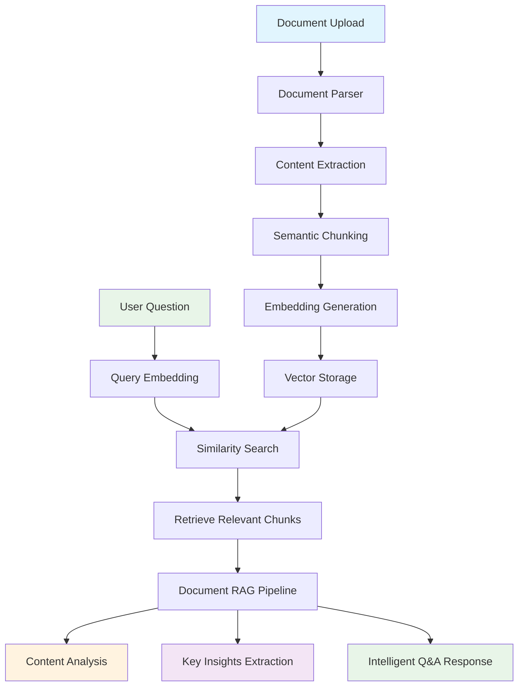

# Document QA Chatbot

Learn document processing and AI-powered Q&A by building a system that analyzes any document type for insights and answers questions intelligently.

## 🎯 Learning Objectives

Master the fundamentals of **Document Analysis & Q&A** through hands-on implementation:

- **Universal Document Parsing** - Parse various document types (PDF, Word, text) with different structures
- **Intelligent Content Analysis** - Extract key insights and important information from any document
- **Smart Q&A System** - Build RAG pipelines for document-specific question answering
- **Content Summarization** - Generate summaries and identify key points
- **Multi-Format Support** - Handle different document formats and structures

## 🏗️ System Architecture



## 🚀 Quick Start

```bash
# Start the demo
make dev

# Visit: http://localhost:4020/demos/document-qa-chatbot
```

## 🧪 Learning Challenges

### **Challenge 1: Document Parsing Quality**
**Goal**: Understand how parsing affects Q&A accuracy across document types

**Experiment**:
- Test with PDF, Word, and text documents
- Compare parsing accuracy for different content structures
- Analyze how parsing quality impacts answer quality

**Question**: How does document parsing quality affect Q&A accuracy across different document types?

### **Challenge 2: Chunking Strategy Impact**
**Goal**: Compare different chunking approaches for document analysis

**Experiment**:
- Test semantic vs fixed-size chunking
- Compare chunk overlap strategies
- Analyze context preservation across chunks

**Question**: What chunking strategy works best for different types of documents and questions?

### **Challenge 3: RAG vs Direct LLM Performance**
**Goal**: Compare document-specific RAG with general LLM responses

**Experiment**:
- Ask questions about uploaded document content
- Compare RAG responses with ChatGPT responses
- Test accuracy and specificity of answers

**Question**: When does document RAG outperform general LLM for document-specific questions?

### **Challenge 4: Multi-Document Analysis**
**Goal**: Handle questions across multiple uploaded documents

**Experiment**:
- Upload multiple related documents
- Ask questions that span across documents
- Test cross-document information retrieval

**Question**: How can you effectively analyze and answer questions across multiple documents?

## 🔧 Configuration

```bash
# .env
FIREWORKS_API_KEY=your_key_here
FIREWORKS_MODEL=accounts/fireworks/models/qwen3-235b-a22b-instruct-2507
EMBEDDING_MODEL=all-MiniLM-L6-v2  # Fast & cheap
```

## 🎓 Key Document AI Concepts

### **What You'll Discover:**
1. **Document Diversity** - Different document types require different processing approaches
2. **Content Structure** - How document structure affects information extraction
3. **Context Preservation** - Maintaining context across document chunks
4. **Answer Quality** - Balancing accuracy with comprehensiveness
5. **Source Attribution** - Properly citing document sources in responses

### **Production Considerations:**
- Document security and privacy
- Performance optimization for large documents
- Error handling for parsing failures
- Multi-format document support
- Scalable document storage and retrieval

## 🚀 Advanced Challenges

### **Challenge 5: Document Summarization**
**Goal**: Generate intelligent summaries of uploaded documents

**Learning Focus**: Abstractive vs extractive summarization, key point identification, and summary quality evaluation.

### **Challenge 6: Cross-Document Comparison**
**Goal**: Compare information across multiple documents

**Learning Focus**: Document similarity analysis, information synthesis, and comparative insights generation.

### **Challenge 7: Document Classification**
**Goal**: Automatically classify and categorize uploaded documents

**Learning Focus**: Document type detection, content categorization, and metadata extraction.

### **Challenge 8: Real-time Document Updates**
**Goal**: Handle dynamic documents that change over time

**Learning Focus**: Incremental processing, change detection, and maintaining consistency across updates.

## 🤔 Critical Thinking Questions

1. **What if the document is in a different language?** How would you handle multilingual document analysis?
2. **How would you handle very large documents?** What strategies would you use for scalability?
3. **What if the document contains sensitive information?** How would you ensure privacy and security?
4. **How would you measure document analysis quality?** What metrics matter most for Q&A systems?
5. **What if the document is corrupted or incomplete?** How would you handle edge cases?
6. **How would you handle documents with images, tables, or complex formatting?** What parsing strategies would you use?

## 📚 Further Learning

**Essential Reading:**
- [Document Processing Best Practices](https://docs.unstructured.io/) - Advanced document parsing
- [RAG System Design](https://docs.langchain.com/) - Building robust RAG pipelines

**Next Steps:**
- Implement document-specific embedding models
- Add multi-language document support
- Build document comparison features
- Scale with document databases
- Add real-time document processing

---

*This demo teaches you document AI by doing. Experiment with different document types, break things, and learn what makes document Q&A systems work effectively.*
