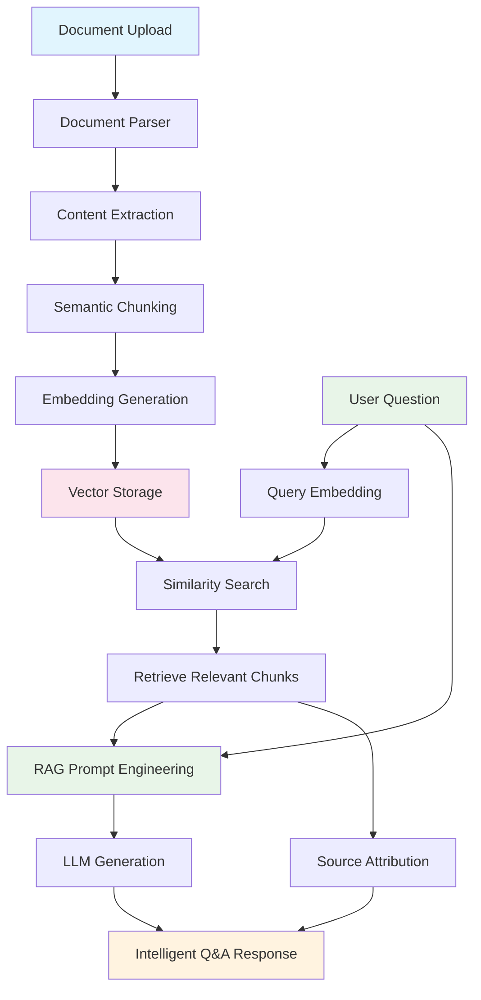

# Document QA Chatbot

Learn document processing and AI-powered Q&A by building a system that analyzes any document type for insights and answers questions intelligently.

## Learning Objectives

Master the fundamentals of **Retrieval-Augmented Generation (RAG)** and document analysis through hands-on implementation:

- **Universal Document Parsing:** Process various document types (PDF, Word, text).
- **Text Pre-processing:** Implement effective text splitting and chunking strategies.
- **Vector Embeddings:** Convert text chunks into semantic vector representations.
- **Vector Storage & Retrieval:** Build and query a vector index to find relevant information.
- **RAG Pipeline:** Construct a full Q&A pipeline that combines retrieved context with an LLM prompt.
- **Source Attribution:** Make your chatbot trustworthy by citing its sources.

## System Architecture



## Quick Start

```bash
# Start the demo
make dev

# Visit: http://localhost:4020/demos/document-qa-chatbot
```

-----

## Your Learning Path: Incremental Challenges

Follow these incremental challenges to build your application. Each one adds a new layer of functionality and learning.

### Challenge 1: The "Naive" Q&A (Basic Parsing)

**Goal:** Get your first end-to-end answer, but see *why* RAG is necessary.

- **Your Task:**

  1. Implement file upload for a **simple `.txt` file** only.

  2. Read the *entire* text content of the file into a single string.

  3. Create a **simple prompt** that "stuffs" the entire document text into the context, along with the user's question.

     - *Example:* `"Here is a document:\n---{document_text}---\n\nBased on this document, answer the following question:\n{user_question}"`

  4. Send this to the LLM and display the answer.

- **Experiment:** Try uploading a document that is *longer* than the LLM's context window (e.g., a 50-page text file). What happens? You've just discovered the core problem that RAG solves.

- **Key Concepts:** Basic File I/O, LLM Context Window, Prompt Engineering.

-----

### Challenge 2: The "Universal" Parser (Handling Any File)

**Goal:** Ingest and extract clean text from multiple common file types.

- **Your Task:**

  1. Integrate a document parsing library (e.g., `unstructured.io` or a combination of `PyPDF2` and `python-docx`).

  2. Update your ingestion logic to handle `.pdf`, `.docx`, and `.txt` files.

  3. Ensure the output is always clean, extracted text, regardless of the input file type.

- **Key Concepts:** Document Parsing, Content Extraction, Handling MIME types, Library Integration.

-----

### Challenge 3: Building the "Brain" (Chunking & Embedding)

**Goal:** Implement the "R" (Retrieval) part of RAG by creating a searchable vector index.

- **Your Task:**

  1. Take the extracted text from Challenge 2 and implement a **text chunking strategy** (e.g., `RecursiveCharacterTextSplitter` with a set chunk size and overlap).

  2. Using the `EMBEDDING_MODEL`, generate a **vector embedding** for every single chunk.

  3. Store these embeddings in a simple **in-memory vector store** (like FAISS, ChromaDB in-memory, or even a simple NumPy array). This is your document's "memory."

- **Key Concepts:** Text Chunking (Splitting), Embedding Models, Vector Databases, In-memory Indexing.

-----

### Challenge 4: The *Smart* Answer (Full RAG Pipeline)

**Goal:** Connect your retrieval system to the LLM to generate context-aware answers.

- **Your Task:**

  1. When a user asks a question, first generate an embedding for the **question itself**.

  2. Perform a **similarity search** with the question's embedding against your vector store to find the `top-k` (e.g., top 3) most relevant text chunks.

  3. **Engineer a RAG prompt:** Create a new prompt that includes *only* these relevant chunks as context.

     - *Example:* `"Use the following pieces of context to answer the question. If you don't know the answer from the context, say so.\n\nContext:\n{chunk_1}\n{chunk_2}\n\nQuestion: {user_question}"`

  4. Send this *new prompt* to the LLM and display the answer.

- **Key Concepts:** RAG Pipeline, Similarity Search (`k-NN`), RAG Prompt Engineering.

-----

### Challenge 5: The *Better* Answer (Optimizing RAG)

**Goal:** Improve the quality and relevance of your RAG pipeline by tuning its components.

- **Your Task:**

  1. **Experiment with Chunking:** Change your chunking strategy. What happens if the `chunk_size` is very small (like 100 chars)? What if it's very large (2000 chars)? What about `chunk_overlap`?

  2. **Experiment with Retrieval:** Change the number of retrieved chunks (`k`). What is the difference in the final answer between `k=1` and `k=10`?

  3. Observe how these parameters create a trade-off between **context precision** (small, focused chunks) and **context completeness** (large, broad chunks).

- **Key Concepts:** Hyperparameter Tuning, Chunking Strategies, Precision vs. Recall.

-----

### Challenge 6: The *Trustworthy* Answer (Source Attribution)

**Goal:** Make your chatbot trustworthy by showing the user *where* in the document it found the answer.

- **Your Task:**

  1. When you create your chunks (Challenge 3), add **metadata** to them (e.g., `source: "my_doc.pdf"`, `page_number: 5`, or `chunk_id: 12`).

  2. After the LLM generates an answer (Challenge 4), retrieve the metadata from the `top-k` chunks that were used as context.

  3. Display this metadata alongside the answer (e.g., "This answer was based on content from `my_doc.pdf`, page 5.").

- **Key Concepts:** Metadata, Source Attribution, Verifiability, Trust & Safety.

-----

### Challenge 7: The *Summarizer* (Beyond Q&A)

**Goal:** Re-use your RAG components to add a new, powerful feature: document summarization.

- **Your Task:**

  1. Add a "Summarize Document" button to your UI.

  2. Instead of running the Q&A pipeline, implement a **summarization pipeline**.

  3. A common pattern is "Map-Reduce":

     - **Map:** Send *each* text chunk to the LLM with a prompt like `"Summarize this text: {chunk}"`.

     - **Reduce:** Take all the individual chunk summaries and send them *together* to the LLM in a final prompt: `"Summarize these summaries: {all_chunk_summaries}"`.

- **Key Concepts:** Summarization, LLM Chains, Map-Reduce, Batch Processing.

-----

### Challenge 8 (Bonus): The *Multi-Doc* Chatbot (Advanced RAG)

**Goal:** Scale your system to allow the user to upload and chat with *multiple* documents at once.

- **Your Task:**

  1. Allow the user to upload multiple documents, which all feed into the *same* vector store.

  2. Ensure your chunk metadata (Challenge 6) clearly identifies **which document** each chunk came from.

  3. When you perform the similarity search, it will now retrieve chunks from *any* of the uploaded documents.

  4. Your RAG prompt and source attribution logic should work seamlessly, pulling context and citing sources from across the entire document collection.

- **Key Concepts:** Multi-document RAG, Scalable Vector Stores, Metadata Filtering.

## Configuration

```bash
# .env
FIREWORKS_API_KEY=your_key_here
FIREWORKS_MODEL=accounts/fireworks/models/qwen3-235b-a22b-instruct-2507
EMBEDDING_MODEL=all-MiniLM-L6-v2  # Fast & cheap
```

## Key Document AI Concepts

### **What You'll Discover:**

1. **Parsing is Hard:** Different document types (especially PDFs) have complex structures (tables, images) that make text extraction a major challenge.
2. **Chunking is an Art:** Your chunking strategy is one of the *most important* factors for RAG quality.
3. **Context is Everything:** The quality of the retrieved chunks directly determines the quality of the LLM's answer. Garbage in, garbage out.
4. **RAG vs. Fine-Tuning:** RAG is for providing *knowledge* at query-time. Fine-tuning is for teaching *skills* or *style* at training-time.
5. **Source Attribution Builds Trust:** Users will not trust a "black box" answer. Citing sources is non-negotiable for production systems.

### **Production Considerations:**

- Document security, privacy, and access control.
- Performance optimization for large documents (e.g., using a real database, async processing).
- Error handling for parsing failures or corrupted documents.
- Scalable and persistent vector storage (e.g., Pinecone, Weaviate, managed Chroma).
- Handling images, tables, and other complex document elements (Multi-modal RAG).

## Critical Thinking Questions

1. **What if the document is in a different language?** How would you handle multilingual document analysis?
2. **How would you handle very large documents (e.g., a 1,000-page book)?** What strategies would you use for scalability beyond an in-memory store?
3. **What if the document contains sensitive information (PII)?** How would you ensure privacy and security?
4. **How would you measure the *quality* of your RAG system?** What metrics matter most?
5. **What if the document is corrupted or is a scanned image (not text)?** How would you handle these edge cases?
6. **How would you handle tables?** A simple text chunk will destroy a table's structure. What's a better approach?

## Further Learning

**Essential Reading:**

- [Unstructured.io Docs](https://docs.unstructured.io/) - Advanced document parsing
- [LangChain RAG Docs](https://python.langchain.com/docs/use_cases/question_answering/) - Building robust RAG pipelines

**Next Steps:**

- Implement a persistent vector database (like Chroma or Weaviate).
- Add support for Optical Character Recognition (OCR) for scanned images (e.g., using `pytesseract`).
- Build a "chat history" so the LLM can remember the last few questions.
- Explore more advanced RAG techniques like re-ranking.
