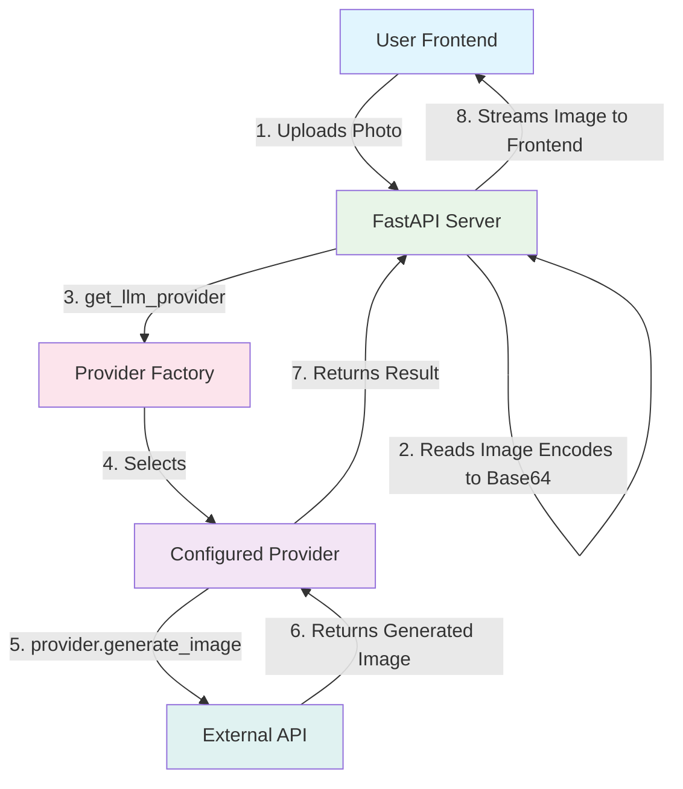
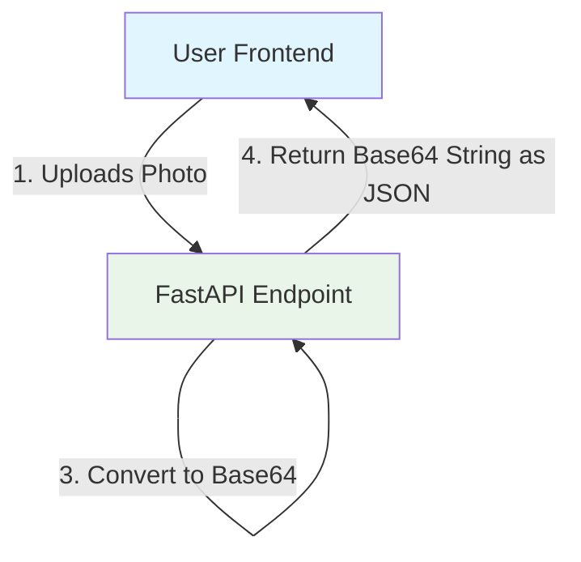
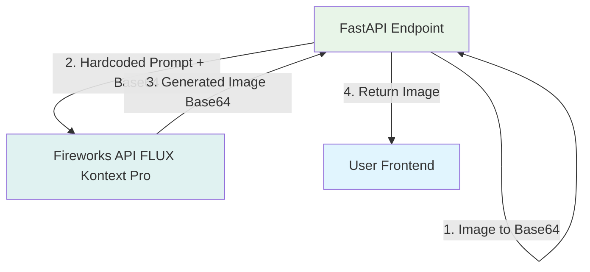
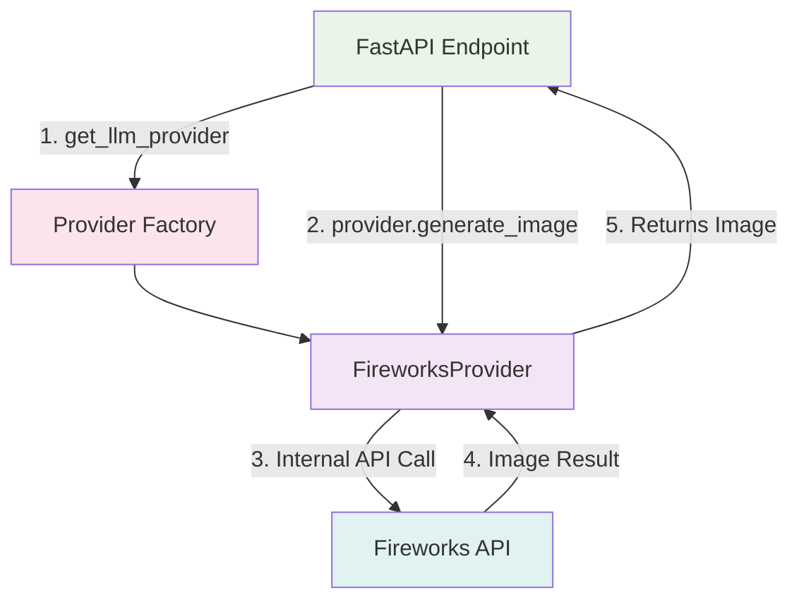
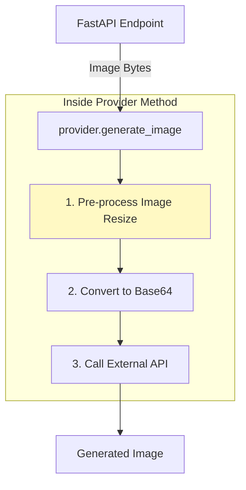

# Image to Coloring Book Converter

Learn image-to-image generation using LLM providers by building a tool that converts any photo into a coloring book page.

## Learning Objectives

Master the fundamentals of **Image-to-Image Generation** through hands-on implementation:

- **Image API Calls:** How to send and receive image data (like Base64) to an LLM provider
- **Provider Pattern:** How to use the `llm_provider` system to interact with different image generation models (FLUX, GPT Image)
- **Prompt Engineering for Images:** How to write prompts that control the style of an output image based on an input image
- **Image Pre/Post-processing:** How to resize, format, and optimize images for API calls to save costs and improve results
- **Provider Extension:** How to add new capabilities (like `generate_image`) to the provider classes

## System Architecture (Final Target)

This is the final system you will build. The FastAPI server uses the Provider Pattern to select the correct LLM API (like Fireworks or OpenAI) to perform the image-to-image conversion.



## Quick Start

```bash
# Start the demo
make dev

# Visit: http://localhost:4020/demos/image-to-drawing
```

## Configuration

```bash
# .env
# Option 1: Use Fireworks AI FLUX Kontext Pro model (recommended for image-to-image)
FIREWORKS_API_KEY=your_fireworks_api_key
IMAGE_MODEL=accounts/fireworks/models/flux-kontext-pro

# Option 2: Use OpenAI GPT Image 1
# OPENAI_API_KEY=your_openai_key
# IMAGE_MODEL=gpt-image-1
```

**Note:** Currently, only Fireworks AI (FLUX Kontext Pro) and OpenAI (GPT Image 1) are fully supported for image generation in the demo. Implementing other providers is part of your learning path!

## Your Learning Path: Incremental Challenges

Follow these incremental challenges to build your application. Each one adds a new layer of functionality and learning.

### Challenge 1: The "Echo" API (File Upload & Base64)

**Goal:** Get the core API running. Accept an image, process it into the required format (Base64), and send it back.

**Architecture:**



**Your Task:**

1. Create a FastAPI endpoint that accepts an image file upload
2. Add validation to ensure the file is a valid image type (e.g., `image/jpeg`, `image/png`, `image/webp`) and not too large (e.g., < 10MB)
3. Read the image's bytes and convert it to a Base64 encoded string
4. Return a JSON response containing the Base64 string and the content type

**Key Concepts:** FastAPI `UploadFile`, File Validation, Base64 Encoding, API Data Preparation

**Observation:** You now have the "input" side of your application working. The Base64 string you just generated is the exact format you'll need to send to the LLM APIs.

---

### Challenge 2: The First Conversion (Monolithic Call)

**Goal:** Get your first end-to-end coloring book page! Hardcode a direct call to the Fireworks API, bypassing the provider pattern for now.

**Architecture:**



**Your Task:**

1. Inside your endpoint, after you have the Base64 string (from Challenge 1), create a hardcoded prompt: "Convert the provided input image into a coloring book sketch. Keep the exact same image - same subjects, same composition, same layout. Transform it to black line art on white background only. Remove all colors and shading. Keep the image identical, just as a coloring book sketch."
2. Use the `aiohttp` library to make a direct call to the Fireworks workflow endpoint
3. You will need to pass your `FIREWORKS_API_KEY`, the `IMAGE_MODEL`, the `prompt`, and your `base64_image` in the format `data:image/{format};base64,{base64_image}`
4. Handle the async workflow pattern: submit request, get `request_id`, poll `/get_result` until status is "Ready", "Complete", or "Finished"
5. Get the resulting image from the API's response (it may be a URL or Base64) and return it to the frontend

**Key Concepts:** Image-to-Image (img2img), External API Calls, `aiohttp` library, Async Workflows, Prompt Engineering (for images)

**Observation:** It works! You've proven the core concept. However, the code is hardcoded, messy, and only works for one provider. Now, let's refactor it.

---

### Challenge 3: The Refactored Provider

**Goal:** Move your hardcoded logic into the proper `llm_provider` pattern, making your system clean and extensible.

**Architecture:**



**Your Task:**

1. Open `llm_provider.py` and find the `FireworksAIProvider` class
2. The `generate_image` method should already exist - verify it uses the workflow endpoint with async polling
3. In your FastAPI endpoint, delete the hardcoded logic
4. Replace it with:
   - `provider = get_llm_provider()`
   - `result_image = await provider.generate_image(image_bytes, prompt)`

**Key Concepts:** Provider Pattern, Refactoring, Abstraction, Class Methods, `NotImplementedError`

**Observation:** Your endpoint is now clean and simple. All the complexity is hidden inside the provider. If you try to run this with `OPENAI_API_KEY` set, it should work with OpenAI's implementation... let's verify that.

---

### Challenge 4: The Alternative Provider (OpenAI)

**Goal:** Make your application work with a second provider, OpenAI's GPT Image 1, by verifying its `generate_image` method works correctly.

**Your Task:**

1. Open `llm_provider.py` and find the `OpenAIProvider` class
2. Verify the `generate_image` method is implemented using `client.images.edit()`
3. The OpenAI API requires the original image (as bytes) and a `prompt`
4. Switch your `.env` file to use `OPENAI_API_KEY` and `IMAGE_MODEL=gpt-image-1`
5. Re-run your app. It should now work using GPT Image 1 instead of Fireworks, with no changes to your FastAPI endpoint logic

**Key Concepts:** Provider Extensibility, Reading API Documentation, Adapting to Different APIs

**Observation:** The provider pattern makes it trivial to switch between providers. The same code works with different APIs!

---

### Challenge 5: The Optimizer (Image Preprocessing)

**Goal:** Save money and reduce latency by adding image pre-processing before sending the image to the API.

**Architecture:**



**Your Task:**

1. Inside the `generate_image` methods (for both Fireworks and OpenAI), add a pre-processing step
2. Use the `PIL` (Pillow) library to:
   - Open the `image_bytes`
   - Resize the image if it's too large (e.g., `image.thumbnail((1024, 1024))`). This significantly reduces cost and upload time
   - Convert the image to a standard format (e.g., `RGB` `PNG`) to ensure compatibility
3. Use the bytes from this new, resized image for your API call

**Key Concepts:** Image Optimization, Cost Reduction, `PIL` (Pillow) Library, Pre-processing Pipelines, Latency

**Experiment:** Try uploading a huge 10MB photo. Without this step, it's slow and expensive. With this step, it's fast and cheap, and the quality is often just as good.

---

### Challenge 6 (Bonus): The Developer (Implement OpenRouter)

**Goal:** Add image generation support for the `OpenRouterProvider`.

**Your Task:**

1. Research OpenRouter's image generation API (Hint: They often follow the OpenAI-compatible format)
2. Implement the `generate_image()` method in the `OpenRouterProvider` class in `llm_provider.py`
3. You will need to find a model on OpenRouter that supports image-to-image (like `flux-1-schnell`)
4. Test by setting your `.env` to use OpenRouter and the new model

**Key Concepts:** API Research, Provider Pattern Extension, Model Discovery

---

### Challenge 7 (Bonus): The Enhancer (Image Post-processing)

**Goal:** Add post-processing to automatically improve the quality of the generated coloring book page.

**Your Task:**

1. After you receive the generated image bytes from the API (but before returning it from `generate_image`), add a post-processing step
2. Use `PIL` to:
   - Increase the contrast (`ImageEnhance.Contrast`)
   - Sharpen the lines (`ImageEnhance.Sharpness`)
3. This can often turn a "faint" or "gray" image into a crisp, black-and-white line drawing

**Key Concepts:** Image Enhancement, Post-processing Pipelines, `PIL` Filters

---

## Key Image AI Concepts

### What You'll Discover:

1. **Images are Just Data:** You'll learn that images are just `bytes`, which can be encoded into `Base64` strings for transmission in JSON payloads, just like any other text.

2. **Img2Img is a "Style Transfer":** Unlike text generation (prompt in, text out), img2img takes an image + prompt in, and gives an image out. Your prompt acts as a modifier, telling the AI how to change the input image.

3. **The Provider Pattern is Versatile:** The `llm_provider` pattern isn't just for text! It's an abstraction layer that can be extended to handle any type of LLM-related task, including image generation, audio, etc.

4. **Pre-processing is Critical (and Saves Money):** Image models are often priced by input pixels. Sending a 10MB, 4K photo is slow and very expensive. Resizing it to 1024x1024 first (Challenge 5) is the #1 optimization you can make.

5. **Models are Not Equal:** You'll see that some models (like Fireworks FLUX Kontext Pro) are designed for fast style transfer, while others (like GPT Image 1) may not produce the same quality for this specific task.

## Production Considerations

1. **Image Storage (Not Base64):** In production, you would not send large Base64 strings back and forth. The API would receive the upload, save it to a cloud storage bucket (like S3 or GCS), and the provider would save the result to the bucket, returning only the URL to the frontend.

2. **Cost:** Image generation is much more expensive than text. You must implement strict rate limiting and image resizing (Challenge 5) to control costs.

3. **Caching:** If the same image is submitted twice with the same prompt, you should not regenerate it. Implement a caching layer (e.g., using Redis) that hashes the (image + prompt) and stores the result URL.

4. **Async Processing:** Image generation can be slow (5-30 seconds). Your API endpoint should not block. It should take the request, return a "processing" status and a `job_id`, and let the frontend poll a `/status/{job_id}` endpoint for the final result.

## Critical Thinking Questions

1. How do the results from Fireworks FLUX Kontext Pro and OpenAI GPT Image 1 compare for this specific "coloring book" task? Which is better, and why?

2. What's the cost difference? How would you design a system to always pick the cheapest provider that can do the job?

3. How would you implement the "Async Processing" described in the Production Considerations? What would the API endpoints look like?

4. How would you change your prompt to generate different styles? (e.g., "cartoon," "sketch," "watercolor painting")

5. What security risks are involved in user-uploaded images? (Hint: EXIF data, embedded malware, etc.) How would you "sanitize" an image?

## Further Learning

**Essential Reading:**
- [OpenAI GPT Image Cookbook](https://cookbook.openai.com/examples/generate_images_with_gpt_image) - Image generation with GPT Image
- [Gemini Image Generation](https://aistudio.google.com/models/gemini-2-5-flash-image) - Image generation with Gemini
- [Pillow (PIL) Library Docs](https://pillow.readthedocs.io/en/stable/) - For all your pre/post-processing needs

**API References:**
- Fireworks AI: Uses `/workflows/{model}` endpoint with async polling via `/get_result`
- OpenAI: Uses `images.edit()` API with `gpt-image-1` model for image-to-image
