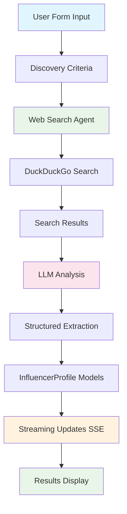

# Influencer Discovery Agent

Learn browser automation and agentic web search by building an AI agent that autonomously searches the web, analyzes results, and extracts structured influencer profiles based on dynamic user criteria.

## Learning Objectives

Master the fundamentals of **Browser Automation** and **Agentic Web Search** through hands-on implementation:

- **Dynamic Criteria Input:** Accept user-defined search criteria via form (no hardcoded values)
- **Web Search Integration:** Use DuckDuckGo for open-source web search
- **Agentic Data Extraction:** AI agents that analyze search results and extract structured data
- **Structured Output:** Extract influencer profiles with validation using Pydantic models
- **Real-Time Streaming:** Stream discovery progress for better user experience
- **Browser Automation:** Foundation for browser-based navigation (extensible to browser_use)

## System Architecture



## Quick Start

```bash
# Start the demo
make dev

# Visit: http://localhost:4020/demos/influencer-discovery
```

## Your Learning Path: Incremental Challenges

Follow these incremental challenges to build your application. Each one adds a new layer of agentic complexity.

### Challenge 1: Form Input & Data Models

**Goal:** Create a form to accept dynamic discovery criteria and validate input.

- **Architecture:**

  ```mermaid
  graph TD
      A[Frontend Form] --> B[DiscoveryRequest Model]
      B --> C[Validation]
      C --> D[API Endpoint]
      style A fill:#e1f5fe
      style B fill:#e8f5e8
      style C fill:#fff3e0
  ```

- **Your Task:**

  1. Create frontend form with fields:
     - Minimum followers (required)
     - Maximum followers (optional)
     - Content keywords (comma-separated)
     - Location
     - Number of influencers to find
  2. Create `DiscoveryRequest` Pydantic model with validation
  3. Create API endpoint to accept and validate request
  4. Return session ID for tracking

- **Key Concepts:** Form handling, Pydantic validation, API request/response patterns

- **Code Location:**
  - `models.py` - Define `DiscoveryRequest` model
  - `main.py` - Create `/start-discovery` endpoint
  - `frontend/src/app/demos/influencer-discovery/page.tsx` - Form UI

- **Observation:** Notice how Pydantic automatically validates input (e.g., min_followers >= 1000, count between 1-10). This ensures data quality before processing.

-----

### Challenge 2: Web Search Integration

**Goal:** Integrate DuckDuckGo for open-source web search.

- **Architecture:**

  ```mermaid
  graph TD
      A[Discovery Criteria] --> B[Search Query Builder]
      B --> C[DuckDuckGo Search]
      C --> D[Search Results]
      D --> E[Result Formatting]
      style A fill:#e1f5fe
      style C fill:#e8f5e8
      style D fill:#fff3e0
  ```

- **Your Task:**

  1. Install `ddgs` package (already in requirements.txt)
  2. Create `search_web_for_influencers()` function
  3. Build search queries from user criteria
  4. Execute searches and collect results
  5. Format results for LLM analysis

- **Key Concepts:** Web search APIs, Query construction, Result formatting

- **Code Location:**
  - `browser_agent.py` - Implement `search_web_for_influencers()`

- **Observation:** Notice how we construct multiple search queries from user criteria. This increases the chances of finding relevant influencers.

-----

### Challenge 3: Agentic Data Extraction

**Goal:** Use LLM to analyze search results and extract structured influencer profiles.

- **Architecture:**

  ```mermaid
  graph TD
      A[Search Results] --> B[LLM Prompt Construction]
      B --> C[LLM Analysis]
      C --> D[JSON Response]
      D --> E[Profile Parsing]
      E --> F[InfluencerProfile Models]
      style A fill:#e1f5fe
      style C fill:#e8f5e8
      style F fill:#fff3e0
  ```

- **Your Task:**

  1. Create comprehensive prompt for LLM
  2. Include search criteria and results in prompt
  3. Request structured JSON output with influencer profiles
  4. Parse JSON response into `InfluencerProfile` models
  5. Validate and filter results based on criteria

- **Key Concepts:** LLM prompting for structured extraction, JSON parsing, Model validation

- **Code Location:**
  - `browser_agent.py` - Implement `discover_influencers_agentic()`

- **Observation:** The LLM acts as an intelligent parser, extracting structured data from unstructured search results. It can infer follower counts, content focus, and collaboration potential even when not explicitly stated.

-----

### Challenge 4: Real-Time Progress Streaming

**Goal:** Stream discovery progress using Server-Sent Events (SSE).

- **Architecture:**

  ```mermaid
  graph TD
      A[Discovery Task] --> B[Progress Callback]
      B --> C[Session Storage]
      C --> D[SSE Stream]
      D --> E[Frontend Updates]
      style A fill:#e1f5fe
      style C fill:#e8f5e8
      style D fill:#fff3e0
      style E fill:#fce4ec
  ```

- **Your Task:**

  1. Implement progress callback system
  2. Store progress updates in session
  3. Create SSE streaming endpoint
  4. Poll session for updates and stream to frontend
  5. Update frontend UI in real-time

- **Key Concepts:** Server-Sent Events, Progress tracking, Real-time updates

- **Code Location:**
  - `browser_agent.py` - Implement `_report_progress()`
  - `main.py` - Implement `stream_discovery_progress()` and `/stream/{session_id}` endpoint
  - `frontend/src/app/demos/influencer-discovery/page.tsx` - SSE client

- **Observation:** Streaming provides better UX by showing progress in real-time. Users can see the agent searching, analyzing, and extracting data as it happens.

-----

### Challenge 5: Browser Automation (Advanced)

**Goal:** Extend the agent to use browser automation for direct Instagram navigation.

- **Architecture:**

  ```mermaid
  graph TD
      A[Search Results] --> B[Extract Instagram URLs]
      B --> C[Browser Navigation]
      C --> D[Profile Page Scraping]
      D --> E[Follower Count Extraction]
      E --> F[Bio Analysis]
      F --> G[Structured Profile]
      style A fill:#e1f5fe
      style C fill:#e8f5e8
      style D fill:#fff3e0
      style G fill:#fce4ec
  ```

- **Your Task:**

  1. Install `browser-use` package
  2. Set up browser automation (Playwright)
  3. Navigate to Instagram profile pages
  4. Extract follower counts, bio, posts
  5. Analyze content to determine collaboration potential
  6. Integrate with existing agentic extraction

- **Key Concepts:** Browser automation, Web scraping, Dynamic content extraction

- **Code Location:**
  - `browser_agent.py` - Extend `discover_influencers_with_browser()`

- **Observation:** Browser automation allows direct access to Instagram data, providing more accurate follower counts and content analysis. However, it's slower and requires handling authentication and rate limiting.

-----

## Key Agentic AI Concepts

### 1. Dynamic Criteria vs. Hardcoded Values

**Before (Hardcoded):**
```python
# ❌ Bad: Hardcoded values
min_followers = 10000
keywords = ["AI", "tech"]
location = "India"
```

**After (Dynamic):**
```python
# ✅ Good: User-defined criteria
request = DiscoveryRequest(
    min_followers=user_input,
    content_keywords=user_keywords,
    location=user_location
)
```

**Why it matters:** Makes the system flexible and reusable. Users can search for any type of influencer, not just predefined categories.

### 2. Agentic Data Extraction

The LLM acts as an intelligent parser that:
- Understands context from search results
- Extracts structured data even when incomplete
- Infers missing information (e.g., follower counts from descriptions)
- Validates data against criteria

### 3. Structured Output with Pydantic

Using Pydantic models ensures:
- Type safety and validation
- Clear data contracts
- Automatic serialization/deserialization
- Better error messages

### 4. Progress Streaming

Real-time updates improve UX by:
- Showing agent activity (searching, analyzing, extracting)
- Providing feedback during long operations
- Building trust through transparency

## Critical Thinking Questions

1. **Scalability:** How would you handle rate limiting when searching multiple queries? What strategies could prevent being blocked?

2. **Accuracy:** How can you improve the accuracy of follower count extraction when it's not explicitly stated in search results?

3. **Browser Automation:** What are the trade-offs between web search (fast, but less accurate) vs. browser automation (slower, but more accurate)?

4. **Data Quality:** How would you validate that extracted Instagram usernames are correct and profiles exist?

5. **Privacy & Ethics:** What ethical considerations should you keep in mind when scraping influencer data? How would you handle consent?

6. **Error Handling:** How would you handle cases where search returns no results or LLM extraction fails?

## Further Learning

### Browser Automation Libraries

- **browser-use:** High-level browser automation with LLM integration
- **Playwright:** Low-level browser control (used by browser-use)
- **Selenium:** Alternative browser automation framework

### Web Search Alternatives

- **DuckDuckGo (ddgs):** Open-source, no API key needed
- **SerpAPI:** Commercial search API with structured results
- **Google Custom Search:** Official Google search API

### Advanced Patterns

- **Multi-Agent Systems:** Use multiple agents for different tasks (search, analysis, validation)
- **Caching:** Cache search results to avoid redundant API calls
- **Rate Limiting:** Implement exponential backoff for API calls
- **Data Validation:** Use additional sources to verify extracted data

## File Structure

```
influencer_discovery/
├── __init__.py              # Package initialization
├── models.py                # Pydantic data models
├── browser_agent.py         # Agentic discovery logic
├── main.py                  # FastAPI endpoints
└── README.md               # This file
```

## API Endpoints

- `POST /influencer-discovery/start-discovery` - Start a new discovery session
- `GET /influencer-discovery/status/{session_id}` - Get discovery status
- `GET /influencer-discovery/stream/{session_id}` - Stream discovery progress (SSE)
- `GET /influencer-discovery/health` - Health check

## Dependencies

- `ddgs` - DuckDuckGo search
- `playwright` - Browser automation (for future browser_use integration)
- `pydantic` - Data validation
- `fastapi` - API framework
- `asyncio` - Async operations

