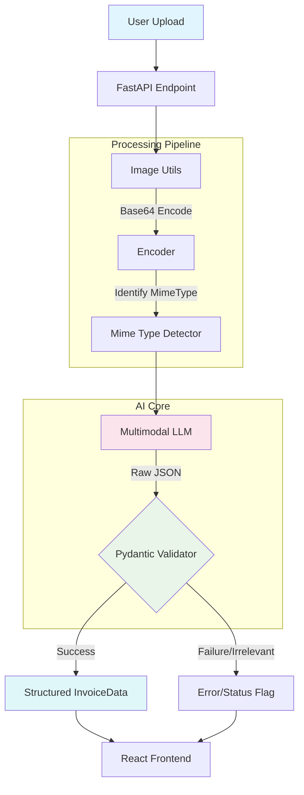

# Invoice Parser & Structured Data Extraction

## 🎯 Learning Objectives

This demo teaches you how to build a production-ready multimodal document extraction system that can:

1. **Multimodal AI Integration** - Use vision-enabled LLMs to "see" and interpret complex document layouts
2. **Structured Data Extraction** - Enforce strict JSON output using Pydantic models
3. **Intent Classification** - Built-in validation to distinguish invoices from irrelevant documents
4. **End-to-End Pipeline** - Manage the full flow from file upload to base64 encoding to data visualization

## 📚 Key Concepts

### Multimodal RAG / Extraction
Unlike traditional OCR which converts image → text → LLM, Multimodal models (like Gemini 1.5/2.0 or GPT-4o) process the image *directly*. This preserves:
- Spatial layout (tables, columns)
- Visual cues (bold text, headers, logos)
- Contextual meaning (checkboxes, signatures)

### Structured Outputs (Pydantic)
WE use Pydantic models to define exactly what the LLM should return. This guarantees:
- **Type Safety**: Prices are numbers, dates are strings, boolean flags are actual booleans.
- **Predictability**: The API always responds with the same shape.
- **Validation**: Malformed data is caught before it reaches the frontend.

### Zero-Shot Classification
The prompt isn't just "extract data". It first asks the model to *classify* the document. If it's not an invoice, the model sets an `is_invoice: false` flag, allowing the UI to handle errors gracefully without crashing.

## 🏗️ Architecture



## 📁 File Structure

- `main.py` - FastAPI router definition and endpoint logic
- `invoice_analyzer.py` - Core AI logic, Pydantic models (`InvoiceData`), and prompt engineering
- `invoice_utils.py` - Helper functions for file handling and base64 encoding
- `README.md` - This documentation

## 🚀 Usage

### API Endpoints

1. **POST /invoice-parser/upload**
   - Upload a file for analysis
   - **Body**: `multipart/form-data` with `file` field
   - **Returns**: JSON object conforming to `InvoiceData` schema
   
   ```json
   {
     "is_invoice": true,
     "vendor_name": "Acme Corp",
     "total_amount": 1050.00,
     "items": [...]
   }
   ```

2. **GET /invoice-parser/health**
   - Simple health check to verify service status

## 🔧 Implementation Details

### The Pydantic Schema
We define the "contract" with the LLM using Python classes:

```python
class InvoiceItem(BaseModel):
    description: str
    quantity: Optional[float]
    unit_price: Optional[float]
    amount: float

class InvoiceData(BaseModel):
    is_invoice: bool
    vendor_name: Optional[str]
    # ... other fields
    items: List[InvoiceItem]
```

### The Multimodal Prompt
The prompt is designed to be "modal-agnostic" but highly specific about output format:

> "You are an expert invoice processing agent... First, determine if this document is an invoice... If it IS, extract... If NOT, set is_invoice to false..."

## 🎓 Challenges

### Challenge 1: Multi-Currency Support
**Goal:** Modify the schema and prompt to strictly enforce 3-letter ISO currency codes (USD, EUR, GBP).
**Hint:** Use Pydantic's `Field` with a regex validator or an `Enum` class.

### Challenge 2: Confidence Scores
**Goal:** Ask the LLM to return a confidence score (0-1) for specific fields like `total_amount`.
**Hint:** Add a `confidence_score` field to the Pydantic model and update the system prompt to estimate certainty.

### Challenge 3: Line Item Categorization
**Goal:** Auto-categorize each line item (e.g., "Hardware", "Service", "Subscription").
**Hint:** Add a `category` Enun field to `InvoiceItem` and ask the LLM to infer it based on the description.

## 🔍 Key Code Patterns

### Handling Base64 Images for LLMs
```python
# invoice_analyzer.py

content = [
    {"type": "text", "text": prompt},
    {
        "type": "image_url",
        "image_url": {
            "url": f"data:{mime_type};base64,{base64_image}"
        }
    }
]
response = await self.llm_provider.generate_text(content)
```

### Robust JSON Parsing
```python
# Cleaning potential markdown formatting from LLM response
clean_json = response_text.strip()
if clean_json.startswith("```json"):
    clean_json = clean_json.replace("```json", "", 1)
# ... parsing logic
```

## 🐛 Troubleshooting

### Issue: "File type not supported"
- **Cause:** You uploaded a file other than PDF, PNG, JPG, or WEBP.
- **Fix:** Convert your document to one of these standard formats.
- **Note:** **PDF inputs are currently ONLY supported when using the Google Gemini provider.** If you are using OpenAI, FireworksAI, or OpenRouter, please upload **images (PNG/JPG)** instead.

### Issue: JSON Decode Error
- **Cause:** The LLM output wasn't valid JSON (rare with modern models, but possible).
- **Fix:** Check the logs to see the raw LLM response. You might need to refine the prompt to be more strict about "ONLY return JSON".

### Issue: Incorrect Values
- **Cause:** The image resolution might be too low, or the font is handwritten/illegible.
- **Fix:** Try with a higher-resolution image or a digital-native PDF.
