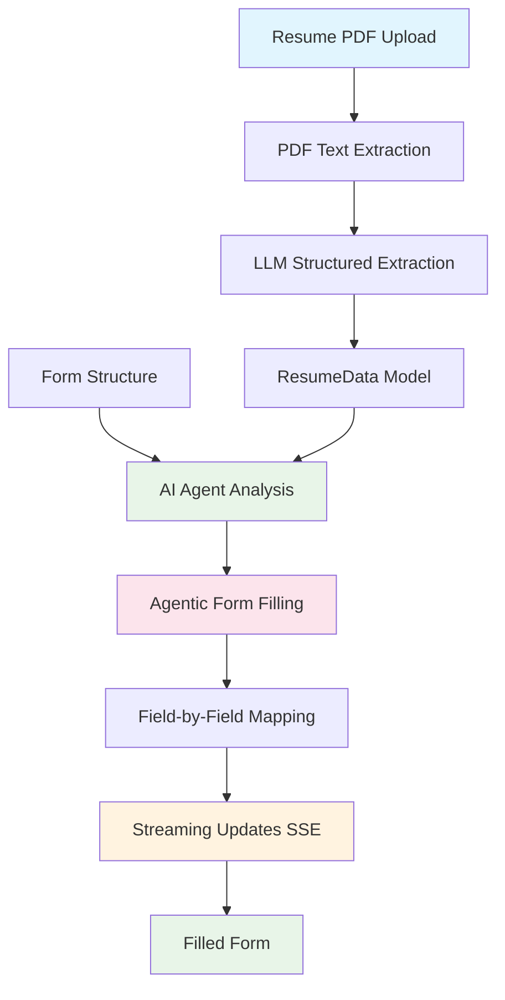

# Job Application Form Auto-Fill

Learn agentic AI patterns and dynamic form automation by building an AI agent that autonomously discovers form structures and intelligently fills them from resume data.

## Learning Objectives

Master the fundamentals of **Agentic AI** and **Dynamic Form Automation** through hands-on implementation:

- **Agentic Form Discovery:** AI agents that understand form structures dynamically, without hardcoded templates
- **Autonomous Field Mapping:** Agents that map data to fields semantically, handling variations in field names
- **Document Parsing:** Extract structured data from PDF resumes using LLMs
- **Real-Time Streaming:** Stream form filling progress for better user experience
- **Structured Data Extraction:** Using LLMs to extract structured data from unstructured documents

## System Architecture



## Quick Start

```bash
# Start the demo
make dev

# Visit: http://localhost:4020/demos/job-application-form-filling
```

-----

## Your Learning Path: Incremental Challenges

Follow these incremental challenges to build your application. Each one adds a new layer of agentic complexity.

### Challenge 1: Basic Resume Parsing

**Goal:** Extract structured data from a PDF resume.

- **Architecture:**

  ```mermaid
  graph TD
      A[PDF Upload] --> B[Text Extraction]
      B --> C[LLM Structured Extraction]
      C --> D[ResumeData Model]
      style A fill:#e1f5fe
      style C fill:#e8f5e8
      style D fill:#fff3e0
  ```

- **Your Task:**

  1. Implement PDF upload endpoint
  2. Use LlamaIndex to extract text from PDF
  3. Use LLM to extract structured data (name, email, work experience, etc.) into a Pydantic model
  4. Return parsed resume data

- **Key Concepts:** Document parsing with LlamaIndex, Structured extraction with LLMs, Pydantic models for data validation

- **Code Location:**
  - `resume_parser.py` - Implement `parse_resume_pdf()`

- **Observation:** Notice how the LLM converts unstructured PDF text into a clean, structured `ResumeData` object. This structured data is what your agent will use later.

-----

### Challenge 2: Hardcoded Field Mapping

**Goal:** Fill form fields using simple if/else logic (baseline approach).

- **Architecture:**

  ```mermaid
  graph TD
      A[ResumeData] --> B[if/else Field Matching]
      B --> C[Field: full_name]
      B --> D[Field: email]
      B --> E[Field: work_experience]
      C --> F[Filled Form]
      D --> F
      E --> F
      style A fill:#e1f5fe
      style B fill:#e8f5e8
      style F fill:#fff3e0
  ```

- **Your Task:**

  1. Create a simple form structure with fields like `full_name`, `email`, `work_experience`
  2. Map resume data to form fields using if/else statements:
     - `if field.name == "full_name": return resume_data.name`
     - `if field.name == "email": return resume_data.email`
  3. Fill form fields one by one

- **Key Concepts:** Basic form filling logic, Field mapping patterns

- **Observation:** This works, but it's brittle. What happens if the form uses `"name"` instead of `"full_name"`? What if the form has a field called `"employment_history"` instead of `"work_experience"`? You'd need to add more if/else statements for every variation.

-----

### Challenge 3: AI-Powered Field Mapping

**Goal:** Use AI to intelligently map fields instead of hardcoded rules.

- **Architecture:**

  ```mermaid
  graph TD
      A[ResumeData] --> B[AI Agent]
      C[Form Field] --> B
      B --> D[Semantic Understanding]
      D --> E[Field Value]
      style A fill:#e1f5fe
      style B fill:#e8f5e8
      style D fill:#fce4ec
      style E fill:#fff3e0
  ```

- **Your Task:**

  1. Replace if/else logic with LLM calls
  2. For each field, create a prompt that:
     - Shows the field name, label, and type
     - Shows all available resume data
     - Asks the LLM to extract the appropriate value
  3. Use semantic understanding to match fields (e.g., "Work History" vs "Work Experience")

- **Key Concepts:** Semantic field matching, LLM-based field mapping, Handling field name variations

- **Observation:** This is better! The AI can handle variations in field names. But it's still slow (one LLM call per field) and each field is processed independently, without understanding the full form context.

-----

### Challenge 4: Agentic Form Filling (Current Implementation)

**Goal:** Build a truly agentic system that understands the complete form structure and fills it autonomously.

- **Architecture:**

  ```mermaid
  graph TD
      A[ResumeData] --> C[AI Agent]
      B[Form Structure] --> C
      C --> D[Complete Understanding]
      D --> E[All Field Values]
      E --> F[Stream Field-by-Field]
      style A fill:#e1f5fe
      style B fill:#e1f5fe
      style C fill:#e8f5e8
      style D fill:#fce4ec
      style E fill:#fff3e0
      style F fill:#fff3e0
  ```

- **Your Task:**

  1. Create an agent that sees the **complete form structure** (all fields at once)
  2. Agent analyzes **all available resume data**
  3. Agent makes **autonomous decisions** about field mapping
  4. Generate **all field values in one intelligent pass**
  5. Stream the values field-by-field for visual feedback

- **Key Concepts:** Agentic AI patterns, Holistic form understanding, Autonomous decision making, Dynamic form adaptation

- **Code Location:**
  - `form_agent.py` - `agentic_form_filling()` function

- **Observation:** This is a *massive* leap in quality and efficiency. The agent sees the big picture and makes intelligent decisions. It can handle any form structure because it understands semantically, not through hardcoded rules.

-----

### Challenge 5: Truly Dynamic Form Discovery

**Goal:** Make the agent work with ANY form structure, even if not provided.

- **Your Task:**

  1. Modify agent to work without predefined form structure
  2. Agent discovers form fields from context
  3. Agent adapts to different form layouts and field names
  4. Test with completely different form structures

- **Key Concepts:** Dynamic form discovery, Context-aware form understanding, True agentic adaptation

- **Code Location:**
  - `form_agent.py` - Update `agentic_form_filling()` to handle `form_structure=None`

- **Observation:** The agent is now truly autonomous. It can work with forms it's never seen before, discovering the structure and filling it intelligently. This is how real-world browser automation agents work.

## Configuration

```bash
# .env
FIREWORKS_API_KEY=your_key_here
FIREWORKS_MODEL=accounts/fireworks/models/qwen3-235b-a22b-instruct-2507
# or
GEMINI_API_KEY=your_key_here
# or
OPENAI_API_KEY=your_key_here
```

## Key Agentic AI Concepts

### **What You'll Discover:**

1. **Task Decomposition:** Breaking form filling into specialized steps (parsing → agentic mapping → streaming) improves quality and maintainability.

2. **Agentic Understanding:** A truly agentic system understands context semantically. It doesn't need hardcoded field name matching—it understands that "Work History" and "Employment Experience" are the same thing.

3. **Holistic Processing:** Processing all fields at once (Challenge 4) is more efficient and produces better results than processing fields independently (Challenge 3).

4. **Dynamic Adaptation:** The agent adapts to any form structure because it reasons about the task, not just pattern-matches field names.

5. **Real-Time Feedback:** Streaming updates (SSE) provide better UX, even though the agent generates all values in one pass.

## Critical Thinking Questions

1. **How would you handle partial failures?** If the agent successfully fills 8 out of 10 fields, should it continue or stop? How would you handle validation?

2. **How would you optimize costs?** The agent makes one LLM call to fill all fields. But what if the form has 50 fields? Would you still use one call, or break it into chunks?

3. **How would you handle conflicting data?** What if the resume has two different email addresses? How would the agent decide which one to use?

4. **How would you add validation?** After the agent fills the form, how would you validate that the data is correct? Would you use another agent to review?

5. **How would you handle multi-step forms?** What if the form has multiple pages or conditional fields that appear based on previous answers?

## Further Learning

**Essential Reading:**

- [LangChain Agentic Patterns](https://python.langchain.com/docs/use_cases/agent_simulations/) - Advanced agentic patterns
- [Browser Automation with AI](https://github.com/browser-use/browser-use) - Real-world examples of AI form filling

**Next Steps:**

- Implement **Form Validation Agent:** Add an agent that reviews filled forms for accuracy
- Add **Multi-Form Support:** Test the agent with completely different form structures (e.g., scholarship application, visa form)
- Implement **Confidence Scores:** Have the agent return confidence scores for each field
- Explore **Human-in-the-Loop:** Add a step where users can review and correct agent-filled fields before submission
