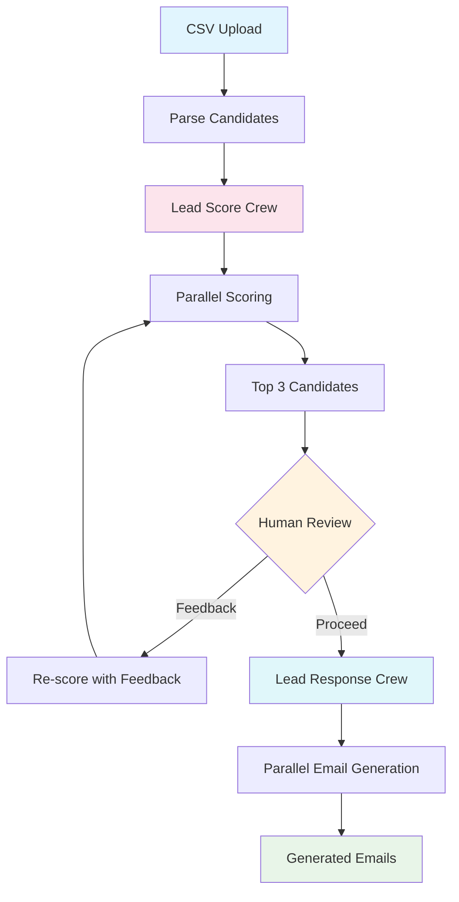

# Lead Scoring & Email Generation

Learn multi-crew orchestration and human-in-the-loop patterns by building an AI-powered lead scoring system that evaluates candidates, gathers human feedback, and generates personalized emails using **CrewAI**.

## 🎯 Learning Objectives

Master the fundamentals of **CrewAI** and **Multi-Crew Orchestration** through hands-on implementation:

- **CrewAI Crews:** How to create specialized teams of agents (Crews) for different tasks.
- **Human-in-the-Loop:** How to integrate human feedback into AI workflows to refine and approve results.
- **Parallel Processing:** How to use `asyncio` to score multiple leads concurrently for massive speed improvements.
- **State Management:** How to manage the workflow state (candidates, scores, feedback) across multiple crews.
- **Multi-Crew Orchestration:** How to hand off the results from one crew (Scoring) to another (Email Generation).
- **Batch Processing:** How to handle CSV uploads and process multiple candidates at once.

## 🏗️ System Architecture (Final Target)

This is the final multi-crew system you will build. Each "Crew" is a specialized team of agents that handles a specific part of the workflow, with a human reviewer in the middle.



## 🚀 Quick Start

```bash
# Start the demo
make dev

# Visit: http://localhost:4020/demos/lead-scoring
```

-----

## Your Learning Path: Incremental Challenges

Follow these incremental challenges to build your application. Each one adds a new layer of complexity.

### Challenge 1: The Basic Scorer (Single Crew, Sequential)

**Goal:** Build a basic lead scoring system with a single `CrewAI` crew that scores candidates one by one.

- **Architecture:**

  ```mermaid
  graph TD
      A[CSV Upload] --> B[Parse Candidates]
      B --> C[Lead Score Crew Sequential]
      C -->|1. Score Candidate 1| C
      C -->|2. Score Candidate 2| C
      C -->|3. Score Candidate 3| C
      C --> D[Scores]
      
      style A fill:#e1f5fe
      style C fill:#fce4ec
      style D fill:#e8f5e8
  ```

- **Your Task:**

  1. Implement a CSV parser that reads candidate data (id, name, email, bio, skills).
  2. Define your `CrewAI` **Agents** (e.g., `HRAnalyst`) and **Tasks** (e.g., `score_candidate_task`) in Python.
  3. Create a `LeadScoreCrew` using these agents and tasks.
  4. In your API, create a loop that iterates through each candidate *sequentially* and calls the `crew.kickoff()` method.
  5. Display the scores in a simple list.

- **Key Concepts:** `CrewAI` Agents, Tasks, Crews, `kickoff()`, Sequential Processing, CSV Parsing.

- **Observation:** This works, but it's *very* slow. If you upload 20 leads and each `kickoff()` takes 5 seconds, the user is waiting almost 2 minutes. This motivates the next step.

-----

### Challenge 2: Parallel Processing (Speed)

**Goal:** Speed up scoring by processing all candidates in parallel using `asyncio`.

- **Architecture:**

  ```mermaid
  graph TD
      A[CSV Upload] --> B[Parse Candidates]
      B --> C[Lead Score Crew Parallel]
      
      subgraph Parallel[Parallel Scoring]
          C1[Candidate 1 to Crew]
          C2[Candidate 2 to Crew]
          C3[Candidate 3 to Crew]
      end
      
      C --> Parallel
      Parallel --> D[All Scores]
      
      style A fill:#e1f5fe
      style C fill:#fce4ec
      style C1 fill:#fce4ec
      style C2 fill:#fce4ec
      style C3 fill:#fce4ec
      style D fill:#e8f5e8
  ```

- **Your Task:**

  1. Refactor your scoring logic from Challenge 1.
  2. Create an `async def score_candidate(candidate_data)` function that sets up and runs a single `crew.kickoff()`.
  3. In your main API endpoint, create a list of `score_candidate` tasks for all candidates.
  4. Use **`asyncio.gather()`** to run *all* scoring tasks concurrently.
  5. Wait for all tasks to complete before displaying the results.

- **Key Concepts:** **`asyncio`**, **`asyncio.gather()`**, Parallel Processing, Concurrency, Performance Optimization.

- **Observation:** This is dramatically faster! The 2-minute wait from Challenge 1 might drop to 10 seconds (depending on your LLM's rate limits). The system is now efficient, but the scoring is static and can't be corrected.

-----

### Challenge 3: Human-in-the-Loop (Quality)

**Goal:** Add a human feedback loop to refine the AI's scoring criteria, improving the quality and relevance of the results.

- **Architecture:**

  ```mermaid
  graph TD
      A[1. Run Parallel Scoring from Ch. 2] --> B[2. Display Top 3 Candidates in UI]
      B --> C{3. Human Review in UI}
      C -->|Provides Feedback| D[4. Re-run Scoring Crew with new feedback in prompt]
      D --> A
      C -->|Proceeds| E[5. Ready for Ch. 4]
      
      style B fill:#fff3e0
      style C fill:#e0f7fa
      style D fill:#fce4ec
  ```

- **Your Task:**

  1. After all scores are gathered (Challenge 2), identify and display the "Top 3" candidates in the UI, including their scores and the AI's *reasoning*.
  2. Add a text box for "Feedback" and a "Re-score" button.
  3. When "Re-score" is clicked, take the user's feedback (e.g., "Focus more on React experience, ignore Java") and **inject it into the agent's prompt or task description.**
  4. Re-run the entire parallel scoring (Challenge 2) using this new, augmented prompt.
  5. The UI should update with the new, refined scores.

- **Key Concepts:** **Human-in-the-Loop (HITL)**, Iterative Refinement, Dynamic Prompting, User Feedback.

- **Observation:** The scoring quality improves significantly. The human's expertise guides the AI, making the system adaptive and far more useful than a static "fire and forget" script.

-----

### Challenge 4: The Multi-Crew (Email Generation)

**Goal:** Add a *second, separate* crew that is specialized in communication to generate personalized emails for the approved candidates.

- **Architecture:**

  ```mermaid
  graph TD
      A[Human Clicks Proceed with Top 3 Candidates] --> B[FastAPI Endpoint]
      B --> C[Lead Response Crew Parallel]
      
      subgraph Parallel[Parallel Email Generation]
          C1[Candidate 1 to Email Crew]
          C2[Candidate 2 to Email Crew]
          C3[Candidate 3 to Email Crew]
      end
      
      C --> Parallel
      Parallel --> D[Generated Emails JSON]
      D --> B
      B --> E[Display Emails in UI]

      style A fill:#fff3e0
      style C fill:#e0f7fa
      style C1 fill:#e0f7fa
      style C2 fill:#e0f7fa
      style C3 fill:#e0f7fa
      style E fill:#e8f5e8
  ```

- **Your Task:**

  1. Define a *new* set of agents and tasks for email generation (e.g., `EmailPersonalizerAgent`, `EmailFormatterTask`).
  2. Create a new `LeadResponseCrew`.
  3. Add a "Generate Emails" button in the Top Candidates section (from Challenge 3).
  4. When the user clicks "Generate Emails", send all candidates (with their scores and reasoning) to a new API endpoint.
  5. This endpoint will, in parallel (using `asyncio.gather()`), run the `LeadResponseCrew` for each candidate.
  6. The crew's task should be: "Based on this candidate's profile [profile], their score [score], and the reason [reasoning], write a personalized invitation for a Zoom call" for top 3 candidates, or "write a polite rejection email" for others.
  7. Display the generated emails in the UI.

- **Key Concepts:** **Multi-Crew Orchestration**, **Separation of Concerns**, State Handoff, Task Specialization.

- **Observation:** You now have a complete, multi-stage workflow! The "Scoring Crew" is an expert at *analysis*. The "Email Crew" is an expert at *communication*. This is far more robust, maintainable, and scalable than one giant, monolithic crew trying to do everything.

-----

## 🔧 Configuration

```bash
# .env
FIREWORKS_API_KEY=your_key_here
FIREWORKS_MODEL=accounts/fireworks/models/qwen3-235b-a22b-instruct-2507
# or
GEMINI_API_KEY=your_key_here
# or
OPENAI_API_KEY=your_key_here
```

## Key CrewAI Concepts

### **What You'll Discover:**

1. **Crews are Specialized Teams:** Each crew has a specific role (scoring vs. email generation). This separation of concerns makes the system far more maintainable and effective.

2. **Parallel Processing is Essential:** For batch operations (like scoring 100 leads), `asyncio.gather()` is not a "nice to have," it's a *necessity*. It changes the app's performance from "unusable" to "interactive."

3. **Human-in-the-Loop is a Quality Multiplier:** Adding a simple feedback loop (Challenge 3) turns the AI from a simple tool into an adaptive partner, a core pattern for successful AI products.

4. **State Management is Key:** The "state" (candidates, scores, feedback) must be carefully passed from step to step, from the UI to the API, and from one crew to the next.

5. **Configuration-Driven Design:** `CrewAI` encourages defining agents, tasks, and crews in a structured way (like YAML or Python classes), making it easy to modify behavior without changing core application code.

## Production Considerations

- **Persistence:** The in-memory candidate list and scores will be lost on restart. A production app would use a database (like SQLite or Postgres) to store leads, scores, feedback, and generated emails.

- **Rate Limiting:** Running 100 parallel `kickoff()` calls will almost certainly trigger your LLM's API rate limits. A robust system would use a **semaphore** (`asyncio.Semaphore(10)`) to limit concurrent requests to a safe number (e.g., 10 at a time).

- **Error Handling:** What if one of the 100 parallel scoring tasks fails? You need to wrap your `kickoff()` calls in `try...except` blocks to handle individual failures gracefully without crashing the entire batch.

- **Email Delivery:** This app *generates* emails. A production system needs an *email delivery* service (like SendGrid or Mailgun) and a "Send" button to actually deliver them.

- **Security:** The "feedback" prompt from the user (Challenge 3) is a potential **prompt injection** vector. It should be sanitized or handled with care before being passed to the next crew.

## Critical Thinking Questions

1. **How would you handle very large CSV files (10,000+ leads)?** What optimizations would you add beyond `asyncio`? (Hint: Think about queues, streaming).

2. **What if one candidate scoring fails?** Should the entire workflow stop? Or should it continue with the other candidates and report the failure?

3. **How would you add email scheduling and delivery?** What new tools or services would you need?

4. **How could you A/B test email content?** How would you design a workflow to test two different email versions and measure effectiveness?

5. **What monitoring and analytics would you add?** What metrics would you track to know if your scoring quality and email generation are effective?

## 📚 Further Learning

**Essential Reading:**

- [CrewAI Documentation](https://docs.crewai.com) - Official docs on crews, agents, tasks, and orchestration.

- [CrewAI Flows](https://docs.crewai.com/concepts/flows) - A deep dive into workflow orchestration and how crews can hand off tasks.

- [Human-in-the-Loop (HITL) AI](https://en.wikipedia.org/wiki/Human-in-the-loop) - Best practices and patterns for integrating human feedback.

**Next Steps:**

- **Implement Email Templates:** Add customizable email templates that your `LeadResponseCrew` can use.

- **Add Analytics Dashboard:** Track scoring trends and email open/response rates.

- **Integrate ATS Systems:** Connect with a real Applicant Tracking System (ATS) API instead of a CSV.

- **Add Multi-Job Support:** Allow the user to upload a CSV *and* select one of *five* different job descriptions to score against.

- **Implement Persistent Storage:** Use a database (like SQLite) to store candidates, scores, and feedback so you can resume work.
