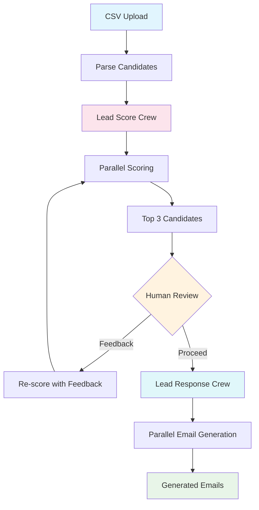

# Lead Scoring & Email Generation

Learn multi-crew orchestration and human-in-the-loop patterns by building an AI-powered lead scoring system that evaluates candidates, gathers human feedback, and generates personalized emails using **CrewAI**.

## Learning Objectives

Master the fundamentals of **CrewAI** and **Multi-Crew Orchestration** through hands-on implementation:

- **CrewAI Crews:** How to create specialized teams of agents for different tasks
- **Human-in-the-Loop:** How to integrate human feedback into AI workflows for better results
- **Parallel Processing:** How to score multiple leads concurrently for efficiency
- **State Management:** How to manage workflow state across multiple crews
- **Email Generation:** How to generate personalized emails using AI agents
- **Batch Processing:** How to handle CSV uploads and process multiple candidates

## System Architecture (Final Target)

This is the final multi-crew system you will build. Each "Crew" is a specialized team of agents that handles a specific part of the workflow.



## Quick Start

```bash
# Start the demo
make dev

# Visit: http://localhost:4020/demos/lead-scoring
```

-----

## Your Learning Path: Incremental Challenges

Follow these incremental challenges to build your application. Each one adds a new layer of complexity.

### Challenge 1: The Basic Scorer (Single Crew)

**Goal:** Build a basic lead scoring system with a single crew.

- **Architecture:**

  ```mermaid
  graph TD
      A["CSV Upload"] --> B["Parse Candidates"]
      B --> C["Lead Score Crew"]
      C --> D["Scores"]
      style A fill:#e1f5fe
      style C fill:#fce4ec
      style D fill:#e8f5e8
  ```

- **Your Task:**

  1. Create a CSV parser that reads candidate data (id, name, email, bio, skills)
  2. Create a LeadScoreCrew with an HR Evaluation Agent
  3. Score each candidate sequentially against a job description
  4. Display scores in a simple list

- **Observation:** This works but is slow. Each candidate is scored one at a time, and there's no way to refine the scoring.

-----

### Challenge 2: Parallel Processing

**Goal:** Speed up scoring by processing candidates in parallel.

- **Architecture:**

  ```mermaid
  graph TD
      A["CSV Upload"] --> B["Parse Candidates"]
      B --> C["Parallel Scoring"]
      C --> D["All Scores"]
      style A fill:#e1f5fe
      style C fill:#fce4ec
      style D fill:#e8f5e8
  ```

- **Your Task:**

  1. Use `asyncio.gather()` to score all candidates concurrently
  2. Create tasks for each candidate scoring operation
  3. Wait for all tasks to complete before displaying results

- **Observation:** Much faster! But still no way to refine or customize the scoring.

-----

### Challenge 3: Human-in-the-Loop

**Goal:** Add human feedback to improve scoring quality.

- **Architecture:**

  ```mermaid
  graph TD
      A["Score Candidates"] --> B["Top 3 Display"]
      B --> C["Human Review"]
      C -->|Feedback| D["Re-score with Feedback"]
      D --> A
      C -->|Proceed| E["Generate Emails"]
      style B fill:#fff3e0
      style C fill:#e0f7fa
      style D fill:#fce4ec
  ```

- **Your Task:**

  1. After scoring, identify the top 3 candidates
  2. Display them to the user with scores and reasoning
  3. Allow user to provide feedback (e.g., "Focus more on React experience")
  4. Re-score all candidates with the feedback incorporated
  5. Show updated scores

- **Observation:** The scoring quality improves significantly with human guidance. The system becomes more adaptive and useful.

-----

### Challenge 4: Email Generation Crew

**Goal:** Add a second crew to generate personalized emails.

- **Architecture:**

  ```mermaid
  graph TD
      A["Scored Candidates"] --> B["Lead Response Crew"]
      B --> C["Parallel Email Generation"]
      C --> D["Generated Emails"]
      style A fill:#e1f5fe
      style B fill:#e0f7fa
      style D fill:#e8f5e8
  ```

- **Your Task:**

  1. Create a LeadResponseCrew with an Email Followup Agent
  2. For top 3 candidates: Generate invitation emails asking for Zoom call availability
  3. For other candidates: Generate polite rejection emails
  4. Generate all emails in parallel
  5. Display generated emails

- **Observation:** You now have a complete workflow! Multiple crews working together, each with a specialized role.

## Configuration

```bash
# .env
FIREWORKS_API_KEY=your_key_here
FIREWORKS_MODEL=accounts/fireworks/models/qwen3-235b-a22b-instruct-2507
# or
GEMINI_API_KEY=your_key_here
# or
OPENAI_API_KEY=your_key_here
```

## Key CrewAI Concepts

### **What You'll Discover:**

1. **Crews are Specialized Teams:** Each crew has a specific role (scoring vs. email generation). This separation of concerns makes the system more maintainable.
2. **Parallel Processing:** Scoring multiple candidates concurrently dramatically improves performance. Use `asyncio.gather()` to run tasks in parallel.
3. **Human-in-the-Loop:** Adding human feedback improves AI system quality. The system learns from human guidance and adapts.
4. **State Management:** Workflow state (candidates, scores, feedback) must be carefully managed across multiple crews and steps.
5. **CrewAI Configuration:** YAML files define agents and tasks, making it easy to modify behavior without changing code.

## Critical Thinking Questions

1. **How would you handle very large CSV files (10,000+ leads)?** What optimizations would you add?
2. **What if one candidate scoring fails?** Should the workflow continue with other candidates?
3. **How would you add email scheduling and delivery?** What infrastructure would you need?
4. **How could you add A/B testing for email content?** How would you measure effectiveness?
5. **What monitoring and analytics would you add?** How would you track scoring quality and email performance?

## Further Learning

**Essential Reading:**

- [CrewAI Documentation](https://docs.crewai.com) - Official docs on crews, agents, and tasks
- [CrewAI Flows](https://docs.crewai.com/concepts/flows) - Deep dive into workflow orchestration
- [Human-in-the-Loop AI](https://www.partnershiponai.org/workinggroups/human-ai-collaboration/) - Best practices for HITL systems

**Next Steps:**

- Implement **Email Templates:** Add customizable email templates
- Add **Analytics Dashboard:** Track scoring trends and email performance
- Integrate **ATS Systems:** Connect with real applicant tracking systems
- Add **Multi-Job Support:** Score candidates against multiple job descriptions
- Implement **Persistent Storage:** Use a database instead of in-memory storage