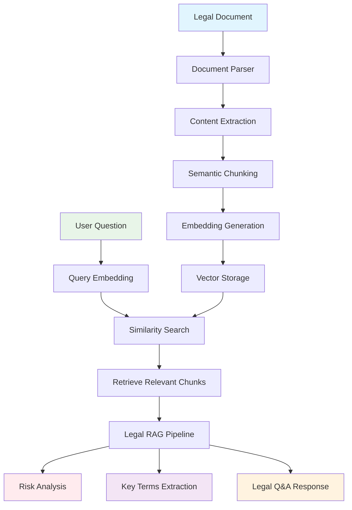

# Legal Contract Analyzer

Learn document processing and legal AI by building a system that analyzes legal documents for risks and key terms.

## 🎯 Learning Objectives

Master the fundamentals of **Legal Document Analysis** through hands-on implementation:

- **Document Parsing & Extraction** - Parse complex legal documents with tables, images, and structured content
- **Risk Analysis & Categorization** - Identify and categorize legal risks using AI
- **Key Terms Extraction** - Extract important legal terms and definitions
- **Legal RAG Pipeline** - Build Q&A systems for legal document analysis
- **Legal AI Limitations** - Understand when and why legal AI works

## 🏗️ System Architecture



## 🚀 Quick Start

```bash
# Start the demo
make dev

# Visit: http://localhost:4020/demos/legal-contract-analyzer
```

## 🧪 Learning Challenges

### **Challenge 1: Document Parsing Impact**
**Goal**: Understand how parsing quality affects analysis accuracy

**Experiment**:
- Try different parsing methods (docling vs unstructured vs simple)
- Test with various document types (PDF, Word, text)
- Compare parsing accuracy for tables and images

**Question**: How does document parsing quality affect risk analysis and key terms extraction?

### **Challenge 2: Risk Analysis Accuracy**
**Goal**: Compare AI risk analysis with manual review

**Experiment**:
- Upload a known contract with known risks
- Compare AI-identified risks with manual analysis
- Test with different risk categories (financial, legal, operational)

**Question**: How accurate is AI risk analysis compared to human legal review?

### **Challenge 3: Key Terms Extraction Quality**
**Goal**: Evaluate key terms extraction effectiveness

**Experiment**:
- Test with contracts containing specific legal terms
- Compare extracted terms with known important clauses
- Analyze importance ranking accuracy

**Question**: How well does AI identify and rank important legal terms?

### **Challenge 4: Legal RAG vs Direct LLM**
**Goal**: Compare legal RAG performance with direct LLM queries

**Experiment**:
- Ask the same legal question to the RAG system
- Ask ChatGPT the same question directly
- Compare accuracy and legal specificity

**Question**: When does legal RAG outperform direct LLM for legal questions?

## 🔧 Configuration

```bash
# .env
FIREWORKS_API_KEY=your_key_here
FIREWORKS_MODEL=accounts/fireworks/models/qwen3-235b-a22b-instruct-2507
EMBEDDING_MODEL=all-MiniLM-L6-v2  # Fast & cheap
```

## 🎓 Key Legal AI Concepts

### **What You'll Discover:**
1. **Document Complexity** - Legal documents have complex structures that affect parsing
2. **Risk Categorization** - Different types of risks require different analysis approaches
3. **Legal Context Preservation** - Maintaining legal context across document chunks
4. **Hallucination Risk** - Legal AI may generate incorrect legal advice
5. **Source Attribution** - Legal analysis requires proper citation and sources

### **Production Considerations:**
- Document security and privacy
- Legal compliance and audit trails
- Error handling for parsing failures
- Performance optimization for large documents
- Legal disclaimer and accuracy warnings

## 🚀 Advanced Challenges

### **Challenge 5: Multi-Document Analysis**
**Goal**: Analyze multiple related legal documents simultaneously

**Learning Focus**: Cross-document risk analysis, contract comparison, and relationship mapping between legal documents.

### **Challenge 6: Legal Clause Comparison**
**Goal**: Compare similar clauses across different contracts

**Learning Focus**: Clause similarity analysis, standard vs custom terms identification, and contract standardization insights.

### **Challenge 7: Risk Scoring & Prioritization**
**Goal**: Implement sophisticated risk scoring algorithms

**Learning Focus**: Risk quantification, priority ranking, and actionable recommendation generation.

### **Challenge 8: Legal Compliance Checking**
**Goal**: Check contracts against legal compliance requirements

**Learning Focus**: Regulatory compliance analysis, legal requirement mapping, and compliance gap identification.

## 🤔 Critical Thinking Questions

1. **What if the legal document is in a different language?** How would you handle multilingual analysis?
2. **How would you prevent legal hallucination?** What validation could you add?
3. **What if you had 10,000 legal documents?** How would you scale the system?
4. **How would you measure legal analysis quality?** What metrics matter most?
5. **How would you handle confidential legal documents?** What security measures would you implement?
6. **What if the legal document contains errors or is incomplete?** How would you handle edge cases?

## 📚 Further Learning

**Essential Reading:**
- [Legal AI Best Practices](https://www.legaltechhub.com/) - Production-ready legal AI
- [Document Processing with Docling](https://github.com/DS4SD/docling) - Advanced document parsing

**Next Steps:**
- Implement legal-specific embedding models
- Add contract comparison features
- Build legal compliance checking
- Scale with legal document databases
- Add multi-language support

---

*This demo teaches you legal AI by doing. Experiment with different documents, break things, and learn what makes legal AI applications work.*
