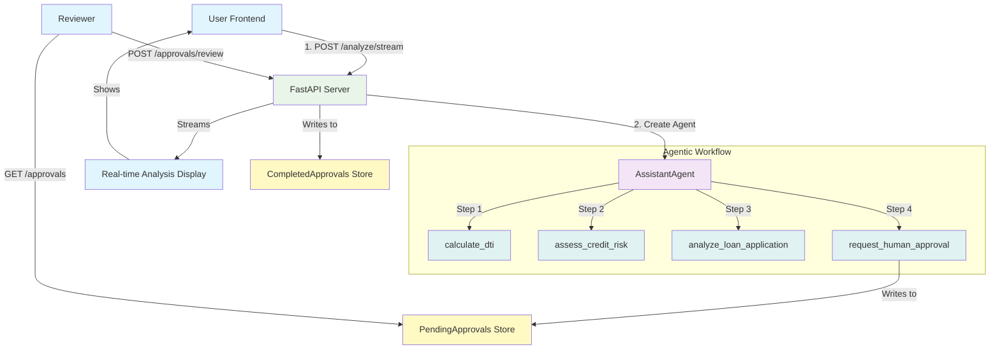

# Loan Application Assistant - Agentic AI Workflows

Learn agentic AI workflows by building a loan application assistant where an AI agent autonomously performs multi-step analysis using tools, orchestrating complex workflows to analyze applications and prepare them for human review.

## Learning Objectives

Master the fundamentals of **Agentic AI Workflows** using AutoGen:

  - **Multi-Step Agent Workflows:** Build an AI agent that autonomously performs complex, sequential analysis steps.
  - **AI Tool Calling:** Give an agent tools to calculate metrics, assess risk, and generate comprehensive reports.
  - **Agent Orchestration:** Watch the agent decide which tools to use and in what order to complete the analysis.
  - **Streaming Workflows:** Display agent analysis in real-time as it performs each step.
  - **Human Escalation:** After agent completes analysis, applications are escalated to humans for final decision.

## System Architecture

This system demonstrates agentic workflows:

1.  **Form Submission:** User submits loan application via form.
2.  **Agentic Analysis:** AI agent automatically performs multi-step analysis:
    - Calculates debt-to-income ratio
    - Assesses credit risk
    - Generates comprehensive analysis
    - Creates review request
3.  **Real-Time Display:** Analysis results stream to the frontend showing each step.
4.  **Human Escalation:** Completed analyses appear in pending queue for human review.

<!-- end list -->



## Quick Start

### Prerequisites

1.  **Dependencies:**
    The required dependencies are already in `api/requirements.txt`:

      * `autogen-agentchat[openai]`
      * `autogen-ext[openai]`
        These will be automatically installed when you run `make dev`.

2.  **Environment Variables:**

    ```bash
    # In api/.env
    # Required: LLM API Key
    OPENAI_API_KEY=your-key-here
    # OR
    FIREWORKS_API_KEY=your-key-here

    # Optional: Model configuration
    OPENAI_MODEL=gpt-4o-mini
    OPENAI_BASE_URL=https://api.fireworks.ai/inference/v1  # For Fireworks
    ```

### Running the Demo

#### Option 1: Docker (Recommended)

```bash
# Start all services (API and Frontend)
make dev

# Visit: http://localhost:4020/demos/loan-application
```

#### Option 2: Manual (Local Development)

```bash
# First, install dependencies
make install

# Terminal 1: Start API server
cd api
python -m uvicorn main:app --reload --port 8000

# Terminal 2: Start Frontend
cd frontend
npm run dev

# Visit: http://localhost:4020/demos/loan-application
```

-----

## Your Learning Path: Incremental Challenges

Follow these incremental challenges to build your application. Each one adds a new layer of functionality and learning.

### Challenge 1: The Basic Chat (Two Agents)

**Goal:** Get a basic AutoGen chat working between a `UserProxyAgent` (who will execute tools) and an `AssistantAgent` (the AI Loan Officer).

  * **Architecture:**
    ```mermaid
    graph TD
        A["UserProxyAgent<br/>(Takes user input)"] <--> B["AssistantAgent<br/>(AI Loan Officer)"];
        
        style A fill:#fce4ec
        style B fill:#e0f7fa
    ```
  * **Your Task:**
    1.  Define an `AssistantAgent` ("assistant") with a system message: "You are an AI loan officer. You analyze applications."
    2.  Define a `UserProxyAgent` ("user\_proxy") with `human_input_mode="NEVER"` (for now) and `code_execution_config=False`.
    3.  Use `user_proxy.initiate_chat(assistant, message="Hello, I'd like to apply for a loan.")`.
  * **Key Concepts:** `UserProxyAgent`, `AssistantAgent`, `initiate_chat`, System Message.
  * **Observation:** You have a basic chat. The AI will respond, but it can't *do* anything. It has no tools.

-----

### Challenge 2: The Analyzer (Read-Only Tools)

**Goal:** Give the AI agent tools to perform financial analysis. The AI can now *analyze*, but it can't *act*.

  * **Architecture:**
    ```mermaid
    graph TD
        A["UserProxyAgent<br/>(Executes Tools)"] <--> B["AssistantAgent<br/>(Calls Tools)"];
        A -->|Calls| C["@tool def calculate_dti()"];
        A -->|Calls| D["@tool def assess_credit_risk()"];
        
        style A fill:#fce4ec
        style B fill:#e0f7fa
        style C fill:#fff9c4
        style D fill:#fff9c4
    ```
  * **Your Task:**
    1.  Implement the Python functions:
          * `calculate_debt_to_income_ratio(income: float, debt: float) -> float`
          * `assess_credit_risk(credit_score: int) -> str`
    2.  Decorate them with `@tool`.
    3.  **Register the tools:** Pass `tools=[calculate_dti, assess_credit_risk]` to the `AssistantAgent`'s `llm_config`.
    4.  **Enable execution:** Configure the `UserProxyAgent` to execute these tools.
    5.  Test with: `user_proxy.initiate_chat(assistant, message="Analyze this loan: $50k income, $15k debt, 720 credit score.")`
  * **Key Concepts:** **Function Calling**, **`@tool` Decorator**, Tool Execution, LLM as an Analyst.
  * **Observation:** Watch the terminal\! The agent will call `calculate_dti` with `50000, 15000` and `assess_credit_risk` with `720`. It will then use these results to give you a summary. It is now an *analyzer*.

-----

### Challenge 3: The Agentic Workflow (Request Approval Tool)

**Goal:** Implement agentic workflow where the AI agent completes multi-step analysis and creates a review request.

  * **Architecture:**
    ```mermaid
    graph TD
        A["AssistantAgent"] -- Final Step --> B["Calls @tool request_human_approval()"];
        B -->|Writes to| C[PendingApprovals<br/>In-Memory Store]

        style A fill:#e0f7fa
        style B fill:#fff9c4
        style C fill:#fce4ec
    ```
  * **Your Task:**
    1.  Create an in-memory store: `PENDING_APPROVALS = {}`.
    2.  Implement the `request_human_approval(analysis_summary: str, recommendation: str, applicant_details: dict)` function.
    3.  Inside this function, generate a unique `approval_id`, create a request object, and add it to `PENDING_APPROVALS`.
    4.  Decorate it with `@tool` and add it to the `AssistantAgent`'s `tools` list.
    5.  **Update your `AssistantAgent`'s system prompt:** "Your final step is to collate all analysis and call `request_human_approval` to create a review request for human decision."
  * **Key Concepts:** **Agentic Workflow Pattern**, State Management, "Write" Tool, Prompt Engineering, Multi-Step Agent Orchestration.
  * **Experiment:** Run the analysis from Challenge 2. The AI's *final message* should now be the output of the `request_human_approval` tool (e.g., "Approval request ABC123 created...").

-----

### Challenge 4: The Review Dashboard (API Read)

**Goal:** Create an API endpoint for reviewers to see what's in the pending queue (human escalation).

  * **Architecture:**
    ```mermaid
    graph TD
        A["Reviewer Frontend"] -->|GET /approvals| B["FastAPI Server"];
        B -->|Reads from| C[PendingApprovals<br/>In-Memory Store]
        
        style A fill:#e1f5fe
        style B fill:#e8f5e8
        style C fill:#fce4ec
    ```
  * **Your Task:**
    1.  In your FastAPI `main.py`, create a new endpoint: `GET /approvals`.
    2.  This endpoint simply returns the contents of the `PENDING_APPROVALS` dictionary.
    3.  Run the app, perform the AI analysis from Challenge 3, and then visit `http://localhost:8000/approvals` in your browser. You should see the pending request as JSON.
  * **Key Concepts:** API Endpoints, Frontend Integration, State Reading.

-----

### Challenge 5: The Decision (API Write)

**Goal:** Allow reviewers to *act* on the pending request by approving or rejecting it (human escalation).

  * **Architecture:**
    ```mermaid
    graph TD
        A[Reviewer Frontend] -->|POST /approvals/id/review| B[FastAPI Server]
        B -->|Moves item from| C[PendingApprovals]
        B -->|Writes decision to| D[CompletedApprovals]
        
        style A fill:#e1f5fe
        style B fill:#e8f5e8
        style C fill:#fce4ec
        style D fill:#fff9c4
    ```
  * **Your Task:**
    1.  Create a new in-memory store: `COMPLETED_APPROVALS = {}`.
    2.  Create a new endpoint: `POST /approvals/{approval_id}/review`.
    3.  This endpoint should take a simple JSON body (e.g., `{"decision": "approved", "notes": "Looks good."}`).
    4.  The logic should:
          * Pop the request from `PENDING_APPROVALS`.
          * Add the decision and notes to it.
          * Put the completed record into `COMPLETED_APPROVALS`.
  * **Key Concepts:** API `POST` Method, State Modification, Human Escalation Pattern.

-----

### Challenge 6: Closing the Loop (Status Check Tool)

**Goal:** Allow the *original applicant* (or the AI) to check the status of the application *after* it has been reviewed.

  * **Architecture:**
    ```mermaid
    graph TD
        A["AssistantAgent"] -- Calls --> B["@tool get_application_status()"];
        B -- Reads --> C[PendingApprovals]
        B -- Reads --> D[CompletedApprovals]
        
        style A fill:#e0f7fa
        style B fill:#fff9c4
        style C fill:#fce4ec
        style D fill:#fce4ec
    ```
  * **Your Task:**
    1.  Implement a new function: `get_application_status(approval_id: str) -> dict`.
    2.  This function checks *both* stores:
          * If `approval_id` is in `PENDING_APPROVALS`, return `{"status": "pending_review"}`.
          * If `approval_id` is in `COMPLETED_APPROVALS`, return the full record (e.g., `{"status": "approved", "notes": "Looks good."}`).
          * If in neither, return `{"status": "not_found"}`.
    3.  Decorate it with `@tool` and add it to the `AssistantAgent`'s `tools` list.
  * **Experiment:**
    1.  *User:* "Analyze my loan..." (AI creates request `ABC123`).
    2.  *User:* "What's the status of `ABC123`?" (AI calls tool, "Status is pending\_review").
    3.  *Human:* (Uses API to approve `ABC123`).
    4.  *User:* "What's the status of `ABC123`?" (AI calls tool, "Status is approved, notes: 'Looks good.'").
  * **Key Concepts:** **Closing the Loop**, Read-Only Tools, Full Workflow.

-----

### Challenge 7 (Bonus): Multi-Stage Workflow

**Goal:** Implement a more realistic, multi-stage approval workflow (e.g., junior reviewer → senior reviewer).

  * **Your Task:**
    1.  Modify your `PENDING_APPROVALS` objects to include a new state, e.g., `"status": "pending_junior_review"`.
    2.  Modify the `POST /review` endpoint. Instead of just "approve/reject," it takes the reviewer's *role*.
    3.  Implement rules:
          * If `amount < $50,000` AND `role == "junior"`, move to `COMPLETED_APPROVALS`.
          * If `amount >= $50,000` AND `role == "junior"`, update the status to `"pending_senior_review"`.
          * If `role == "senior"`, move to `COMPLETED_APPROVALS`.
    4.  Update your `get_application_status` tool to report these new, granular statuses.
  * **Key Concepts:** State Machines, Workflow Orchestration, Business Logic, Rules Engines.

## Configuration

```bash
# In api/.env
# Required: LLM API Key
OPENAI_API_KEY=your-key-here
# OR
FIREWORKS_API_KEY=your-key-here

# Optional: Model configuration
OPENAI_MODEL=gpt-4o-mini
OPENAI_BASE_URL=https://api.fireworks.ai/inference/v1  # For Fireworks
```

## Key Agentic AI Concepts

### **What You'll Discover:**

1.  **AI as an Analyst, Not a Decider:** This is the *most critical* pattern for regulated industries. The AI's job is not to say "yes" or "no," but to do 90% of the analytical work and present a *recommendation* for a human to review.
2.  **State is Managed by the Application:** The "pending" state isn't managed inside the AI's memory. The AI's final action is to call a tool that *changes the application's state* (writes to a database/store). This is a robust, scalable pattern.
3.  **Separation of Interfaces:** You have two "frontends" for this system:
      * **The Applicant Interface:** (Your chatbot UI) where analysis is *initiated* and status is *checked*.
      * **The Reviewer Interface:** (Your `/approvals` dashboard) where decisions are *made*.
4.  **Tools as State-Changers:** You'll use "read-only" tools (like `calculate_dti`) for analysis and "write" tools (like `request_human_approval`) to transition the workflow state.
5.  **Prompting for Safety:** The `AssistantAgent`'s system prompt is a critical safety rail. Explicitly telling it, "**Never approve or reject a loan yourself**" is as important as the code.

## Production Considerations

1.  **Security**: Secure all financial data. The API endpoints for review must be authenticated and authorized.
2.  **Audit Trail**: Log *every* analysis, *every* tool call, and *every* human decision. This is non-negotiable for compliance.
3.  **Persistence**: The in-memory `PENDING_APPROVALS` store must be replaced with a real database (e.g., Postgres, MongoDB) to be production-ready.
4.  **Scalability**: Your agent-based analysis can be run as-needed, but your approval API must be able to handle high volumes.
5.  **Notifications**: In production, the `request_human_approval` tool should also trigger a notification (email, Slack) to the human review team.

## Critical Thinking Questions

1.  How does the agent decide which tools to use and in what order? What makes this an "agentic" workflow?
2.  How would you design the "Audit Trail"? What specific data points would you log for every application?
3.  What happens if a reviewer *times out*? How would you build an "escalation" policy (e.g., after 48 hours, notify a manager)?
4.  How would you handle a situation where the AI's analysis is *wrong*? How would a human "correct" the AI's report for future runs?
5.  What security considerations are most important for the `POST /review` endpoint?

## Further Learning

  - [AutoGen Agent Documentation](https://microsoft.github.io/autogen/stable/user-guide/agentchat-user-guide/)
  - [Agentic AI Workflows](https://microsoft.github.io/autogen/stable/user-guide/agentchat-user-guide/tutorial/)
  - [How to design an approval workflow](https://www.smartsheet.com/approval-process-workflow)