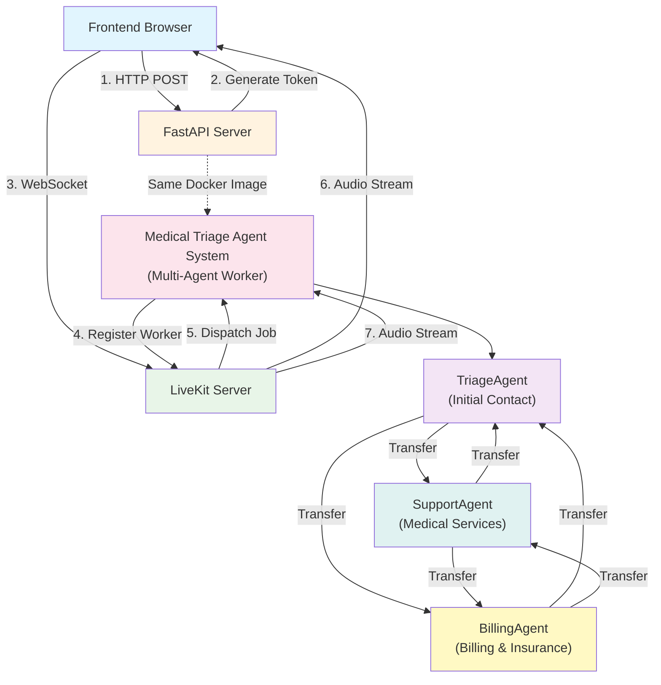

# Medical Office Triage Voice AI

Learn multi-agent voice AI systems by building a medical office triage system with specialized agents that can transfer between each other while preserving conversation context.

## Learning Objectives

Master the fundamentals of **Multi-Agent Voice AI Systems** through hands-on implementation:

- **Multi-Agent Architecture:** Create multiple specialized agents that work together
- **Agent-to-Agent Transfer:** Seamlessly transfer conversations between agents
- **Context Preservation:** Maintain conversation history across agent transfers
- **Specialized Agent Roles:** Design agents with distinct responsibilities and expertise
- **Chat History Management:** Truncate and preserve relevant conversation context
- **Shared State Management:** Share data and agent instances across transfers

## System Architecture



### How It Works

**Multi-Agent System:**

The medical office triage system uses three specialized agents:

1. **TriageAgent** - Initial point of contact that greets patients and determines their needs
2. **SupportAgent** - Handles medical services (appointments, prescriptions, records)
3. **BillingAgent** - Manages billing, insurance, and payment questions

**Agent Transfer Flow:**

```
1. Patient connects → TriageAgent greets them
2. TriageAgent determines patient needs
3. If medical services → Transfer to SupportAgent
4. If billing questions → Transfer to BillingAgent
5. Agents can transfer back if needed
6. Conversation context is preserved across transfers
```

**Context Preservation:**

- Previous agent's conversation history is preserved
- Chat history is truncated to keep last 6 relevant messages
- System messages and agent roles are maintained
- Function calls are preserved for continuity

**The Flow:**

```
1. User clicks "Connect" in frontend
   ↓
2. Frontend calls POST /medical-office-triage/connection
   ↓
3. FastAPI generates LiveKit token and returns it
   ↓
4. Frontend connects to LiveKit server with token
   ↓
5. LiveKit sees a participant joined, dispatches job to agent system
   ↓
6. Agent system's entrypoint() function is called
   ↓
7. TriageAgent is initialized and starts conversation
   ↓
8. Patient speaks, TriageAgent determines needs
   ↓
9. TriageAgent transfers to SupportAgent or BillingAgent if needed
   ↓
10. Context is preserved, conversation continues seamlessly
```

## Quick Start

### Prerequisites

1. **Install Dependencies:**
   ```bash
   pip install "livekit-agents[deepgram,openai]~=1.2"
   pip install pyyaml  # For YAML prompt loading
   ```
   Note: Fireworks is accessed through the OpenAI plugin, so we install `openai` not `fireworks`.

2. **LiveKit Server:** You need a LiveKit server running. Options:
   - Cloud: Sign up at [livekit.cloud](https://livekit.cloud)
   - Self-hosted: Follow [LiveKit deployment guide](https://docs.livekit.io/deploy/)

3. **Environment Variables:**
   ```bash
   # In api/.env
   LIVEKIT_URL=wss://your-livekit-server.com
   LIVEKIT_API_KEY=your-api-key
   LIVEKIT_API_SECRET=your-api-secret
   
   # LLM Provider (Required)
   FIREWORKS_API_KEY=your-fireworks-key
   
   # Voice AI Provider (Required)
   DEEPGRAM_API_KEY=your-deepgram-key
   ```

### Running the Demo

#### Option 1: Docker (Recommended - Everything starts automatically)

```bash
# Start all services (API, Frontend, and Medical Triage Agent System)
make dev

# Visit: http://localhost:4020/demos/medical-office-triage
```

The medical triage agent system will automatically start as a separate service and connect to LiveKit when participants join rooms.

#### Option 2: Manual (Local Development)

```bash
# Terminal 1: Start API server
cd api
python -m uvicorn main:app --reload

# Terminal 2: Start the medical triage agent system
cd api/demos/medical_office_triage
python triage_agent.py dev

# Terminal 3: Start frontend (if not already running)
cd frontend
npm run dev

# Visit: http://localhost:4020/demos/medical-office-triage
```

## Your Learning Path: Incremental Challenges

Follow these incremental challenges to build your multi-agent voice AI application. Each one adds a new layer of functionality and learning.

### Challenge 1: The Basic Multi-Agent Setup

**Goal:** Create a multi-agent system with three specialized agents.

- **Your Task:**

  1. Create `UserData` dataclass to store shared state
  2. Create `BaseAgent` class with common functionality
  3. Create three specialized agents:
     - `TriageAgent` - Initial contact agent
     - `SupportAgent` - Medical services agent
     - `BillingAgent` - Billing agent
  4. Initialize all agents in `entrypoint()` function
  5. Register agents in `UserData.personas` dictionary
  6. Start session with `TriageAgent`

- **Key Concepts:** Multi-agent architecture, Agent specialization, Shared state, Agent initialization

- **Observation:** You should have three agents initialized and ready. The TriageAgent starts the conversation when a patient connects.

-----

### Challenge 2: Agent Transfer Mechanism

**Goal:** Enable agents to transfer to each other using function tools.

- **Your Task:**

  1. Create `_transfer_to_agent()` method in `BaseAgent`:
     - Get next agent from `userdata.personas`
     - Update `userdata.prev_agent` reference
     - Return next agent instance
  2. Add transfer tools to each agent:
     - `TriageAgent`: `transfer_to_support()` and `transfer_to_billing()`
     - `SupportAgent`: `transfer_to_triage()` and `transfer_to_billing()`
     - `BillingAgent`: `transfer_to_triage()` and `transfer_to_support()`
  3. Decorate transfer tools with `@function_tool`
  4. Have agents announce transfers before switching
  5. Test: Say "I need to schedule an appointment" - TriageAgent should transfer to SupportAgent

- **Experiment:** Try different phrasings that should trigger transfers. Notice how the LLM decides when to call transfer tools based on conversation context.

- **Key Concepts:** Function tools, Agent transfer, Tool calling, Agent coordination

- **Observation:** Agents can now transfer to each other. The LLM intelligently decides when to call transfer tools based on patient needs.

-----

### Challenge 3: Context Preservation

**Goal:** Preserve conversation history when transferring between agents.

- **Your Task:**

  1. Implement `on_enter()` method in `BaseAgent`:
     - Update room attributes to track current agent
     - Get chat context from previous agent if exists
     - Preserve previous agent's conversation history
     - Add system message with current agent role
     - Update chat context and generate reply
  2. Implement `_truncate_chat_ctx()` method:
     - Keep last 6 messages from previous agent
     - Preserve function calls if needed
     - Remove duplicate messages
  3. Test: Have a conversation with TriageAgent, then transfer to SupportAgent. Notice how the new agent knows about the previous conversation.

- **Experiment:** Have a longer conversation before transferring. Notice how the chat history is truncated to keep relevant context. Try transferring multiple times - context should be preserved across all transfers.

- **Key Concepts:** Context preservation, Chat history management, Conversation continuity, State management

- **Observation:** Conversation context is now preserved across agent transfers. Patients don't need to repeat information when transferred to different agents.

-----

### Challenge 4: Specialized Agent Prompts

**Goal:** Create specialized prompts for each agent to guide their behavior.

- **Your Task:**

  1. Create `prompts/` directory with YAML files:
     - `triage_prompt.yaml` - Instructions for TriageAgent
     - `support_prompt.yaml` - Instructions for SupportAgent
     - `billing_prompt.yaml` - Instructions for BillingAgent
  2. Create `utils.py` with `load_prompt()` function:
     - Load YAML files from prompts directory
     - Extract instructions from YAML
     - Handle errors gracefully
  3. Load prompts in each agent's `__init__()` method
  4. Test: Each agent should behave according to its specialized role

- **Experiment:** Modify prompt files to change agent behavior. Notice how different prompts affect agent responses and decision-making.

- **Key Concepts:** Prompt engineering, YAML configuration, Agent specialization, Behavioral guidelines

- **Observation:** Each agent now has specialized instructions that guide its behavior. Agents follow their roles more consistently.

-----

### Challenge 5: Chat History Truncation

**Goal:** Implement intelligent chat history truncation to maintain context without exceeding limits.

- **Your Task:**

  1. Enhance `_truncate_chat_ctx()` method:
     - Keep last N messages (configurable, default 6)
     - Option to keep system messages
     - Option to keep function calls
     - Remove leading function calls
  2. Add parameters to control truncation behavior
  3. Test with long conversations - verify that relevant context is preserved

- **Experiment:** Adjust `keep_last_n_messages` parameter. Try different values (3, 6, 10) and see how it affects context preservation. Notice the trade-off between context length and token usage.

- **Key Concepts:** Token management, Context window limits, Conversation history optimization, Memory management

- **Observation:** Chat history is now intelligently truncated to keep relevant context while managing token limits. The system balances context preservation with efficiency.

-----

### Challenge 6: Frontend Integration

**Goal:** Build a frontend that connects to LiveKit and enables multi-agent voice conversations.

- **Your Task:**

  1. Create React component using `@livekit/components-react`
  2. Implement connection logic:
     - Call `POST /medical-office-triage/connection` to get token
     - Connect to LiveKit room using `room.connect(server_url, token)`
  3. Add UI components:
     - Input field for participant name
     - "Connect" button
     - Connection status indicator
     - Agent status indicator (which agent is currently active)
     - Mute/unmute button
     - Disconnect button
  4. Display current agent (from room attributes)
  5. Test: Connect and verify agent transfers work through the UI

- **Experiment:** Monitor room attributes to see agent changes in real-time. Notice how the UI updates when agents transfer.

- **Key Concepts:** Frontend integration, LiveKit SDK, Real-time UI updates, Agent status tracking, WebSocket connections

- **Observation:** You now have a complete multi-agent voice AI application with a user interface. Users can see which agent is currently handling their conversation.

-----

### Challenge 7 (Bonus): Enhanced Features

**Goal:** Add advanced features to make the system production-ready.

- **Your Task:**

  1. **Error Handling:**
     - Handle agent disconnections gracefully
     - Add retry logic for failed transfers
     - Handle network errors in frontend

  2. **Agent State Persistence:**
     - Store conversation state in database
     - Track agent history per session
     - Support session resumption

  3. **Additional Agents:**
     - Add more specialized agents (e.g., PharmacyAgent, LabResultsAgent)
     - Implement agent routing logic
     - Create agent directory/registry

  4. **Analytics:**
     - Track transfer frequency
     - Monitor agent performance
     - Measure conversation duration

  5. **Advanced Context Management:**
     - Implement conversation summarization
     - Add context compression
     - Support long-term memory

  6. **Integration:**
     - Connect to patient management system
     - Integrate with scheduling system
     - Link to billing system

- **Key Concepts:** Production readiness, Database integration, Scalability, Analytics, System integration

## Configuration

### Environment Variables

```bash
# LiveKit Configuration (Required)
LIVEKIT_URL=wss://your-livekit-server.com
LIVEKIT_API_KEY=your-api-key
LIVEKIT_API_SECRET=your-api-secret

# LLM Provider (Required)
# Using Fireworks with Qwen3-235B model for fast, efficient inference
FIREWORKS_API_KEY=your-fireworks-key

# Voice AI Providers (Required)
# Deepgram is used for both Speech-to-Text (STT) and Text-to-Speech (TTS)
DEEPGRAM_API_KEY=your-deepgram-key
```

### LiveKit Setup

1. **Cloud Option (Easiest):**
   - Sign up at [livekit.cloud](https://livekit.cloud)
   - Get your server URL, API key, and secret
   - Add to `.env` file

2. **Self-Hosted Option:**
   - Follow [LiveKit deployment guide](https://docs.livekit.io/deploy/)
   - Deploy to your server or use Docker
   - Configure API credentials

## Key Multi-Agent Concepts

### **What You'll Discover:**

1. **Multi-Agent Architecture:** Multiple specialized agents working together to handle complex workflows

2. **Agent Specialization:** Each agent has a specific role and expertise, making the system more efficient and accurate

3. **Context Preservation:** Conversation history is maintained across agent transfers, avoiding patient repetition

4. **Agent Transfer:** Seamless handoff between agents while maintaining conversation continuity

5. **Shared State Management:** Agents share data and instances through UserData structure

6. **Chat History Management:** Intelligent truncation keeps relevant context while managing token limits

## Critical Thinking Questions

1. **How would you handle multiple concurrent patient calls?** What data structure would you use? How would you track conversations per patient?

2. **How would you persist conversation history?** What database would you use? How would you structure the schema?

3. **What happens if an agent disconnects during transfer?** How would you handle reconnection? Should conversation state be saved?

4. **How would you add more specialized agents?** What would be the routing logic? How would you manage agent discovery?

5. **How would you handle agent conflicts?** What if multiple agents want to handle the same request?

6. **How would you implement agent priority?** Should certain agents take precedence in specific scenarios?

7. **How would you scale this system?** What breaks with 100 concurrent patients? How would you optimize?

## Further Learning

**Essential Reading:**

- [LiveKit Documentation](https://docs.livekit.io/) - Official LiveKit docs
- [LiveKit Agents Guide](https://docs.livekit.io/agents/) - Building voice agents
- [Multi-Agent Systems](https://en.wikipedia.org/wiki/Multi-agent_system) - Understanding multi-agent architectures

**Next Steps:**

- Implement conversation persistence with a database
- Add more specialized agents for different departments
- Build an admin dashboard for agent monitoring
- Integrate with patient management systems
- Add support for multiple languages
- Implement agent performance analytics
- Create agent routing policies
- Add conversation summarization

