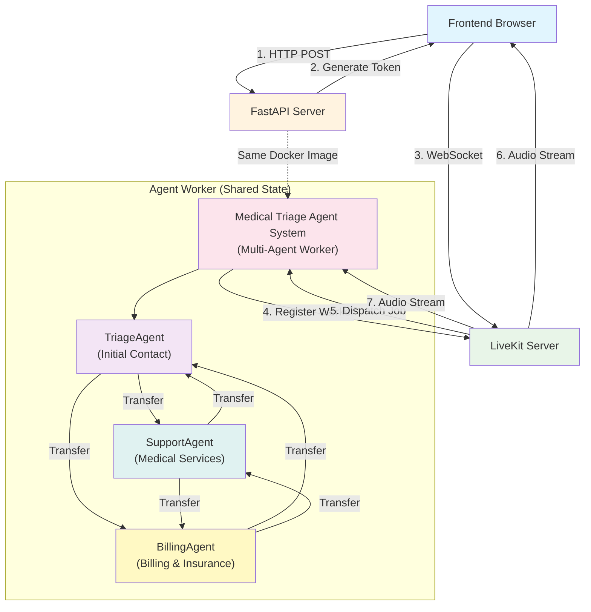

# Medical Office Triage Voice AI

Learn multi-agent voice AI systems by building a medical office triage system with specialized agents that can transfer between each other while preserving conversation context.

## Learning Objectives

Master the fundamentals of **Multi-Agent Voice AI Systems** through hands-on implementation:

  - **Voice Agent Basics:** Build a complete end-to-end voice AI loop (STT -\> LLM -\> TTS).
  - **Multi-Agent Architecture:** Design a system with multiple, specialized agents.
  - **Agent-to-Agent Transfer:** Use function calling to trigger a handoff between agents.
  - **Context Preservation:** Maintain conversation history and state across agent transfers.
  - **Specialized Agent Roles:** Engineer distinct prompts and tools for each agent's responsibilities.
  - **Shared State Management:** Use a central `UserData` object to manage shared state and agent instances.

## System Architecture (Final Target)

This is the complete, multi-agent system you will build. It uses LiveKit for real-time audio transport and a FastAPI server for coordination, with multiple agents sharing a common state.



## Quick Start

(Prerequisites and Run-steps from your original document are excellent and placed here.)

### Prerequisites

1.  **Install Dependencies:**

    ```bash
    pip install "livekit-agents[deepgram,openai]~=1.2"
    pip install pyyaml  # For YAML prompt loading
    ```

    *Note: Fireworks is accessed through the OpenAI plugin, so we install `openai`.*

2.  **LiveKit Server:** You need a LiveKit server running.

      * **Cloud:** Sign up at [livekit.cloud](https://livekit.cloud)
      * **Self-hosted:** Follow [LiveKit deployment guide](https://docs.livekit.io/deploy/)

3.  **Environment Variables:**

    ```bash
    # In api/.env
    LIVEKIT_URL=wss://your-livekit-server.com
    LIVEKIT_API_KEY=your-api-key
    LIVEKIT_API_SECRET=your-api-secret

    # LLM Provider (Required)
    FIREWORKS_API_KEY=your-fireworks-key

    # Voice AI Provider (Required)
    DEEPGRAM_API_KEY=your-deepgram-key
    ```

### Running the Demo

#### Option 1: Docker (Recommended)

```bash
# Start all services (API, Frontend, and Medical Triage Agent System)
make dev

# Visit: http://localhost:4020/demos/medical-office-triage
```

#### Option 2: Manual (Local Development)

```bash
# Terminal 1: Start API server
cd api
python -m uvicorn main:app --reload

# Terminal 2: Start the medical triage agent system
cd api/demos/medical_office_triage
python triage_agent.py dev

# Terminal 3: Start frontend (if not already running)
cd frontend
npm run dev

# Visit: http://localhost:4020/demos/medical-office-triage
```

-----

## Your Learning Path: Incremental Challenges

Follow these incremental challenges to build your application. Each one adds a new layer of functionality and learning.

### Challenge 1: The "Hello, Voice\!" Agent (Single Agent)

**Goal:** Get a *single* agent to connect, listen, and respond. This is the "Hello, World\!" of voice AI, establishing the core STT -\> LLM -\> TTS loop.

  * **Architecture:**
    ```mermaid
    graph TD
        A["Patient (Voice)"] <--> B["LiveKit Server"];
        B <--> C["Single Agent Worker"];
        C --> D["STT (Deepgram)"];
        D --> E["LLM (Fireworks)"];
        E --> F["TTS (Deepgram)"];
        F --> C;
        
        style C fill:#fce4ec
    ```
  * **Your Task:**
    1.  Create a *single* agent file (e.g., `agent.py`).
    2.  Implement the LiveKit `entrypoint` to start your agent.
    3.  Configure the `livekit-agents` pipeline with **Deepgram (STT/TTS)** and **Fireworks (LLM)**.
    4.  Give the LLM a *very simple* system prompt: `"You are a helpful assistant. Be brief."`
    5.  Run the agent and connect via the frontend. When you speak, the agent should hear you and respond.
  * **Key Concepts:** LiveKit Agents, STT/TTS Pipeline, Voice Activity Detection (VAD), LLM Integration, Real-Time Audio Streaming.

-----

### Challenge 2: The *Specialist* Agent (Prompt Engineering)

**Goal:** Give your single agent a specific *role* and *purpose* by loading a specialized prompt from a file.

  * **Your Task:**
    1.  Create the `prompts/` directory and a `triage_prompt.yaml` file.
    2.  Add the detailed instructions for the `TriageAgent` to this YAML.
    3.  Create a `utils.py` with a `load_prompt()` function to read the YAML file.
    4.  In your agent, replace the simple `"You are a helpful assistant"` prompt with the loaded YAML prompt.
    5.  Test again. The agent should now *act* like a medical triage agent, greeting you and asking why you're calling.
  * **Key Concepts:** Prompt Engineering, Role-Playing, YAML Configuration, Code Reusability.
  * **Observation:** Notice how *only* changing the prompt completely changes the agent's behavior, turning it from a generic bot into a specialized worker.

-----

### Challenge 3: The *Multi-Agent* Scaffold (System Design)

**Goal:** Design the multi-agent architecture. Create all three agents and the shared state object, even if they can't transfer yet.

  * **Architecture:**
    ```mermaid
    graph TD
        A[Patient] <--> B[LiveKit]
        B --> C[TriageAgent Active]
        
        subgraph AgentSystem["Agent System"]
            F[UserData Shared State]
            D[SupportAgent Idle]
            E[BillingAgent Idle]
            C -.-> F
            D -.-> F
            E -.-> F
        end
        
        style C fill:#f3e5f5
        style D fill:#e0f2f1
        style E fill:#fff9c4
        style F fill:#e8f5e8
    ```
  * **Your Task:**
    1.  Create a `UserData` dataclass to store shared state (e.g., `personas`, `prev_agent`).
    2.  Create a `BaseAgent` class with common functionality (like `__init__` logic).
    3.  Create the three agent classes: `TriageAgent`, `SupportAgent`, and `BillingAgent`, all inheriting from `BaseAgent`.
    4.  Load the specific prompts for `SupportAgent` and `BillingAgent` from their own YAML files.
    5.  In your `entrypoint`, initialize *all three* agents and store them in `UserData.personas`.
    6.  Start the session with the `TriageAgent` as the active agent. The user can *only* talk to the `TriageAgent` for now.
  * **Key Concepts:** Multi-Agent Architecture, Shared State, Object-Oriented Design, System Scaffolding.

-----

### Challenge 4: The *Transfer Signal* (Function Calling)

**Goal:** Use LLM function calling to allow the `TriageAgent` to *decide* when a transfer is needed.

  * **Architecture:**
    ```mermaid
    graph TD
        A["Patient: 'I need to pay my bill.'"] --> B["TriageAgent"];
        B --> C["LLM (w/ Tools)"];
        C -- "Found match" --> D["Function Call: transfer_to_billing()"];
        B -- "Responds to user" --> E["Agent: 'Sure, let me transfer you to billing.'"];
        
        style B fill:#f3e5f5
        style C fill:#e8f5e8
        style D fill:#fce4ec
    ```
  * **Your Task:**
    1.  Add `transfer_to_support()` and `transfer_to_billing()` methods to the `TriageAgent`.
    2.  Decorate them with `@function_tool`.
    3.  These functions should *only* print a log message for now (e.g., `"Transfer to billing initiated"`).
    4.  Update the `triage_prompt.yaml` to explicitly tell the LLM it *has* these tools and *when* to use them.
  * **Experiment:** Talk to the `TriageAgent`. Say "I need to schedule an appointment" or "I have a question about my bill." Watch your server logs. The LLM should call the correct function, and the agent should announce the (not-yet-functional) transfer.
  * **Key Concepts:** Function Tools, Tool Calling, LLM as a Router, Agent Decision Making.

-----

### Challenge 5: The *Seamless Handoff* (Context Preservation)

**Goal:** Implement the *actual* agent-to-agent transfer, preserving the full conversation history.

  * **Architecture:**
    ```mermaid
    graph TD
        A[TriageAgent Active] -->|1. Calls _transfer_to_agent| B[UserData Shared State]
        B -->|2. Gets Chat History| B1[Chat History]
        B -->|3. Gets BillingAgent| B2[BillingAgent Instance]
        B -->|4. Updates State| B3[Updated State]
        B3 -->|5. Returns Instance| C[BillingAgent Now Active]
        
        C -->|6. on_enter called| C1[on_enter Method]
        C1 -->|7. Injects history + prompt| D[LLM]
        D -->|8. Generates greeting| C
        C -->|9. Speaks| E[Patient]

        style A fill:#f3e5f5
        style C fill:#fff9c4
        style B fill:#e8f5e8
        style B1 fill:#e8f5e8
        style B2 fill:#e8f5e8
        style B3 fill:#e8f5e8
        style C1 fill:#fff9c4
    ```
  * **Your Task:**
    1.  Implement the `_transfer_to_agent()` method in `BaseAgent`. This logic will get the next agent from `UserData.personas` and update the state.
    2.  Implement the `on_enter()` method in `BaseAgent`. This is the *most critical* step.
    3.  Inside `on_enter()`, get the chat history from the `prev_agent` (if it exists).
    4.  Create a *new* chat context for the current agent, starting with the *old* agent's history.
    5.  Add the *new* agent's system prompt (e.g., "You are the BillingAgent...").
    6.  Tell the agent to generate its first reply (e.g., "Hi, I'm the billing specialist. How can I help?").
  * **Key Concepts:** Context Preservation, Chat History Management, State Handoff, Conversation Continuity.

-----

### Challenge 6: The *Efficient* Handoff (History Truncation)

**Goal:** Prevent the context window from overflowing by intelligently truncating the history during the handoff.

  * **Your Task:**
    1.  Implement the `_truncate_chat_ctx()` method in `BaseAgent`.
    2.  Call this method inside `on_enter()` *before* adding the new system prompt.
    3.  The logic should keep the last `N` (e.g., 6) messages from the previous agent.
    4.  Ensure you *also* preserve any important system messages or function calls.
  * **Experiment:** Have a long, 10-12 message conversation with the `TriageAgent` and then transfer. The new agent should still have the *relevant* recent context, but not the *entire* history, saving tokens and cost.
  * **Key Concepts:** Token Management, Context Window Limits, Optimization, Memory Management.

-----

### Challenge 7: The *Full* Application (Frontend Integration)

**Goal:** Connect the frontend to create a complete, usable application that can call the API and display the agent's status.

  * **Architecture:**
    ```mermaid
    graph TD
        A["Frontend UI"] -- 1. 'Connect' Click --> B["POST /connection"];
        B["FastAPI Server"] -- 2. Returns LiveKit Token --> A;
        A -- 3. Connect(token) --> C["LiveKit Server"];
        C -- 4. Dispatches Job --> D["Agent Worker"];
        A <-->|Audio| C;
        C <-->|Audio| D;
        D -- "Updates Room Metadata" --> C;
        C -- "Pushes Metadata" --> A;
        A -- "Displays 'Current Agent: Billing'" --> A;

        style A fill:#e1f5fe
        style B fill:#fff3e0
        style C fill:#e8f5e8
        style D fill:#fce4ec
    ```
  * **Your Task:**
    1.  Build the React frontend component.
    2.  Implement the "Connect" button's logic to `POST` to your FastAPI server to get a token.
    3.  Use the token to connect to the LiveKit room.
    4.  In your `BaseAgent`, add logic to update the *Room's metadata* with the current agent's name (e.g., `room.update_metadata(...)`).
    5.  In the frontend, *listen* for changes to room metadata and display the `Current Agent: ...` to the user.
  * **Key Concepts:** Frontend Integration, LiveKit SDK, Real-time UI Updates, Agent Status Tracking, API Integration.

-----

### Challenge 8 (Bonus): Production-Ready Features

**Goal:** Add advanced features to make the system more robust, scalable, and intelligent.

  * **Your Task (Choose one or more):**
    1.  **Error Handling:** What happens if a transfer fails? Add retry logic or a transfer to a "default" agent.
    2.  **Persistence:** Store the conversation history and agent state in a database (like Redis or Postgres) so a conversation can be resumed.
    3.  **More Agents:** Add a `PharmacyAgent` or `LabResultsAgent` and update the transfer logic.
    4.  **Analytics:** Log every transfer, conversation duration per agent, and common topics to an analytics platform.
    5.  **Summarization:** Instead of truncating, have an agent *summarize* the previous conversation during the handoff.
  * **Key Concepts:** Production Readiness, Database Integration, Scalability, Analytics, Advanced Agentic Patterns.

## Configuration

(Copied from your original, as it's perfect.)

### Environment Variables

```bash
# LiveKit Configuration (Required)
LIVEKIT_URL=wss://your-livekit-server.com
LIVEKIT_API_KEY=your-api-key
LIVEKIT_API_SECRET=your-api-secret

# LLM Provider (Required)
FIREWORKS_API_KEY=your-fireworks-key

# Voice AI Providers (Required)
DEEPGRAM_API_KEY=your-deepgram-key
```

## Key Multi-Agent Concepts

### **What You'll Discover:**

1.  **Agent Specialization:** It's far more effective to build 3 small, expert agents than 1 giant, monolithic agent.
2.  **LLM as a Router:** Using function calling (Challenge 4) is a powerful, low-code way to let the LLM *decide* where to route the user.
3.  **Context is King:** The *handoff* (Challenge 5) is the most important part of a multi-agent system. A user will get frustrated if they have to repeat themselves.
4.  **State Management is Core:** The `UserData` object (or any shared state) is the "blood" of the system, allowing agents to collaborate and pass information.
5.  **Voice is an "All-or-Nothing" UI:** Unlike text, you can't have a "loading" spinner. The agent *must* be fast and responsive, which is why optimizing prompts and history (Challenge 6) is critical.

## Critical Thinking Questions

(Copied from your original, as they are excellent.)

1.  **How would you handle multiple concurrent patient calls?** What data structure would you use? How would you track conversations per patient?
2.  **How would you persist conversation history?** What database would you use? How would you structure the schema?
3.  **What happens if an agent disconnects during transfer?** How would you handle reconnection? Should conversation state be saved?
4.  **How would you add more specialized agents?** What would be the routing logic? How would you manage agent discovery?
5.  **How would you handle agent conflicts?** What if multiple agents want to handle the same request?
6.  **How would you implement agent priority?** Should certain agents take precedence in specific scenarios?
7.  **How would you scale this system?** What breaks with 100 concurrent patients? How would you optimize?

## Further Learning

(Copied from your original.)

**Essential Reading:**

  - [Cracking the 1-second voice loop](https://dev.to/cloudx/cracking-the-1-second-voice-loop-what-we-learned-after-30-stack-benchmarks-427) - Latency optimization for voice AI systems
  - [How Much Does It Really Cost to Run a Voice-AI Agent at Scale?](https://dev.to/cloudx/how-much-does-it-really-cost-to-run-a-voice-ai-agent-at-scale-8en) - Cost optimization for voice AI systems