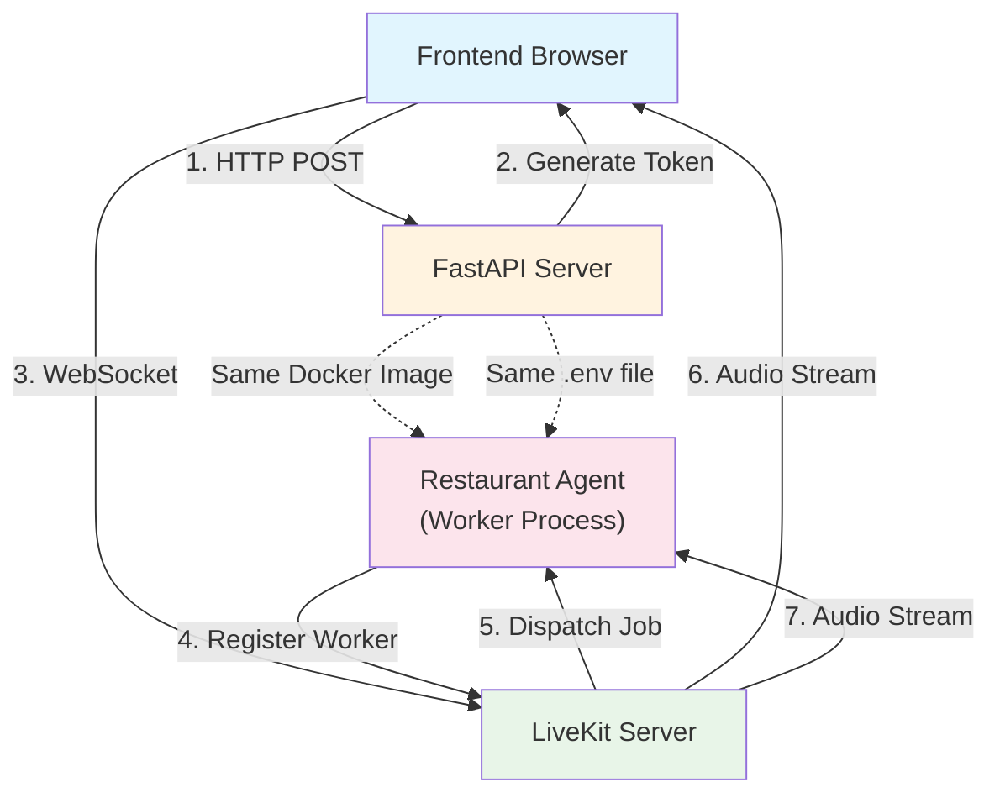

# Restaurant Booking Voice AI

Learn voice AI and LiveKit integration by building a restaurant order booking system with real-time voice conversations.

## Learning Objectives

Master the fundamentals of **Voice AI** and **Real-time Audio Streaming** through hands-on implementation:

- **LiveKit Integration:** Connect voice AI agents to real-time audio rooms
- **Voice Agent Design:** Create conversational AI agents that handle voice interactions
- **Tool Calling:** Give agents tools to perform actions (add items, view menu, place orders)
- **State Management:** Maintain conversation context and order state during voice conversations
- **Real-time Audio:** Process speech-to-text and text-to-speech in real-time

## System Architecture



### How It Works

**Why Separate Processes?**

LiveKit agents work as **worker processes** that:
1. Register with LiveKit server as available workers
2. Wait for LiveKit to dispatch jobs (when users join rooms)
3. Handle real-time audio streams (STT/TTS) continuously
4. Run independently from your API server

This is different from traditional API endpoints because:
- **Real-time audio processing** requires long-lived connections
- **LiveKit manages job dispatch** - agents don't need HTTP endpoints
- **Scalability** - multiple agent instances can handle different rooms
- **Separation of concerns** - API handles HTTP, agents handle voice

**How Docker/Venv Works:**

In `docker-compose.yml`, the agent service:
- Uses the **same Docker image** as the API (`build: context: ./api`)
- Shares the **same code volume** (`./api:/app`)
- Uses the **same .env file** (`env_file: ./api/.env`)
- Has the **same Python environment** (all dependencies from `requirements.txt`)

So when you run `make dev`:
1. Docker builds the API image (includes all Python packages)
2. API container starts (FastAPI server)
3. Agent container starts (same image, different command)
4. Both share the same venv-like environment (Docker's Python installation)
5. Both read the same `.env` file

**The Flow:**

```
1. User clicks "Connect" in frontend
   ↓
2. Frontend calls POST /restaurant-booking/connection
   ↓
3. FastAPI generates LiveKit token and returns it
   ↓
4. Frontend connects to LiveKit server with token
   ↓
5. LiveKit sees a participant joined, dispatches job to agent
   ↓
6. Agent's entrypoint() function is called
   ↓
7. Agent creates VoiceAssistant and starts conversation
   ↓
8. Real-time audio streaming begins (user speaks, agent responds)
```

## Quick Start

### Prerequisites

1. **Install Dependencies:**
   ```bash
   pip install "livekit-agents[deepgram,openai]~=1.2"
   ```
   Note: Fireworks is accessed through the OpenAI plugin, so we install `openai` not `fireworks`.

2. **LiveKit Server:** You need a LiveKit server running. Options:
   - Cloud: Sign up at [livekit.cloud](https://livekit.cloud)
   - Self-hosted: Follow [LiveKit deployment guide](https://docs.livekit.io/deploy/)

3. **Environment Variables:**
   ```bash
   # In api/.env
   LIVEKIT_URL=wss://your-livekit-server.com
   LIVEKIT_API_KEY=your-api-key
   LIVEKIT_API_SECRET=your-api-secret
   
   # LLM Provider (Required)
   FIREWORKS_API_KEY=your-fireworks-key
   
   # Voice AI Provider (Required)
   DEEPGRAM_API_KEY=your-deepgram-key
   ```

### Running the Demo

#### Option 1: Docker (Recommended - Everything starts automatically)

```bash
# Start all services (API, Frontend, and Restaurant Agent)
make dev

# Visit: http://localhost:4020/demos/restaurant-booking
```

The restaurant agent will automatically start as a separate service and connect to LiveKit when participants join rooms.

#### Option 2: Manual (Local Development)

```bash
# Terminal 1: Start API server
cd api
python -m uvicorn main:app --reload

# Terminal 2: Start the restaurant agent
cd api/demos/restaurant_booking
python restaurant_agent.py dev

# Terminal 3: Start frontend (if not already running)
cd frontend
npm run dev

# Visit: http://localhost:4020/demos/restaurant-booking
```

## Your Learning Path: Incremental Challenges

Follow these incremental challenges to build your voice AI application.

### Challenge 1: The First Connection (Token Generation)

**Goal:** Establish a connection between the frontend and LiveKit server.

- **Your Task:**

  1. Set up LiveKit server (cloud or self-hosted)
  2. Get API credentials (API key and secret)
  3. Implement the `/connection` endpoint that generates LiveKit tokens
  4. Test token generation with a simple HTTP request

- **Key Concepts:** JWT tokens, LiveKit authentication, WebSocket connections

- **Observation:** You should be able to generate valid tokens that can connect to LiveKit rooms.

-----

### Challenge 2: The Basic Agent (Voice Conversation)

**Goal:** Create a simple voice agent that can have a conversation.

- **Your Task:**

  1. Create `restaurant_agent.py` with basic agent setup
  2. Configure STT (Speech-to-Text) using Deepgram or OpenAI
  3. Configure TTS (Text-to-Speech) using OpenAI or ElevenLabs
  4. Add basic instructions: "You are a friendly restaurant assistant"
  5. Start the agent and connect to a test room

- **Key Concepts:** Voice agents, STT, TTS, Agent instructions

- **Observation:** The agent should be able to hear you and respond with voice.

-----

### Challenge 3: The Menu Tool (Tool Calling)

**Goal:** Give the agent a tool to retrieve menu information.

- **Your Task:**

  1. Create a `get_menu_items` function tool
  2. Add the tool to the agent's tool list
  3. Update agent instructions to use the tool when asked about the menu
  4. Test: "What's on the menu?" should trigger the tool

- **Key Concepts:** Function tools, Tool calling, Agent capabilities

- **Observation:** The agent can now retrieve and share menu information dynamically.

-----

### Challenge 4: The Order Tool (State Management)

**Goal:** Add functionality to add items to an order.

- **Your Task:**

  1. Create an `order_items` list to store the current order (in-memory)
  2. Create an `add_item_to_order` function tool
  3. Implement item matching logic (exact match, partial match)
  4. Add the tool to the agent
  5. Test: "I'd like a Caesar Salad" should add it to the order

- **Key Concepts:** State management, Tool implementation, Data structures

- **Observation:** The agent can now maintain order state and add items.

-----

### Challenge 5: The Order View Tool (Reading State)

**Goal:** Allow customers to view their current order.

- **Your Task:**

  1. Create a `view_current_order` function tool
  2. Format the order nicely (items, prices, total)
  3. Add the tool to the agent
  4. Test: "What's in my order?" should show the current order

- **Key Concepts:** State reading, Data formatting, User experience

- **Observation:** The agent can now read and display the order state.

-----

### Challenge 6: The Place Order Tool (Finalizing)

**Goal:** Allow customers to finalize and place their order.

- **Your Task:**

  1. Create a `place_order` function tool
  2. Calculate total price
  3. Clear the order state after placing
  4. Return a confirmation message
  5. Test: "I'm ready to order" should finalize and clear the order

- **Key Concepts:** Order completion, State clearing, Confirmation flows

- **Observation:** The complete order flow is now working end-to-end.

-----

### Challenge 7: The Frontend Integration (User Interface)

**Goal:** Build a frontend that connects to LiveKit and displays the conversation.

- **Your Task:**

  1. Create a React component that uses LiveKit SDK
  2. Connect to LiveKit room using token from API
  3. Display transcription of the conversation
  4. Show connection status
  5. Add a button to start/stop the conversation

- **Key Concepts:** Frontend integration, LiveKit SDK, Real-time UI updates

- **Observation:** You now have a complete voice AI application!

-----

### Challenge 8 (Bonus): Enhanced Features

**Goal:** Add advanced features to make the system production-ready.

- **Your Task:**

  1. **Error Handling:** Handle agent disconnections gracefully
  2. **Order Persistence:** Save orders to a database instead of in-memory
  3. **Menu Management:** Load menu from database or API
  4. **Multi-user Support:** Handle multiple concurrent orders
  5. **Order History:** Track order history per customer
  6. **Payment Integration:** Add payment processing (Stripe, etc.)

- **Key Concepts:** Production readiness, Database integration, Scalability

## Configuration

### Environment Variables

```bash
# LiveKit Configuration (Required)
LIVEKIT_URL=wss://your-livekit-server.com
LIVEKIT_API_KEY=your-api-key
LIVEKIT_API_SECRET=your-api-secret

# LLM Provider (Required)
# Using Fireworks with Qwen3-235B model for fast, efficient inference
FIREWORKS_API_KEY=your-fireworks-key

# Voice AI Providers (Required)
# Deepgram is used for both Speech-to-Text (STT) and Text-to-Speech (TTS)
DEEPGRAM_API_KEY=your-deepgram-key
```

### LiveKit Setup

1. **Cloud Option (Easiest):**
   - Sign up at [livekit.cloud](https://livekit.cloud)
   - Get your server URL, API key, and secret
   - Add to `.env` file

2. **Self-Hosted Option:**
   - Follow [LiveKit deployment guide](https://docs.livekit.io/deploy/)
   - Deploy to your server or use Docker
   - Configure API credentials

## Key Voice AI Concepts

### **What You'll Discover:**

1. **Real-time Audio Streaming:** LiveKit handles WebRTC connections for low-latency audio streaming between users and agents.

2. **Speech-to-Text (STT):** Converts user's spoken words into text that the agent can process. This demo uses Deepgram Flux-General model with eager end-of-turn detection for responsive transcription.

3. **Text-to-Speech (TTS):** Converts agent's text responses into natural-sounding speech. This demo uses Deepgram Aura Asteria model for natural voice synthesis.

4. **Voice Activity Detection (VAD):** Detects when the user is speaking vs. silence, helping manage conversation flow.

5. **Turn Detection:** Determines when the user has finished speaking and the agent should respond.

6. **Tool Calling:** Agents can call functions (tools) to perform actions, like adding items to an order.

7. **State Management:** Maintaining conversation context and order state throughout the voice interaction.

## Critical Thinking Questions

1. **How would you handle multiple concurrent orders?** What data structure would you use? How would you track orders per user?

2. **How would you persist order history?** What database would you use? How would you structure the schema?

3. **What happens if the agent disconnects?** How would you handle reconnection? Should orders be saved?

4. **How would you add payment processing?** What security considerations are needed for voice payments?

5. **How could you integrate with a POS system?** What API would you need? How would you sync orders?

6. **How would you handle special dietary requests?** How would the agent capture and store these?

7. **How would you scale this system?** What breaks with 100 concurrent users? How would you optimize?

## Further Learning

**Essential Reading:**

- [LiveKit Documentation](https://docs.livekit.io/) - Official LiveKit docs
- [LiveKit Agents Guide](https://docs.livekit.io/agents/) - Building voice agents
- [WebRTC Fundamentals](https://webrtc.org/) - Understanding real-time audio

**Next Steps:**

- Implement order persistence with a database
- Add support for order modifications
- Build an admin dashboard for order management
- Integrate with a payment processing system
- Add support for multiple languages
- Implement order tracking and notifications

