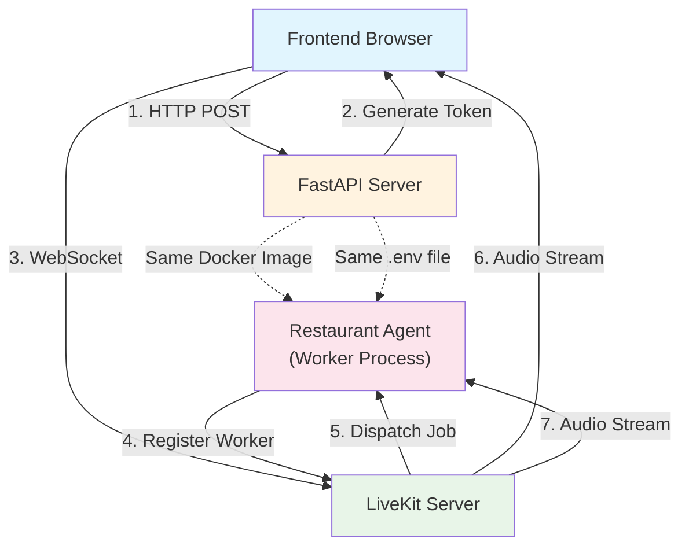

# Restaurant Booking Voice AI

Learn voice AI and LiveKit integration by building a restaurant order booking system with real-time voice conversations.

## Learning Objectives

Master the fundamentals of **Voice AI** and **Real-time Audio Streaming** through hands-on implementation:

- **LiveKit Integration:** Connect voice AI agents to real-time audio rooms
- **Voice Agent Design:** Create conversational AI agents that handle voice interactions
- **Tool Calling:** Give agents tools to perform actions (add items, view menu, place orders)
- **State Management:** Maintain conversation context and order state during voice conversations
- **Real-time Audio:** Process speech-to-text and text-to-speech in real-time

## System Architecture



### How It Works

**Why Separate Processes?**

LiveKit agents work as **worker processes** that:
1. Register with LiveKit server as available workers
2. Wait for LiveKit to dispatch jobs (when users join rooms)
3. Handle real-time audio streams (STT/TTS) continuously
4. Run independently from your API server

This is different from traditional API endpoints because:
- **Real-time audio processing** requires long-lived connections
- **LiveKit manages job dispatch** - agents don't need HTTP endpoints
- **Scalability** - multiple agent instances can handle different rooms
- **Separation of concerns** - API handles HTTP, agents handle voice

**How Docker/Venv Works:**

In `docker-compose.yml`, the agent service:
- Uses the **same Docker image** as the API (`build: context: ./api`)
- Shares the **same code volume** (`./api:/app`)
- Uses the **same .env file** (`env_file: ./api/.env`)
- Has the **same Python environment** (all dependencies from `requirements.txt`)

So when you run `make dev`:
1. Docker builds the API image (includes all Python packages)
2. API container starts (FastAPI server)
3. Agent container starts (same image, different command)
4. Both share the same venv-like environment (Docker's Python installation)
5. Both read the same `.env` file

**The Flow:**

```
1. User clicks "Connect" in frontend
   ↓
2. Frontend calls POST /restaurant-booking/connection
   ↓
3. FastAPI generates LiveKit token and returns it
   ↓
4. Frontend connects to LiveKit server with token
   ↓
5. LiveKit sees a participant joined, dispatches job to agent
   ↓
6. Agent's entrypoint() function is called
   ↓
7. Agent creates VoiceAssistant and starts conversation
   ↓
8. Real-time audio streaming begins (user speaks, agent responds)
```

## Quick Start

### Prerequisites

1. **Install Dependencies:**
   ```bash
   pip install "livekit-agents[deepgram,openai]~=1.2"
   ```
   Note: Fireworks is accessed through the OpenAI plugin, so we install `openai` not `fireworks`.

2. **LiveKit Server:** You need a LiveKit server running. Options:
   - Cloud: Sign up at [livekit.cloud](https://livekit.cloud)
   - Self-hosted: Follow [LiveKit deployment guide](https://docs.livekit.io/deploy/)

3. **Environment Variables:**
   ```bash
   # In api/.env
   LIVEKIT_URL=wss://your-livekit-server.com
   LIVEKIT_API_KEY=your-api-key
   LIVEKIT_API_SECRET=your-api-secret
   
   # LLM Provider (Required)
   FIREWORKS_API_KEY=your-fireworks-key
   
   # Voice AI Provider (Required)
   DEEPGRAM_API_KEY=your-deepgram-key
   ```

### Running the Demo

#### Option 1: Docker (Recommended - Everything starts automatically)

```bash
# Start all services (API, Frontend, and Restaurant Agent)
make dev

# Visit: http://localhost:4020/demos/restaurant-booking
```

The restaurant agent will automatically start as a separate service and connect to LiveKit when participants join rooms.

#### Option 2: Manual (Local Development)

```bash
# Terminal 1: Start API server
cd api
python -m uvicorn main:app --reload

# Terminal 2: Start the restaurant agent
cd api/demos/restaurant_booking
python restaurant_agent.py dev

# Terminal 3: Start frontend (if not already running)
cd frontend
npm run dev

# Visit: http://localhost:4020/demos/restaurant-booking
```

## Your Learning Path: Incremental Challenges

Follow these incremental challenges to build your voice AI application. Each one adds a new layer of functionality and learning.

### Challenge 1: The First Connection (Token Generation)

**Goal:** Establish secure authentication between the frontend and LiveKit server.

- **Architecture:**

  ```mermaid
  graph TD
      A["Frontend Browser"] -->|1. HTTP POST| B["FastAPI /connection"]
      B -->|2. Generate JWT| C["LiveKit Token"]
      C -->|3. Return Token| A
      A -->|4. Connect with Token| D["LiveKit Server"]
      style A fill:#e1f5fe
      style B fill:#e8f5e8
      style C fill:#fce4ec
      style D fill:#fff3e0
  ```

- **Your Task:**

  1. Set up LiveKit server (cloud or self-hosted)
  2. Get API credentials (API key and secret from LiveKit)
  3. Implement the `/connection` endpoint in `main.py` that:
     - Generates a unique room name (e.g., `restaurant_ABC12345`)
     - Creates a participant identity (e.g., `customer_a1b2c3d4`)
     - Generates a JWT token with room permissions using `livekit.api.AccessToken`
     - Returns connection details (server URL, room name, token)
  4. Test token generation with a simple HTTP request (curl or Postman)

- **Experiment:** Try generating multiple tokens for the same room. Notice how each participant gets a unique identity but can join the same room.

- **Key Concepts:** JWT tokens, LiveKit authentication, WebSocket connections, Room-based architecture.

- **Observation:** You should be able to generate valid tokens that contain room permissions and participant information. The token is a JWT that LiveKit validates when connections are established.

-----

### Challenge 2: The Basic Agent (Voice Conversation)

**Goal:** Create a simple voice agent that can hear and respond with voice.

- **Architecture:**

  ```mermaid
  graph TD
      A["User Speaks"] -->|Audio Stream| B["LiveKit Room"]
      B -->|STT| C["Agent: Text"]
      C -->|LLM| D["Agent: Response"]
      D -->|TTS| E["Audio Stream"]
      E -->|Play| A
      style A fill:#e1f5fe
      style B fill:#e8f5e8
      style C fill:#fce4ec
      style D fill:#fff3e0
      style E fill:#e0f7fa
  ```

- **Your Task:**

  1. Create `restaurant_agent.py` with basic agent setup
  2. Configure STT (Speech-to-Text) using Deepgram:
     ```python
     stt=deepgram.STTv2(model="flux-general-en", eager_eot_threshold=0.3)
     ```
  3. Configure TTS (Text-to-Speech) using Deepgram:
     ```python
     tts=deepgram.TTS(model="aura-asteria-en")
     ```
  4. Configure LLM using Fireworks:
     ```python
     llm=openai.LLM.with_fireworks(
         model="accounts/fireworks/models/qwen3-235b-a22b-instruct-2507",
         temperature=0.7
     )
     ```
  5. Add basic instructions: `"You are a friendly restaurant assistant. Help customers with their orders."`
  6. Implement the `entrypoint()` function that connects to rooms
  7. Start the agent: `python restaurant_agent.py dev`

- **Experiment:** Try different STT models (e.g., `nova-2` vs `flux-general-en`). Notice how different models have different latency and accuracy. Try adjusting `eager_eot_threshold` - lower values make the agent respond faster but might cut off the user.

- **Key Concepts:** Voice agents, STT (Speech-to-Text), TTS (Text-to-Speech), Agent instructions, Real-time audio streaming, LiveKit worker processes.

- **Observation:** The agent should be able to hear your speech (converted to text via STT), process it with the LLM, and respond with natural voice (generated via TTS). You've just built your first voice AI agent!

-----

### Challenge 3: The Menu Tool (Tool Calling)

**Goal:** Give the agent a tool to retrieve menu information dynamically.

- **Architecture:**

  ```mermaid
  graph TD
      A["User: 'What's on the menu?'"] -->|STT| B["Agent Receives Text"]
      B -->|LLM Decision| C["Call get_menu_items()"]
      C -->|Tool Execution| D["Return Menu Data"]
      D -->|LLM Formats| E["Agent Speaks Menu"]
      style A fill:#e1f5fe
      style C fill:#e8f5e8
      style D fill:#fce4ec
      style E fill:#fff3e0
  ```

- **Your Task:**

  1. Define a `MENU` dictionary with categories and items
  2. Create a `get_menu_items()` function decorated with `@function_tool()`:
     ```python
     @function_tool()
     async def get_menu_items(category: str = "all") -> str:
         # Return menu items as natural language
     ```
  3. Make sure the function returns **natural conversational text** (not markdown), as TTS will read it literally
  4. Add the tool to the agent's `tools` list:
     ```python
     tools=[get_menu_items]
     ```
  5. Update agent instructions to mention: "When customers ask about the menu, use the get_menu_items tool"
  6. Test: Say "What's on the menu?" - the agent should call the tool and speak the menu items

- **Experiment:** Try asking for specific categories: "What appetizers do you have?" Notice how the LLM decides to call the tool with `category="appetizers"`. The LLM is making decisions about when and how to use tools!

- **Key Concepts:** Function tools, Tool calling, Agent capabilities, Async functions, Natural language generation for voice.

- **Observation:** The agent can now retrieve and share menu information dynamically. The LLM intelligently decides when to call the tool based on the conversation context. This is the foundation of agentic behavior - agents can perform actions, not just generate text.

-----

### Challenge 4: The Order Tool (State Management)

**Goal:** Add functionality to add items to an order and maintain state.

- **Architecture:**

  ```mermaid
  graph TD
      A["User: 'I'd like a Caesar Salad'"] -->|STT| B["Agent"]
      B -->|LLM Decision| C["Call add_item_to_order('Caesar Salad')"]
      C -->|Tool Execution| D["Search Menu"]
      D -->|Match Found| E["Add to order_items[]"]
      E -->|Return Confirmation| F["Agent Speaks: 'Added Caesar Salad'"]
      style A fill:#e1f5fe
      style C fill:#e8f5e8
      style E fill:#fce4ec
      style F fill:#fff3e0
  ```

- **Your Task:**

  1. Create a global `order_items = []` list to store the current order (in-memory)
  2. Create an `add_item_to_order(item_name: str)` function tool:
     - Search for the item in the `MENU` dictionary (exact match first, then partial match)
     - If found, append the item to `order_items`
     - Return a confirmation message (e.g., "Added Caesar Salad ($8.99) to your order")
     - If not found, return a helpful error message
  3. Add the tool to the agent's `tools` list
  4. Update agent instructions: "When customers want to order something, use the add_item_to_order tool"
  5. Test: Say "I'd like a Caesar Salad" - the agent should call the tool and confirm the addition

- **Experiment:** Try ordering items with different phrasings:
   - "I'd like a Caesar Salad"
   - "Can I get the Caesar Salad?"
   - "Add Caesar Salad to my order"
   
   Notice how the LLM understands these different phrasings and still calls the tool correctly. Try ordering something not on the menu - the tool should handle it gracefully.

- **Key Concepts:** State management, Tool implementation, Data structures, In-memory storage, Item matching algorithms.

- **Observation:** The agent can now maintain order state and add items. The `order_items` list persists throughout the conversation, allowing the agent to build up an order over multiple interactions. This is stateful conversation - the agent remembers what was ordered.

-----

### Challenge 5: The Order View Tool (Reading State)

**Goal:** Allow customers to view their current order and see what they've selected.

- **Your Task:**

  1. Create a `view_current_order()` function tool:
     - Check if `order_items` is empty
     - If empty, return "Your order is currently empty"
     - If not empty, format the order nicely:
       - List all items with prices
       - Calculate total price
       - Return natural conversational text (not markdown)
     - Example: "You have Caesar Salad for $8.99, Grilled Salmon for $22.99. Your total comes to $31.98."
  2. Add the tool to the agent's `tools` list
  3. Update agent instructions: "When customers want to see their order, use the view_current_order tool"
  4. Test: After adding some items, say "What's in my order?" - the agent should call the tool and read the order

- **Experiment:** Add multiple items, then ask to view the order. Add more items, view again - notice how the order accumulates. Try viewing an empty order - the tool should handle it gracefully.

- **Key Concepts:** State reading, Data formatting, User experience, Natural language formatting for voice, Price calculations.

- **Observation:** The agent can now read and display the order state. Customers can check their order at any time during the conversation. The tool reads from the same `order_items` list that `add_item_to_order` writes to - this is shared state.

-----

### Challenge 6: The Place Order Tool (Finalizing)

**Goal:** Allow customers to finalize and place their order, completing the ordering flow.

- **Architecture:**

  ```mermaid
  graph TD
      A["User: 'I'm ready to order'"] -->|STT| B["Agent"]
      B -->|LLM Decision| C["Call place_order()"]
      C -->|Tool Execution| D["Calculate Total"]
      D -->|Format Confirmation| E["Clear order_items[]"]
      E -->|Return Confirmation| F["Agent Speaks Order Summary"]
      style A fill:#e1f5fe
      style C fill:#e8f5e8
      style E fill:#fce4ec
      style F fill:#fff3e0
  ```

- **Your Task:**

  1. Create a `place_order()` function tool:
     - Check if `order_items` is empty
     - If empty, return "You don't have any items in your order yet"
     - If not empty:
       - Calculate total price
       - Format order confirmation with all items and total
       - **Clear the `order_items` list** (for the next customer)
       - Return confirmation message (e.g., "Perfect! I've placed your order for: Caesar Salad, Grilled Salmon. Your total is $31.98. Thank you!")
  2. Add the tool to the agent's `tools` list
  3. Update agent instructions: "When customers are ready to place their order, use the place_order tool. Always confirm orders before placing them."
  4. Test: Add some items, then say "I'm ready to order" - the agent should finalize and clear the order

- **Experiment:** Try placing an order with no items - the tool should prevent it. Try placing an order, then immediately try to view the order - it should be empty (cleared). This demonstrates state clearing after order completion.

- **Key Concepts:** Order completion, State clearing, Confirmation flows, Transaction-like behavior, Order finalization.

- **Observation:** The complete order flow is now working end-to-end! Customers can browse the menu, add items, view their order, and place it. After placing, the order state is cleared, ready for the next customer. You've built a complete voice ordering system!

-----

### Challenge 7: The Frontend Integration (User Interface)

**Goal:** Build a frontend that connects to LiveKit and enables voice conversations.

- **Architecture:**

  ```mermaid
  graph TD
      A["React Frontend"] -->|1. POST /connection| B["FastAPI"]
      B -->|2. Return Token| A
      A -->|3. Connect with Token| C["LiveKit Room"]
      D["Restaurant Agent"] -->|4. Joins Room| C
      C -->|5. Audio Stream| A
      C -->|6. Audio Stream| D
      style A fill:#e1f5fe
      style B fill:#e8f5e8
      style C fill:#fce4ec
      style D fill:#fff3e0
  ```

- **Your Task:**

  1. Create a React component that uses `@livekit/components-react`:
     - Import `Room`, `RoomContext`, `useLocalParticipant`, `useRemoteParticipants`
     - Create a `Room` instance
  2. Implement connection logic:
     - Call `POST /restaurant-booking/connection` to get token
     - Connect to LiveKit room using `room.connect(server_url, token)`
  3. Add UI components:
     - Input field for participant name
     - "Connect" button
     - Connection status indicator
     - Mute/unmute button (using `setMicrophoneEnabled()`)
     - Disconnect button
  4. Add `RoomAudioRenderer` to play agent's voice
  5. Test: Enter your name, click "Connect", speak to the agent

- **Experiment:** Try disconnecting and reconnecting - notice how the agent greets you again. Try muting your microphone - the agent should stop hearing you. Try speaking while the agent is speaking - notice how interruptions work (if `allow_interruptions=True`).

- **Key Concepts:** Frontend integration, LiveKit SDK, Real-time UI updates, WebSocket connections, Audio playback, Microphone control.

- **Observation:** You now have a complete voice AI application with a user interface! Users can connect, speak to the agent, and hear responses in real-time. The frontend, API, and agent all work together seamlessly through LiveKit.

-----

### Challenge 8 (Bonus): Enhanced Features

**Goal:** Add advanced features to make the system production-ready and scalable.

- **Your Task:**

  1. **Personalization:**
     - Implement `on_enter()` hook in the agent to greet customers by name
     - Get participant name from `get_job_context().room.remote_participants`
     - Personalize responses throughout the conversation

  2. **Error Handling:**
     - Handle agent disconnections gracefully
     - Add retry logic for failed tool calls
     - Handle network errors in frontend

  3. **Order Persistence:**
     - Replace in-memory `order_items` with database storage
     - Use session IDs to track orders per user
     - Store order history in database

  4. **Menu Management:**
     - Load menu from database or API endpoint
     - Support dynamic menu updates
     - Add menu categories and descriptions

  5. **Multi-user Support:**
     - Use dictionary mapping `session_id -> order_items` instead of global list
     - Handle multiple concurrent orders
     - Isolate order state per user session

  6. **Order History:**
     - Track order history per customer
     - Allow customers to view past orders
     - Add "reorder" functionality

  7. **Payment Integration:**
     - Integrate with Stripe or similar payment processor
     - Add secure payment flow
     - Handle payment confirmations

  8. **Advanced Features:**
     - Add order modifications (remove items, change quantities)
     - Add dietary preferences tracking
     - Add order status tracking (pending, confirmed, preparing, ready)
     - Add notifications for order updates

- **Key Concepts:** Production readiness, Database integration, Scalability, Session management, Error handling, Payment processing, Multi-tenancy.

## Configuration

### Environment Variables

```bash
# LiveKit Configuration (Required)
LIVEKIT_URL=wss://your-livekit-server.com
LIVEKIT_API_KEY=your-api-key
LIVEKIT_API_SECRET=your-api-secret

# LLM Provider (Required)
# Using Fireworks with Qwen3-235B model for fast, efficient inference
FIREWORKS_API_KEY=your-fireworks-key

# Voice AI Providers (Required)
# Deepgram is used for both Speech-to-Text (STT) and Text-to-Speech (TTS)
DEEPGRAM_API_KEY=your-deepgram-key
```

### LiveKit Setup

1. **Cloud Option (Easiest):**
   - Sign up at [livekit.cloud](https://livekit.cloud)
   - Get your server URL, API key, and secret
   - Add to `.env` file

2. **Self-Hosted Option:**
   - Follow [LiveKit deployment guide](https://docs.livekit.io/deploy/)
   - Deploy to your server or use Docker
   - Configure API credentials

## Key Voice AI Concepts

### **What You'll Discover:**

1. **Real-time Audio Streaming:** LiveKit handles WebRTC connections for low-latency audio streaming between users and agents.

2. **Speech-to-Text (STT):** Converts user's spoken words into text that the agent can process. This demo uses Deepgram Flux-General model with eager end-of-turn detection for responsive transcription.

3. **Text-to-Speech (TTS):** Converts agent's text responses into natural-sounding speech. This demo uses Deepgram Aura Asteria model for natural voice synthesis.

4. **Voice Activity Detection (VAD):** Detects when the user is speaking vs. silence, helping manage conversation flow.

5. **Turn Detection:** Determines when the user has finished speaking and the agent should respond.

6. **Tool Calling:** Agents can call functions (tools) to perform actions, like adding items to an order.

7. **State Management:** Maintaining conversation context and order state throughout the voice interaction.

## Critical Thinking Questions

1. **How would you handle multiple concurrent orders?** What data structure would you use? How would you track orders per user?

2. **How would you persist order history?** What database would you use? How would you structure the schema?

3. **What happens if the agent disconnects?** How would you handle reconnection? Should orders be saved?

4. **How would you add payment processing?** What security considerations are needed for voice payments?

5. **How could you integrate with a POS system?** What API would you need? How would you sync orders?

6. **How would you handle special dietary requests?** How would the agent capture and store these?

7. **How would you scale this system?** What breaks with 100 concurrent users? How would you optimize?

## Further Learning

**Essential Reading:**

- [LiveKit Documentation](https://docs.livekit.io/) - Official LiveKit docs
- [LiveKit Agents Guide](https://docs.livekit.io/agents/) - Building voice agents
- [WebRTC Fundamentals](https://webrtc.org/) - Understanding real-time audio

**Next Steps:**

- Implement order persistence with a database
- Add support for order modifications
- Build an admin dashboard for order management
- Integrate with a payment processing system
- Add support for multiple languages
- Implement order tracking and notifications

