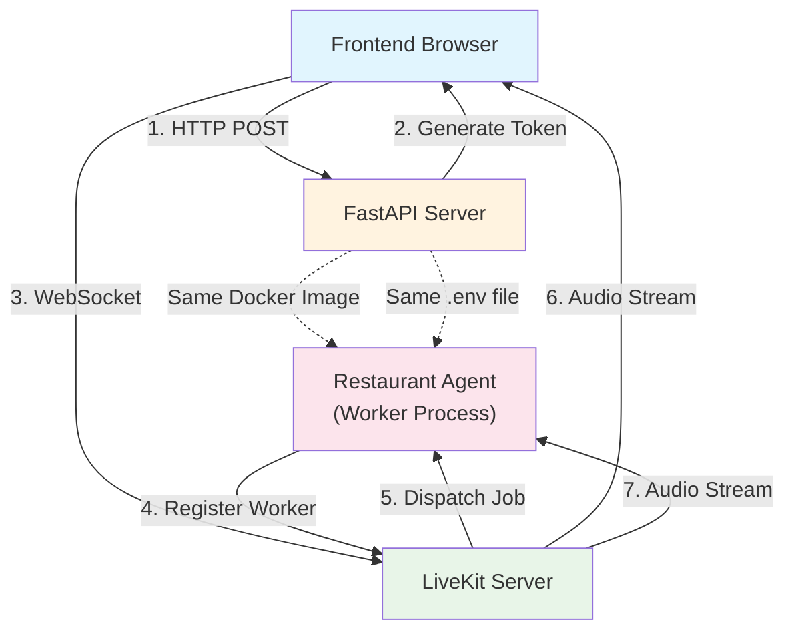

# Restaurant Booking Voice AI

Learn voice AI and LiveKit integration by building a restaurant order booking system with real-time voice conversations.

## 🎯 Learning Objectives

Master the fundamentals of **Voice AI** and **Real-time Audio Streaming** through hands-on implementation:

  - **LiveKit Integration:** Connect voice AI agents to real-time audio rooms.
  - **Voice Agent Design:** Create conversational AI agents that handle voice interactions.
  - **Tool Calling:** Give agents tools to perform actions (add items, view menu, place orders).
  - **State Management:** Maintain conversation context and order state during voice conversations.
  - **Real-time Audio:** Process speech-to-text and text-to-speech in real-time.

## 🏗️ System Architecture (Final Target)



## 🚀 Quick Start

### Prerequisites

1.  **Install Dependencies:**

    ```bash
    pip install "livekit-agents[deepgram,openai]~=1.2"
    ```

    *Note: Fireworks is accessed through the OpenAI plugin, so we install `openai`.*

2.  **LiveKit Server:** You need a LiveKit server running. Options:

      * **Cloud:** Sign up at [livekit.cloud](https://livekit.cloud)
      * **Self-hosted:** Follow [LiveKit deployment guide](https://docs.livekit.io/deploy/)

3.  **Environment Variables:**

    ```bash
    # In api/.env
    LIVEKIT_URL=wss://your-livekit-server.com
    LIVEKIT_API_KEY=your-api-key
    LIVEKIT_API_SECRET=your-api-secret

    # LLM Provider (Required)
    FIREWORKS_API_KEY=your-fireworks-key

    # Voice AI Provider (Required)
    DEEPGRAM_API_KEY=your-deepgram-key
    ```

### Running the Demo

#### Option 1: Docker (Recommended)

```bash
# Start all services (API, Frontend, and Restaurant Agent)
make dev

# Visit: http://localhost:4020/demos/restaurant-booking
```

#### Option 2: Manual (Local Development)

```bash
# Terminal 1: Start API server
cd api
python -m uvicorn main:app --reload

# Terminal 2: Start the restaurant agent
cd api/demos/restaurant_booking
python restaurant_agent.py dev

# Terminal 3: Start frontend (if not already running)
cd frontend
npm run dev

# Visit: http://localhost:4020/demos/restaurant-booking
```

-----

## 🚀 Your Learning Path: Incremental Challenges

Follow these incremental challenges to build your voice AI application. Each one adds a new layer of functionality and learning.

### Challenge 1: The First Connection (Token Generation)

**Goal:** Establish secure authentication between the frontend and LiveKit server by creating a token-generating API endpoint.

  * **Architecture:**
    ```mermaid
    graph TD
        A["Frontend Browser"] -->|1. HTTP POST| B["FastAPI /connection"]
        B -->|2. Generate JWT| C["LiveKit Token"]
        C -->|3. Return Token| A
        A -->|4. Connect with Token| D["LiveKit Server"]
        style A fill:#e1f5fe
        style B fill:#e8f5e8
        style C fill:#fce4ec
        style D fill:#fff3e0
    ```
  * **Your Task:**
    1.  Set up your LiveKit server and get your API key/secret.
    2.  Implement the `/connection` endpoint in your FastAPI server.
    3.  Inside the endpoint, generate a unique `room_name` and `participant_identity`.
    4.  Use `livekit.api.AccessToken` to create a JWT token with room permissions.
    5.  Return the server URL, room name, and token to the frontend.
  * **🎓 Key Concepts:** JWT Tokens, LiveKit Authentication, API Endpoint, Room-based Architecture.
  * **🤔 Observation:** You can now generate valid tokens that LiveKit will accept. This is the "key" that allows a user to enter a specific "room."

-----

### Challenge 2: The Basic Agent (Voice Conversation)

**Goal:** Create a simple voice agent that can connect to LiveKit, hear a user, process their speech with an LLM, and respond with voice.

  * **Architecture:**
    ```mermaid
    graph TD
        A["User Speaks"] -->|Audio Stream| B["LiveKit Room"]
        B -->|STT| C["Agent: Text"]
        C -->|LLM| D["Agent: Response"]
        D -->|TTS| E["Audio Stream"]
        E -->|Play| A
        style A fill:#e1f5fe
        style B fill:#e8f5e8
        style C fill:#fce4ec
        style D fill:#fff3e0
        style E fill:#e0f7fa
    ```
  * **Your Task:**
    1.  Create `restaurant_agent.py` as a new worker process.
    2.  Configure the **STT (Speech-to-Text)**, **LLM**, and **TTS (Text-to-Speech)** pipeline using `livekit-agents` (e.g., with Deepgram and Fireworks).
    3.  Add a basic system prompt: `"You are a friendly restaurant assistant."`
    4.  Implement the `entrypoint()` function to register the agent as a worker with LiveKit.
    5.  Start the agent worker process.
  * **🎓 Key Concepts:** Voice Agents, STT/TTS Pipeline, LLM Integration, Real-time Audio Streaming, LiveKit Worker Process.
  * **🤔 Observation:** The agent connects to LiveKit and waits for a job. When you connect from the frontend, the agent joins the room, and you can have your first (basic) voice conversation\!

-----

### Challenge 3: The Menu Tool (Tool Calling)

**Goal:** Give the agent its first "superpower" by creating a tool it can use to retrieve menu information dynamically.

  * **Architecture:**
    ```mermaid
    graph TD
        A["User: 'What's on the menu?'"] -->|STT| B["Agent Receives Text"]
        B -->|LLM Decision| C["Call get_menu_items()"]
        C -->|Tool Execution| D["Return Menu Data"]
        D -->|LLM Formats| E["Agent Speaks Menu"]
        style A fill:#e1f5fe
        style C fill:#e8f5e8
        style D fill:#fce4ec
        style E fill:#fff3e0
    ```
  * **Your Task:**
    1.  Define a `MENU` dictionary or JSON object in your code.
    2.  Create a `get_menu_items()` function decorated with `@function_tool()`.
    3.  This function should read from the `MENU` and return a **natural-language string** (not JSON/Markdown) for the TTS to read.
    4.  Add the function to the agent's `tools` list.
    5.  Update the agent's system prompt to tell it *when* to use this tool.
  * **🎓 Key Concepts:** Function Tools, Tool Calling, Agent Capabilities, Natural Language Generation (for voice).
  * **🧪 Experiment:** Ask "What's on the menu?" and "What appetizers do you have?" Notice how the LLM intelligently decides *when* to call the tool and *what* parameters to pass (e.g., `category="appetizers"`).

-----

### Challenge 4: The Order Tool (State Management)

**Goal:** Allow the agent to modify a shared state by adding items to a customer's order.

  * **Architecture:**
    ```mermaid
    graph TD
        A["User: 'I'd like a Caesar Salad'"] -->|STT| B["Agent"]
        B -->|LLM Decision| C["Call add_item_to_order('Caesar Salad')"]
        C -->|Tool Execution| D["Search Menu"]
        D -->|Match Found| E["Add to order_items[]"]
        E -->|Return Confirmation| F["Agent Speaks: 'Added Caesar Salad'"]
        
        style A fill:#e1f5fe
        style C fill:#e8f5e8
        style E fill:#fce4ec
        style F fill:#fff3e0
    ```
  * **Your Task:**
    1.  Create an `order_items = []` list to store the current order (in-memory, for now).
    2.  Create an `add_item_to_order(item_name: str)` function tool.
    3.  Inside the tool, search the `MENU` for the item.
    4.  If found, append it to the `order_items` list and return a confirmation message (e.g., "Added Caesar Salad ($8.99) to your order").
    5.  If not found, return a helpful error message (e.g., "I'm sorry, I couldn't find that item.").
    6.  Add this new tool to the agent's `tools` list.
  * **🎓 Key Concepts:** State Management, In-Memory Storage, Tool Implementation, Data Structures, State Modification.
  * **🤔 Observation:** The agent can now maintain state\! The `order_items` list persists across turns, allowing the user to build up an order over multiple interactions.

-----

### Challenge 5: The Order View Tool (Reading State)

**Goal:** Allow the agent to read from the shared state to tell the user what is in their current order.

  * **Architecture:**
    ```mermaid
    graph TD
        A["User: 'What's in my order?'"] -->|STT| B["Agent"]
        B -->|LLM Decision| C["Call view_current_order()"]
        C -->|Tool Execution| D["Read order_items[]"]
        D -->|Format List & Total| E["Return Order String"]
        E -->|LLM Formats| F["Agent Speaks Order"]

        style A fill:#e1f5fe
        style C fill:#e8f5e8
        style D fill:#fce4ec
        style F fill:#fff3e0
    ```
  * **Your Task:**
    1.  Create a `view_current_order()` function tool.
    2.  This tool should read the `order_items` list.
    3.  If empty, return "Your order is currently empty."
    4.  If not empty, format the items and calculate a total price, returning a natural-language string (e.g., "You have... Your total comes to...").
    5.  Add this tool to the agent's `tools` list.
  * **🎓 Key Concepts:** State Reading, Data Formatting, Shared State, Price Calculation.
  * **🧪 Experiment:** Add two items, then ask "What's in my order?" The agent should list both items and the total. Then, add a third item and ask again. The list should be updated.

-----

### Challenge 6: The Place Order Tool (Finalizing)

**Goal:** Complete the ordering loop by allowing the user to "finalize" their order, which confirms the details and clears the state.

  * **Architecture:**
    ```mermaid
    graph TD
        A["User: 'I'm ready to order'"] -->|STT| B["Agent"]
        B -->|LLM Decision| C["Call place_order()"]
        C -->|Tool Execution| D["Calculate Total"]
        D -->|Format Confirmation| E["Clear order_items[]"]
        E -->|Return Confirmation| F["Agent Speaks Order Summary"]
        style A fill:#e1f5fe
        style C fill:#e8f5e8
        style E fill:#fce4ec
        style F fill:#fff3e0
    ```
  * **Your Task:**
    1.  Create a `place_order()` function tool.
    2.  This tool should read `order_items`. If it's empty, tell the user they have no items.
    3.  If it's not empty, format a final confirmation (e.g., "Great\! I've placed your order for... Your total is...").
    4.  **Crucially, clear the `order_items` list** (`order_items.clear()`) after confirming.
    5.  Add this tool to the agent's `tools` list.
  * **🎓 Key Concepts:** Order Completion, State Clearing, Transactional Flow, Confirmation Logic.
  * **🤔 Observation:** The full ordering loop is complete\! The agent can add items, view the cart, and finalize the order. Clearing the state is critical for making the agent ready for the next order.

-----

### Challenge 7: The Frontend Integration (User Interface)

**Goal:** Build the web-based user interface that connects to your API, gets a token, and joins the LiveKit room to talk to the agent.

  * **Architecture:**
    ```mermaid
    graph TD
        A["React Frontend"] -->|1. POST /connection| B["FastAPI"]
        B -->|2. Return Token| A
        A -->|3. Connect with Token| C["LiveKit Room"]
        D["Restaurant Agent"] -->|4. Joins Room| C
        C -->|5. Audio Stream| A
        C -->|6. Audio Stream| D
        style A fill:#e1f5fe
        style B fill:#e8f5e8
        style C fill:#fce4ec
        style D fill:#fff3e0
    ```
  * **Your Task:**
    1.  Create a React component using `@livekit/components-react`.
    2.  Add a "Connect" button that calls your `/connection` API endpoint to get a token.
    3.  Use that token to connect to the LiveKit room (`room.connect(server_url, token)`).
    4.  Add UI controls like mute/unmute and disconnect.
    5.  Include the `<RoomAudioRenderer />` component to automatically play the agent's voice.
  * **🎓 Key Concepts:** Frontend Integration, LiveKit SDK, Real-time UI Updates, WebSocket Connections, Audio Playback.
  * **🤔 Observation:** You now have a complete, end-to-end application. The frontend, API, and agent worker all communicate and function together through LiveKit.

-----

### Challenge 8 (Bonus): Enhanced Features

**Goal:** Make the system more robust, scalable, and production-ready.

  * **Your Task (Choose one or more):**
    1.  **Multi-User State:** The global `order_items` list won't work for multiple users. Change it to a dictionary mapping `session_id` to `order_items` (e.g., `orders = {}`). Get the `session_id` from the LiveKit room or participant.
    2.  **Persistence:** Replace the in-memory dictionary with a database (like Redis or Postgres) to store orders.
    3.  **Personalization:** Use the `entrypoint()` to get the participant's name and greet them (e.g., "Hi, Alice\!").
    4.  **Error Handling:** Improve your tools to handle edge cases, like API failures or network errors.
    5.  **Order Modification:** Add new tools like `remove_item_from_order()` or `change_item_quantity()`.
  * **🎓 Key Concepts:** Production Readiness, Database Integration, Scalability, Session Management, Multi-Tenancy, Error Handling.

## 🔧 Configuration

### Environment Variables

```bash
# LiveKit Configuration (Required)
LIVEKIT_URL=wss://your-livekit-server.com
LIVEKIT_API_KEY=your-api-key
LIVEKIT_API_SECRET=your-api-secret

# LLM Provider (Required)
FIREWORKS_API_KEY=your-fireworks-key

# Voice AI Providers (Required)
DEEPGRAM_API_KEY=your-deepgram-key
```

### LiveKit Setup

1.  **Cloud Option (Easiest):**

      * Sign up at [livekit.cloud](https://livekit.cloud)
      * Get your server URL, API key, and secret
      * Add to `.env` file

2.  **Self-Hosted Option:**

      * Follow [LiveKit deployment guide](https://docs.livekit.io/deploy/)
      * Deploy to your server or use Docker
      * Configure API credentials

## 🎓 Key Voice AI Concepts

### **What You'll Discover:**

1.  **Real-time Audio Streaming:** LiveKit handles the complex WebRTC connections for low-latency audio streaming between users and agents.
2.  **STT (Speech-to-Text):** Converts a user's spoken words into text that the LLM can process.
3.  **TTS (Text-to-Speech):** Converts the LLM's text responses into natural-sounding speech for the user to hear.
4.  **Tool Calling:** This is the core of agentic behavior. It allows the LLM to call your Python functions to interact with the "real world" (like checking a menu or adding to a cart).
5.  **State Management:** The ability to remember information (like an order) across multiple turns of conversation is critical for any useful application.
6.  **Agent Worker Model:** Voice agents are long-lived worker processes, not stateless HTTP endpoints. They connect to a "room" and stay active, processing audio streams continuously.

## 🤔 Critical Thinking Questions

1.  **How would you handle multiple concurrent orders?** What data structure would you use? How would you track orders per user?
2.  **How would you persist order history?** What database would you use? How would you structure the schema?
3.  **What happens if the agent disconnects?** How would you handle reconnection? Should orders be saved?
4.  **How would you add payment processing?** What security considerations are needed for voice payments?
5.  **How could you integrate with a real POS system?** What API would you need? How would you sync orders?
6.  **How would you handle special dietary requests?** How would the agent capture and store these?
7.  **How would you scale this system?** What breaks with 100 concurrent users? How would you optimize?

## 📚 Further Learning

**Essential Reading:**

  - [Building Multi-Agent Conversations with WebRTC and LiveKit](https://dev.to/cloudx/building-multi-agent-conversations-with-webrtc-livekit-48f1)
  - [Building Voice AI Agents with the OpenAI Agents SDK](https://dev.to/cloudx/building-voice-ai-agents-with-the-openai-agents-sdk-2aog)

**Next Steps:**

  - Implement order persistence with a database (like Redis or Postgres).
  - Add support for order modifications (remove items, change quantities).
  - Build an admin dashboard for order management.
  - Integrate with a payment processing system.
  - Add support for multiple languages.