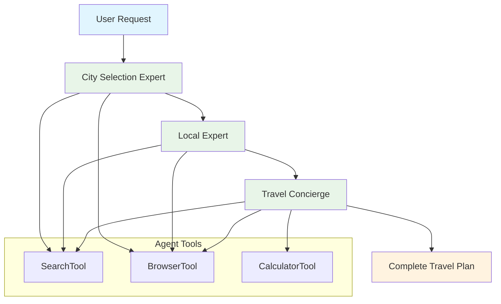

# Travel Planner with CrewAI

Learn multi-agent systems and agent orchestration by building an AI-powered travel planning system that uses specialized agents to create comprehensive travel itineraries.

## Learning Objectives

Master the fundamentals of **Multi-Agent Systems** and **Agent Orchestration** through hands-on implementation:

- **Agent Design:** Create specialized agents with roles, goals, and backstories (e.g., City Selection Expert, Local Expert, Travel Concierge).
- **Task Orchestration:** Use **CrewAI** to coordinate agents through tasks and workflows.
- **Tool Integration:** Give agents tools (search, browser, calculator) to accomplish their tasks.
- **Agent Collaboration:** Learn how agents work together sequentially to solve complex problems.
- **Progress Streaming:** Build real-time progress updates to show users each agent's work (like ChatGPT/Grok).

## System Architecture (Final Target)

This is the final multi-agent system you will build. Each "Agent" has a role, goal, and tools, coordinated by CrewAI.



## Quick Start

```bash
# Start the demo
make dev

# Visit: http://localhost:4020/demos/travel-planner
```

## Configuration

```bash
# .env
FIREWORKS_API_KEY=your_key_here
FIREWORKS_MODEL=accounts/fireworks/models/qwen3-235b-a22b-instruct-2507
# or
OPENAI_API_KEY=your_key_here
# or
OPENROUTER_API_KEY=your_key_here
```

---

## Your Learning Path: Incremental Challenges

Follow these incremental challenges to build your application. Each one adds a new layer of agentic complexity.

### Challenge 1: The Monolith (Single Prompt)

**Goal:** Establish a baseline and understand the limitations of a single, "do-it-all" prompt.

- **Architecture:**

  ```mermaid
  graph TD
      A["User Request"] --> B["Single 'God' Prompt"]
      B --> C["LLM Call"]
      C --> D["Complete Travel Plan"]
      style A fill:#e1f5fe
      style B fill:#e8f5e8
      style D fill:#fff3e0
  ```

- **Your Task:**

  1. Create a simple form to collect travel preferences (destination, interests, budget, duration).

  2. Create one massive "monolithic" prompt that asks the LLM to do *everything*:

     - `"Plan a trip to {destination} for {duration}. Budget is {budget}. Interests: {interests}. Provide: city selection, local insights, day-by-day itinerary, budget breakdown, and packing suggestions."`

  3. Send this to the LLM and display the raw string response.

- **Experiment:** Try this with 3 different requests (budget trip, luxury trip, adventure trip).

- **Observation:** Notice how inconsistent the output is. The formatting is unreliable, sections are mixed together, and the LLM struggles to do all tasks well at once. You have no control over the process.

-----

### Challenge 2: The Sequential Prompts (First Steps Toward Agents)

**Goal:** Improve quality by decomposing the problem into specialized, sequential prompts. This is the first step toward an agentic mindset.

- **Architecture:**

  ```mermaid
  graph TD
      A["User Request"] --> B["Prompt 1: City Selection"]
      B --> C["Prompt 2: Local Insights"]
      C --> D["Prompt 3: Itinerary"]
      B --> E["Result 1"]
      C --> F["Result 2"]
      D --> G["Result 3"]
      subgraph Sequential["Sequential, Unrelated Calls"]
          B
          C
          D
      end
      style A fill:#e1f5fe
      style B fill:#e8f5e8
      style C fill:#e8f5e8
      style D fill:#e8f5e8
  ```

- **Your Task:**

  1. **Do not use CrewAI yet.**

  2. Create 3 separate functions, each with its own specialized prompt and its own LLM call:

     - `select_city(request)`: `"Based on these preferences: {interests}, {budget}, {duration}, {season}, select the best destination city. Provide: city name and reasoning."`

     - `get_local_insights(city)`: `"For {city}, provide comprehensive local insights: top attractions, local customs, best neighborhoods, cuisine recommendations, hidden gems."`

     - `create_itinerary(city, request)`: `"Create a detailed {duration} itinerary for {city}. Include: day-by-day schedule, budget breakdown, packing suggestions, and practical tips."`

  3. Call these functions *sequentially* (one after the other) and manually combine their string outputs for the user.

- **Observation:** The quality of each *part* is much higher. But it's slow (3 full API calls) and inefficient. The prompts are "unaware" of each other—the itinerary function doesn't know what insights the local expert found.

-----

### Challenge 3: The Crew (Intro to CrewAI)

**Goal:** Introduce CrewAI. Create formal agents with roles, goals, and backstories, coordinated through tasks.

- **Agent Definition:** First, define your agents. Each agent has:
  - `role`: What the agent does
  - `goal`: What the agent aims to achieve
  - `backstory`: Context that shapes agent behavior
  - `tools`: Capabilities the agent has

  ```python
  city_agent = Agent(
      role='City Selection Expert',
      goal='Select the best city based on weather, season, and prices',
      backstory='An expert in analyzing travel data to pick ideal destinations.',
      tools=[SearchTool(), BrowserTool()]
  )
  ```

- **Architecture:**

  ```mermaid
  graph TD
      A(Start) --> B["Agent: City Selection"]
      B --> C["Agent: Local Expert"]
      C --> D["Agent: Travel Concierge"]
      D --> E(End)
      style B fill:#e0f7fa
      style C fill:#e0f7fa
      style D fill:#e0f7fa
  ```

- **Your Task:**

  1. Install CrewAI: `pip install 'crewai[tools]'`

  2. Refactor your Challenge 2 functions into **CrewAI agents**.

  3. Create **Tasks** for each agent:

     ```python
     city_task = Task(
         description="Analyze user preferences and select the best city",
         agent=city_agent,
         expected_output="Selected city name and reasoning"
     )
     ```

  4. Create a **Crew** to coordinate them:

     ```python
     crew = Crew(
         agents=[city_agent, local_agent, concierge_agent],
         tasks=[city_task, local_task, concierge_task],
         verbose=True
     )
     ```

  5. Execute the crew: `result = crew.kickoff()`

- **Observation:** You now have a formal, traceable workflow! CrewAI handles the orchestration. However, agents still work in isolation. The concierge doesn't use the local expert's specific insights.

-----

### Challenge 4: The *Smart* Crew (Agent Collaboration)

**Goal:** Make agents truly collaborate by using outputs from previous agents.

- **Your Task:**

  1. **Upgrade your tasks** to be dependent on each other.

  2. **`city_task`:** No change—it takes the user request.

  3. **`local_task` (The Upgrade):**

     - Now it should reference the selected city from `city_task`.

     - CrewAI automatically passes outputs between tasks. Your task description can reference previous outputs.

  4. **`concierge_task` (The Upgrade):**

     - Should use insights from both `city_task` (selected city) and `local_task` (local insights).

     - Update the task description: `"Using the selected city {city} and local insights {insights}, create a detailed itinerary..."`

  5. **Experiment:** Run the same request twice and see how agents collaborate.

- **Observation:** This is a *massive* leap in quality. Your `concierge_agent` now builds on the work of the `local_agent`. Your agents are *collaborating* through CrewAI's task orchestration.

-----

### Challenge 5: Tools Integration (Agent Capabilities)

**Goal:** Give agents tools so they can search the web, browse websites, and calculate budgets.

- **Your Task:**

  1. Import CrewAI tools:

     ```python
     from crewai_tools import (
         DuckDuckGoSearchTool,
         WebsiteSearchTool,
         CalculatorTool
     )
     ```

  2. **Upgrade your agents** to use tools:

     - **`city_agent`:** Give it `SearchTool` and `BrowserTool` so it can research destinations, weather, and prices.

     - **`local_agent`:** Give it `SearchTool` and `BrowserTool` so it can find current information about the city.

     - **`concierge_agent`:** Give it all three tools (`SearchTool`, `BrowserTool`, `CalculatorTool`) so it can calculate budgets, search for prices, and create detailed plans.

  3. Update agent definitions to include tools.

  4. **Test:** Agents should now automatically use tools when they need information they don't have.

- **Observation:** Your agents are now autonomous! They can search for information, browse websites, and make calculations without you providing all the data upfront. This is the power of tool-enabled agents.

-----

### Challenge 6: Progress Streaming (Real-Time Updates)

**Goal:** Show users real-time progress as agents work (like ChatGPT/Grok).

- **Your Task:**

  1. Create a streaming endpoint that sends Server-Sent Events (SSE).

  2. Before each agent starts, send a progress update:

     ```python
     yield f"data: {json.dumps({'step': 'city_selection', 'agent': 'City Selection Expert', 'message': 'Analyzing destinations...'})}\n\n"
     ```

  3. As agents execute, send updates at key points:

     - Agent initialization
     - Task creation
     - Agent execution start
     - Agent execution completion
     - Final results

  4. Update the frontend to:

     - Display progress steps in real-time
     - Show which agent is currently working
     - Display results as they arrive

- **Experiment:** Watch the frontend as you make a request. You should see each agent's progress step-by-step.

- **Observation:** Real-time progress transforms the user experience. Users can see the AI "thinking" and understand the multi-agent process. This builds trust and transparency.

-----

### Challenge 7: Dynamic Agent Creation (Conditional Agents)

**Goal:** Create agents dynamically based on user preferences.

- **Architecture:**

  ```mermaid
  graph TD
      A(Start) --> B{User Request}
      B -->|Budget Trip| C["Budget Agent"]
      B -->|Luxury Trip| D["Luxury Agent"]
      C --> E["Common Agents"]
      D --> E
      E --> F(End)
      style C fill:#e0f7fa
      style D fill:#e0f7fa
      style E fill:#e8f5e8
  ```

- **Your Task:**

  1. Analyze the user's request to determine what agents are needed.

  2. **Conditional Agent Creation:**

     - If budget is mentioned as a constraint, add a "Budget Optimizer" agent.

     - If luxury is mentioned, add a "Luxury Experience" agent.

     - If family travel is mentioned, add a "Family-Friendly" agent.

  3. **Dynamic Task Creation:**

     - Create tasks for the dynamically created agents.

     - Integrate them into the crew workflow.

  4. **Test:** Same request with different emphasis should trigger different agents.

- **Observation:** Dynamic agent creation makes your system flexible and adaptive. You're building an intelligent system that adapts to user needs.

-----

## Key Multi-Agent Concepts

### **What You'll Discover:**

1. **Agent Specialization:** Breaking a complex task (Challenge 1) into specialized agents with roles and goals (Challenge 3) dramatically improves quality and reliability.
2. **Crew Orchestration:** CrewAI's `Crew` manages task execution order and agent coordination. Tasks can reference outputs from previous tasks (Challenge 4).
3. **Tool-Enabled Agents:** Giving agents tools (Challenge 5) makes them autonomous. They can search, browse, and calculate on their own.
4. **Progress Transparency:** Streaming progress (Challenge 6) builds user trust and shows the "thinking process" of multi-agent systems.
5. **Dynamic Systems:** Creating agents conditionally (Challenge 7) makes systems adaptive and intelligent.

## Critical Thinking Questions

1. **How would you handle agent failures?** If the `city_agent` succeeds but the `local_agent` fails, what should your crew do? Should it stop? Should it try again with a different city? Should it continue with partial information?
2. **How would you optimize costs?** What if the user's budget is clearly too low for any destination? Could you add a "Budget Validator" agent that checks feasibility first and stops the crew early if impossible?
3. **How would you add human-in-the-loop?** What if the `city_agent` selects a city the user doesn't like? How would you build a step to *pause* the crew, show the selection to the user, and *resume* if approved?
4. **How would you handle conflicting agents?** What if the `city_agent` selects "Tokyo" but the `local_agent` says "Tokyo is currently experiencing issues"? How would a "Supervisor" agent resolve this conflict?
5. **How would you add parallel execution?** Can `local_agent` and a hypothetical `weather_agent` run in parallel since they don't depend on each other? How would you modify the crew to enable this?

## Further Learning

**Essential Reading:**

- [CrewAI Documentation](https://docs.crewai.com) - The official docs on agents, tasks, and crews.
- [CrewAI Tools](https://docs.crewai.com/concepts/tools) - Learn about available tools and how to create custom ones.
- [Agent Orchestration Patterns](https://docs.crewai.com/concepts/multi-agent-systems) - Patterns for building complex agent teams.

**Next Steps:**

- Implement **Parallel Execution:** Run independent agents simultaneously.
- Add **Agent Reflection:** Create a "Quality Checker" agent that reviews all outputs and suggests improvements.
- Implement **Custom Tools:** Create a custom tool for checking flight prices or hotel availability.
- Explore **Hierarchical Agents:** Build a "Supervisor" agent that, based on the request, *decides* which specialist agents to include in the crew.
