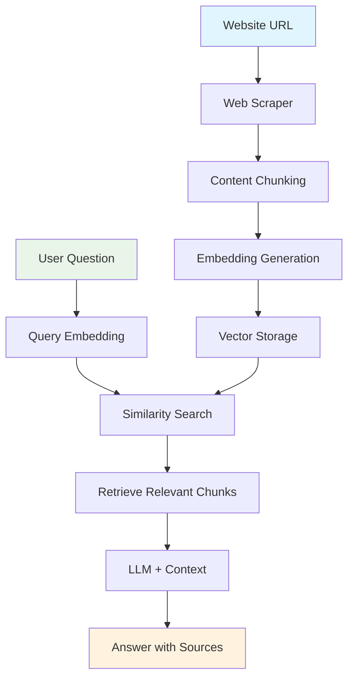

# Website RAG Chatbot

Learn RAG by building a real chatbot that answers questions about any website.

## 🎯 Learning Objectives

Master the fundamentals of **Retrieval-Augmented Generation (RAG)** through hands-on implementation:

- **Web Scraping & Content Extraction** - Extract meaningful content from any website
- **Semantic Chunking Strategies** - Break content into searchable pieces
- **Vector Embeddings & Similarity Search** - Find relevant information quickly
- **LLM Integration with Context** - Generate accurate answers from retrieved content
- **RAG Limitations & Optimization** - Understand when and why RAG works

## 🏗️ System Architecture



## 🚀 Quick Start

```bash
# Start the demo
make dev

# Visit: http://localhost:4020/demos/website-rag
```

## 🧪 Learning Challenges

### **Challenge 1: Chunking Strategy Impact**
**Goal**: Understand how chunk size affects answer quality

**Experiment**:
- Try chunk sizes: 200, 500, 1000 characters
- Test overlap: 0, 50, 100 characters
- Ask the same question with different settings

**Question**: How does chunk size affect answer quality and retrieval accuracy?

### **Challenge 2: RAG vs Direct LLM**
**Goal**: Compare RAG performance with direct LLM queries

**Experiment**:
- Ask the same question to the RAG chatbot
- Ask ChatGPT the same question directly
- Compare accuracy and source attribution

**Question**: When does RAG outperform direct LLM, and why?

### **Challenge 3: Source Attribution Analysis**
**Goal**: Understand hallucination and source reliability

**Experiment**:
- Expand sources after each answer
- Check if sources actually support the answer
- Test with questions outside the website content

**Question**: How often does the LLM hallucinate, and how can you detect it?

### **Challenge 4: Cross-Domain Queries**
**Goal**: Test RAG with multiple information sources

**Experiment**:
- Add URLs from different websites
- Ask questions requiring information from multiple sources
- Test with conflicting information

**Question**: How well does RAG handle multi-source reasoning?

## 🔧 Configuration

```bash
# .env
FIREWORKS_API_KEY=your_key_here
FIREWORKS_MODEL=accounts/fireworks/models/qwen3-235b-a22b-instruct-2507
EMBEDDING_MODEL=all-MiniLM-L6-v2  # Fast & cheap
```

## 🎓 Key RAG Concepts

### **What You'll Discover:**
1. **Context Window Limitations** - RAG is limited by retrieved chunks
2. **Information Fragmentation** - Split information across chunks
3. **Retrieval Quality Dependencies** - Performance depends on embedding model
4. **Hallucination Risk** - LLM may generate unsupported answers

### **Production Considerations:**
- Error handling for failed URLs
- Caching for performance
- Monitoring retrieval quality
- Scaling for multiple users

## 🚀 Advanced Challenges

### **Challenge 5: Multi-URL RAG System**
**Goal**: Support multiple websites simultaneously

**Learning Focus**: How RAG scales with multiple sources, cross-domain information retrieval, and source prioritization.

### **Challenge 6: Pre-processing Pipeline**
**Goal**: Clean and optimize content before chunking

**Learning Focus**: Data quality impacts RAG performance, content cleaning strategies, and information extraction techniques.

### **Challenge 7: Post-processing Enhancement**
**Goal**: Improve answer quality and reliability

**Learning Focus**: How to reduce hallucinations, implement confidence scoring, and validate answers against sources.

## 🤔 Critical Thinking Questions

1. **What if the website content changes?** How would you handle updates?
2. **How would you prevent hallucination?** What validation could you add?
3. **What if you had 10,000 URLs?** How would you scale the system?
4. **How would you measure RAG quality?** What metrics matter most?
5. **How would you handle conflicting information from different sources?**
6. **What if one source is more authoritative than others?**

## 📚 Further Learning

**Essential Reading:**
- [Building the Entire RAG Ecosystem](https://levelup.gitconnected.com/building-the-entire-rag-ecosystem-and-optimizing-every-component-8f23349b96a4) - Production-ready RAG components
- [LangChain RAG Guide](https://python.langchain.com/docs/use_cases/question_answering/) - Production patterns

**Next Steps:**
- Implement vector databases (Pinecone, Weaviate, Chroma, Qdrant, PgVector)
- Add semantic chunking strategies
- Build re-ranking systems
- Scale with Redis caching

---

*This demo teaches you RAG by doing. Experiment, break things, and learn why RAG is both powerful and challenging.*
