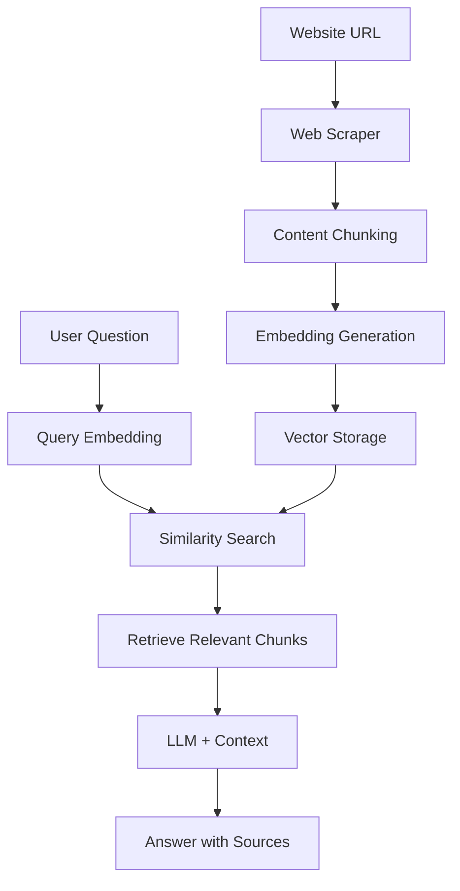

# Website FAQ Chatbot

Learn RAG (Retrieval-Augmented Generation) by building a real chatbot that answers questions about any website.

## 🎯 What You'll Learn

**Core RAG Concepts:**
- Web scraping & content extraction
- Semantic chunking strategies  
- Vector embeddings & similarity search
- LLM integration with retrieved context
- RAG limitations & optimization

## 🏗️ RAG Architecture



## 🚀 Quick Start

```bash
# Start the demo
make dev

# Visit: http://localhost:4020/demos/website-rag
```

## 🧠 Learning Experiments

### 1. **Chunking Strategy Impact**
- Try chunk sizes: 200, 500, 1000 characters
- Test overlap: 0, 50, 100 characters
- **Question**: How does chunk size affect answer quality?

### 2. **RAG vs Direct LLM**
- Ask the same question to the chatbot
- Ask ChatGPT the same question directly
- **Question**: When does RAG outperform direct LLM?

### 3. **Source Attribution Analysis**
- Expand sources after each answer
- Check if sources actually support the answer
- **Question**: How often does the LLM hallucinate?

### 4. **Cross-Domain Queries**
- Add URLs from different websites
- Ask questions requiring information from multiple sources
- **Question**: How well does RAG handle multi-source reasoning?

## 🔧 Configuration

```bash
# .env
GEMINI_API_KEY=your_key_here
EMBEDDING_MODEL=all-MiniLM-L6-v2  # Fast & cheap
```

## 🎓 Key Learning Points

### **RAG Limitations You'll Discover:**
1. **Context Window**: Limited by retrieved chunks
2. **Information Fragmentation**: May miss split information
3. **Retrieval Quality**: Depends on embedding model
4. **Hallucination Risk**: LLM may generate unsupported answers

### **Production Considerations:**
- Error handling for failed URLs
- Caching for performance
- Monitoring retrieval quality
- Scaling for multiple users

## 🧪 Advanced Experiments

### **Challenge 1: Multi-URL RAG System**
- **Goal**: Support multiple websites simultaneously
- **Implementation**: 
  - Modify frontend to accept multiple URLs
  - Update API to handle URL arrays
  - Implement cross-domain information retrieval
- **Learning**: How RAG scales with multiple sources

### **Challenge 2: Pre-processing Pipeline**
- **Goal**: Clean and optimize content before chunking
- **Implementation**:
  - Remove navigation, ads, and irrelevant content
  - Extract structured data (titles, headings, lists)
  - Implement content quality scoring
- **Learning**: Data quality impacts RAG performance

### **Challenge 3: Post-processing Enhancement**
- **Goal**: Improve answer quality and reliability
- **Implementation**:
  - Add answer validation against sources
  - Implement confidence scoring
  - Add fact-checking mechanisms
- **Learning**: How to reduce hallucinations

### **Challenge 4: Optimize for Speed**
- Reduce chunk size to 200 characters
- Use faster embedding model
- **Goal**: Answer in <2 seconds

### **Challenge 5: Optimize for Quality**
- Increase chunk size to 1000 characters
- Use higher-quality embedding model
- **Goal**: Most accurate answers possible

### **Challenge 6: Handle Edge Cases**
- Try URLs with JavaScript-heavy content
- Test with non-English websites
- **Goal**: Robust error handling

## 📚 Further Learning

**Essential Reading:**
- [RAG Paper](https://arxiv.org/abs/2005.11401) - Original research
- [LangChain RAG Guide](https://python.langchain.com/docs/use_cases/question_answering/) - Production patterns

**Next Steps:**
- Implement vector databases (Pinecone, Weaviate)
- Add semantic chunking strategies
- Build re-ranking systems
- Scale with Redis caching

## 🚀 Multi-URL RAG Challenge

### **Step 1: Frontend Modifications**
```typescript
// Add multiple URL input
const [urls, setUrls] = useState<string[]>(['']);
const [urlInput, setUrlInput] = useState('');

// Add URL to list
const addUrl = () => {
  if (urlInput.trim() && isValidUrl(urlInput.trim())) {
    setUrls([...urls, urlInput.trim()]);
    setUrlInput('');
  }
};

// Remove URL from list
const removeUrl = (index: number) => {
  setUrls(urls.filter((_, i) => i !== index));
};
```

### **Step 2: API Updates**
```python
# Update the process endpoint to handle multiple URLs
@router.post("/process-multiple")
async def process_multiple_urls(request: MultiURLRequest):
    """Process multiple URLs simultaneously"""
    results = []
    for url in request.urls:
        # Process each URL
        result = await process_single_url(url)
        results.append(result)
    return {"results": results}
```

### **Step 3: Cross-Domain Retrieval**
```python
# Modify the ask endpoint to search across all processed URLs
async def ask_question_multi_url(question: str, urls: List[str]):
    """Ask questions across multiple websites"""
    all_chunks = []
    for url in urls:
        if url in vector_stores:
            chunks = await vector_stores[url].retrieve_top_k(question, k=3)
            all_chunks.extend(chunks)
    
    # Sort by relevance across all sources
    relevant_chunks = sorted(all_chunks, key=lambda x: x.similarity, reverse=True)
    return relevant_chunks[:5]  # Top 5 most relevant
```

## 🔧 Pre-processing Pipeline Challenge

### **Content Cleaning**
```python
def clean_content(html_content: str) -> str:
    """Remove irrelevant content before chunking"""
    # Remove navigation, ads, footers
    soup = BeautifulSoup(html_content, 'html.parser')
    
    # Remove unwanted elements
    for element in soup(['nav', 'footer', 'aside', 'script', 'style']):
        element.decompose()
    
    # Extract main content
    main_content = soup.find('main') or soup.find('article') or soup
    return main_content.get_text()
```

### **Content Quality Scoring**
```python
def score_content_quality(content: str) -> float:
    """Score content quality (0-1)"""
    score = 0.0
    
    # Length check
    if len(content) > 100:
        score += 0.3
    
    # Structure check (headings, paragraphs)
    if content.count('\n') > 5:
        score += 0.3
    
    # Information density
    word_count = len(content.split())
    if word_count > 50:
        score += 0.4
    
    return min(score, 1.0)
```

## 🎯 Post-processing Enhancement Challenge

### **Answer Validation**
```python
def validate_answer(answer: str, sources: List[str]) -> dict:
    """Validate answer against sources"""
    validation = {
        "confidence": 0.0,
        "source_support": 0.0,
        "hallucination_risk": 0.0
    }
    
    # Check if answer facts are supported by sources
    answer_facts = extract_facts(answer)
    supported_facts = 0
    
    for fact in answer_facts:
        for source in sources:
            if fact.lower() in source.lower():
                supported_facts += 1
                break
    
    validation["source_support"] = supported_facts / len(answer_facts) if answer_facts else 0
    validation["confidence"] = validation["source_support"]
    
    return validation
```

### **Confidence Scoring**
```python
def calculate_confidence(answer: str, sources: List[str], chunks: List[DocumentChunk]) -> float:
    """Calculate confidence score for the answer"""
    confidence = 0.0
    
    # Source relevance
    avg_similarity = sum(chunk.similarity for chunk in chunks) / len(chunks)
    confidence += avg_similarity * 0.4
    
    # Answer length (too short or too long = lower confidence)
    answer_length = len(answer.split())
    if 10 <= answer_length <= 200:
        confidence += 0.3
    
    # Source diversity
    unique_sources = len(set(chunk.url for chunk in chunks))
    confidence += min(unique_sources / 3, 1.0) * 0.3
    
    return min(confidence, 1.0)
```

## 🤔 Thought Experiments

1. **What if the website content changes?** How would you handle updates?
2. **How would you prevent hallucination?** What validation could you add?
3. **What if you had 10,000 URLs?** How would you scale the system?
4. **How would you measure RAG quality?** What metrics matter most?
5. **How would you handle conflicting information from different sources?**
6. **What if one source is more authoritative than others?**

---

*This demo teaches you RAG by doing. Experiment, break things, and learn why RAG is both powerful and challenging.*
